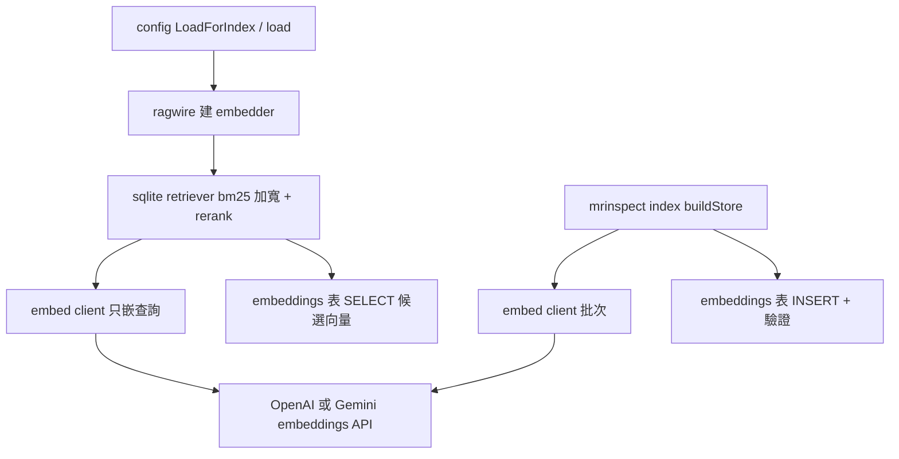
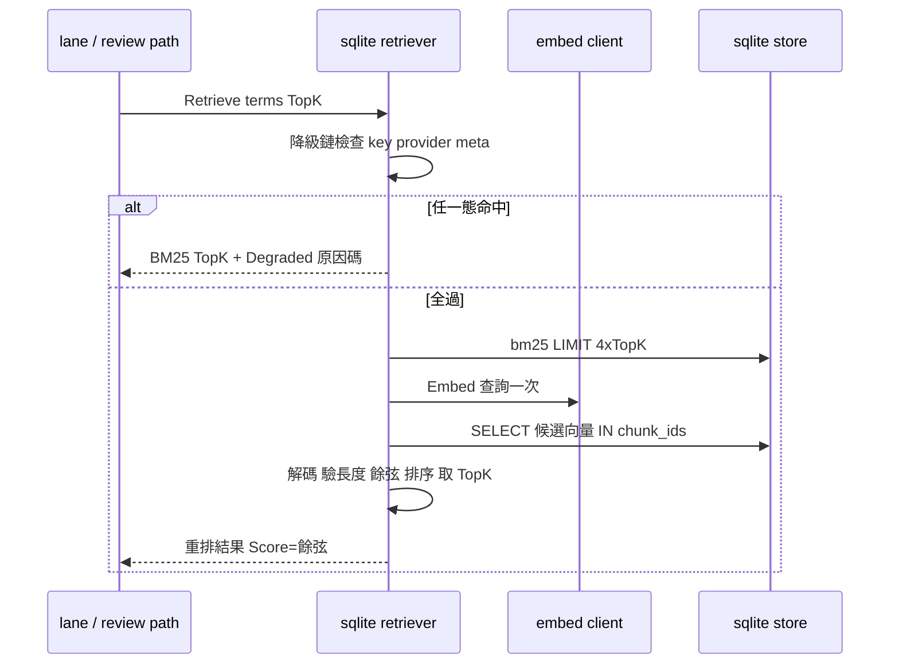

# design-be — embedding-rerank

Implements `REQ-01`–`REQ-03`（spec.md，fingerprint `91b48c8041e08e9f…`）。
純 backend/CLI：**design-fe.md 與 api.yml 均 N/A**（無 HTTP API 面；外部
embeddings API 是我們呼叫別人，不是我們的契約面）。

## 模組配置

| 位置 | 內容 | 對應 REQ |
|---|---|---|
| `internal/rag/embed/`（NEW：`embedder.go`、`remote.go`、`fixture.go`、`embed_test.go`） | `Embedder` 介面（批次形狀：`Embed(ctx, []string) ([][]float32, error)`＋`Model() string`＋`Dim() int`）；`remote.go` 含 OpenAI（`POST /v1/embeddings`，model 常數 `text-embedding-3-small`，key 走 `Authorization: Bearer` header）與 Gemini（model 常數 `gemini-embedding-001`（GA，文件 2026-04；`outputDimensionality: 768`——官方推薦截斷值，縮小 store 與餘弦成本）、`POST /v1beta/models/<model>:batchEmbedContents`，key 走 `x-goog-api-key` header——**不得**用 query param，S-01/S-02 斷言 key 不在 URL）兩個 client，皆有 base-URL／HTTP client 注入選項（同 `internal/ai/` 三家慣例）；`New(provider, key, opts...)` 建構器做 S-03 驗證；**不重試、不寫 transcript**；`fixture.go` 決定性向量＋呼叫計數＋可注入錯誤 | REQ-01 |
| `internal/config/config.go`（MODIFY：`LoadForIndex` :201-214 一帶） | flag 開時解析並驗證 `MRI_RAG_EMBED_KEY` 與 `MRI_EMBED_PROVIDER`（現況 LoadForIndex 完全不讀憑證）；`Load`/`LoadForEval` 共用的 load() 一併攜帶（查詢側 wiring 用） | REQ-01 |
| `internal/rag/sqlite/indexer.go`（MODIFY：`buildStore` :107-130）＋`store.go`（MODIFY :32-47） | flag 開：chunk 蒐集完成後、rename 發佈前，批次呼叫 embedder，逐列寫 `embeddings`（同一 tx 內）；發佈前驗證（每檢索 chunk 恰一向量、dim 全等於 embedder.Dim()、無 NaN/Inf）；`schema_meta.embed_model/embed_dim` 改寫實際值；`IndexStats.Embeddings` 計數；嵌入開始前 log chunk 總數＋預估呼叫數。失敗＝整趟 error → 既有 temp+rename（:42-75）保證發佈物零變動 | REQ-02 |
| `internal/rag/sqlite/retriever.go`（MODIFY：`bm25` :108-132、`rerank` :146-182） | embedder 就緒時 `bm25` 的 `LIMIT` 改綁 `4×TopK`（否則維持 `TopK+1`；`Truncated` 規則 :127-130 不動）；`rerank` 重寫：六態降級優先鏈（key 缺→建構失敗→無向量/meta 空→model/dim 不符→查詢 embed 失敗→向量列損壞）→ 單次 `Embed(ctx, []string{query})` → 單一 `SELECT chunk_id, dim, vec FROM embeddings WHERE chunk_id IN (...)` → LE float32 解碼＋餘弦 → 依相似度排序取 TopK、`Chunk.Score` 改寫為餘弦值（修掉 :178-180 的就地覆寫殘留長度問題）。降級文案由 typed helper 組裝：`rerank degraded: <固定原因碼> (provider=<名>, status=<class>)`，長度上限 200 bytes，絕不含原始 error 字串/URL | REQ-03 |
| `internal/ragwire/`（MODIFY：`sqlite.go:14-19` `RegisterBuiltinBackends`——唯一閉包住 `sqlite.OpenRetriever` 的注入點；`review_path.go:62` 的 `rag.New` 呼叫鏈與 lane 資源解析） | 依 config 建 embedder（flag 開才建；建構失敗不擋 review——把錯誤轉為降級原因傳入 retriever options）；經 `OpenRetriever` 的新 option 注入（package 內部 seam，凍結介面不動） | REQ-03 |
| `.env.example`＋`internal/config/envexample_test.go`＋`docs/{us,tw}/configuration.md` | `MRI_RAG_EMBEDDINGS`、`MRI_RAG_EMBED_KEY`、`MRI_EMBED_PROVIDER` 三變數補齊（前兩者是既有變數但從未進 example） | checklist |

## Table schema

無新表。使用既有兩表（`schema.sql:68-83`），本 change 開始實際寫入：

| 表 | 欄位 | 用法 |
|---|---|---|
| `embeddings` | `chunk_id INTEGER PK → chunks(id)`；`dim INTEGER`；`vec BLOB`；`created_at TEXT` | `vec`＝little-endian float32 × dim；每個檢索模式 chunk 恰一列 |
| `schema_meta` | `embed_model TEXT`；`embed_dim INTEGER`（其餘欄位不動） | flag 開時寫實際值；flag 關維持 `""`/`0`（S-05） |

## 服務關係

## 查詢執行序（flag 開）

## 關鍵設計決定

1. **凍結介面零變更**：改動全在 sqlite package 私有 seam（embedder 欄位
   :31-33 換成 `embed.Embedder` 批次型）與 `OpenRetriever` 的 option；
   `rag.Retriever`/`rag.Result` 原樣。
2. **批次↔seam 對應**（spec REQ-01）：索引側一個資源集分批呼叫
   （批次大小常數，design 定 64）；查詢側 `Embed(ctx, []string{q})`。
   呼叫數 O(chunks/64)，非逐 chunk。
3. **加寬責任在 bm25、截斷責任在 rerank**（spec REQ-03；orc 指認的
   :127-130 先截斷問題就地解決）：embedder 就緒時 bm25 回滿 4×TopK 與
   既有 `Truncated` 值，rerank 排序後切 TopK。
4. **降級原因碼固定枚舉**（typed，防 key/URL 洩漏）：`missing-key`／
   `embedder-init`／`no-vectors`／`model-mismatch`／`embed-call-failed`／
   `corrupt-vector`，加 provider 名與 HTTP status class（4xx/5xx），僅此。
5. **S-52 模式檢視**：沿用 `internal/ai/` 既有 provider 建構慣例
   （介面＋per-provider 建構器＋HTTP 注入），無新 GoF 模式——Strategy
   形狀已內建於 Embedder 介面，不另立 Factory/Registry（兩個 provider
   一個 switch 即可，D4 的 N 在 provider 常數表內）。

## Requirements Checklist（S-51，plan 版）

- [ ] REQ-01：embed 包＋憑證契約＋LoadForIndex（T1/T4）
- [ ] REQ-02：索引入庫＋驗證＋原子性＋成本行（T2）
- [ ] REQ-03：加寬＋讀庫重排＋六態降級＋redacted 文案（T3/T4）
- [ ] env/docs 三變數補齊（T5）
- [ ] S-28/S-29/key-gate 既有測試回歸全綠（T2/T3 的 GREEN 條件）
