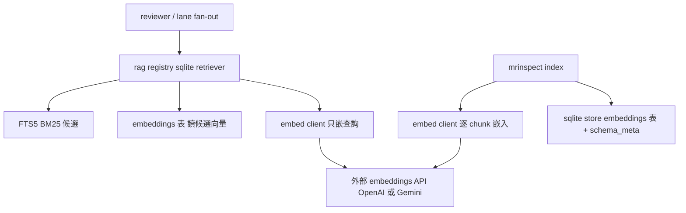

# spec — embedding-rerank

## 背景與範圍

rag-resource-store 出貨時留下休眠的 embedding rerank 路徑：`rerank()` 接縫
已在線上（`internal/rag/sqlite/retriever.go:82`）但 embedder 在生產路徑永遠
nil；schema 已有 `embeddings` 表與 `schema_meta.embed_model`/`embed_dim`
但 indexer 從不寫入；原設計的 `internal/rag/embed/` 包從未建立。使用者
裁決（D1）補完而非刪除。

本 change 把該路徑補到「`MRI_RAG_EMBEDDINGS=true` 時真的端對端運作」：
索引時算向量入庫、查詢時只嵌查詢一次並讀庫內向量重排、所有失敗態降級回
BM25 且原因可見。**預設仍關**；flag 關閉時行為與現狀完全一致。

驗收層級（使用者裁決）：**功能正確即可**——不宣稱檢索品質提升（現行
corpus 25 chunks 無鑑別力）。品質對照留待資源集擴大後另議。

硬約束：
- 凍結介面 `Retriever{Name, Retrieve, Close}`（`internal/rag/retriever.go:36-40`）
  與 `FullLoader{LoadFull}`（`:57-59`）**不得變更**；`rag.Result.Degraded`
  （`:31`）是降級原因的既有傳遞欄位，沿用不新增。
- 既有不變量必須持續成立：rag-resource-store **S-28**（flag 關時不產生任何
  embedding）與 **S-29**（重排只作用於候選集、不引入新 chunk）。
- Anthropic 無 embeddings API——embed provider 只有 openai／gemini 兩種，
  且 embed provider 可以與生成 provider 不同。
- **資料外送揭露**：flag 開啟＝索引時把資源集全文、查詢時把查詢字串送到
  外部 embeddings API。原始輸入與向量一律不得寫入任何 log（含
  `MRI_AI_LOG_DIR` transcript）。

## System context

## REQ-01 — embedding client 與憑證契約

新建 embedding client（介面＋OpenAI／Gemini 兩個遠端實作＋決定性 fixture
實作；包配置與 HTTP 注入方式屬 design-be.md）。

- provider 由 `MRI_EMBED_PROVIDER` 選擇，值域 `openai`｜`gemini`；模型為
  各 provider 的固定常數（openai: `text-embedding-3-small`；gemini 常數於
  design 階段依官方文件定案），**不設模型覆寫變數**（換模型＝改版）。
- **憑證契約**：既有 `MRI_RAG_EMBED_KEY`（`internal/rag/sqlite/retriever.go:20`）
  是唯一的嵌入憑證變數，對任一 embed provider 皆同——它與生成側的
  `AI_PROVIDER_KEY` 各自獨立，因此生成用 anthropic、嵌入用 openai 的組合
  有明確 key 來源。`config.LoadForIndex` MUST 在 flag 開時解析並驗證此
  變數（現況完全不讀憑證）。rag-resource-store 既有的「key 缺→降級」
  scenario 與測試（`retriever_test.go:262-270`）原樣保留。
- 遠端呼叫為批次形狀（一次多段文字）；與既有單段 seam 的對應在 design
  階段定義，但索引一個資源集的呼叫數 MUST 是 O(chunks/批次大小) 而非
  逐 chunk 一次。
- 建構時 flag 開但 provider 未設或不在值域 → 回傳指名 `MRI_EMBED_PROVIDER`
  的錯誤；key 缺 → 指名 `MRI_RAG_EMBED_KEY` 的錯誤。
- fixture 實作 MUST 決定性（相同輸入→相同向量）並可注入呼叫計數／錯誤。
- embed 呼叫**不重試**：失敗即回報（索引 fail fast、查詢降級）——嵌入不走
  `ai.WithRetry`（該 decorator 綁 `Provider.Generate` 且會寫 transcript）。

### S-01 OpenAI embedding client 批次解析

- GIVEN `MRI_EMBED_PROVIDER=openai`、`MRI_RAG_EMBED_KEY` 已設、fake HTTP
  伺服器回傳含兩筆已知向量的合法回應
- WHEN 以兩段文字批次呼叫 embed client
- THEN 回傳兩個向量、順序與輸入一致、值與 fake 回應一致；請求帶 key 於
  header（不在 URL）
- Test mapping: `internal/rag/embed/embed_test.go::TestS01_OpenAIEmbed`
- Verification command: `go test ./internal/rag/embed/ -run TestS01_OpenAIEmbed -count=1 -v`

### S-02 Gemini embedding client 批次解析

- GIVEN `MRI_EMBED_PROVIDER=gemini`、key 已設、fake HTTP 伺服器回傳合法回應
- WHEN 以兩段文字批次呼叫 embed client
- THEN 回傳向量順序與值正確；key 不出現在 URL
- Test mapping: `internal/rag/embed/embed_test.go::TestS02_GeminiEmbed`
- Verification command: `go test ./internal/rag/embed/ -run TestS02_GeminiEmbed -count=1 -v`

### S-03 建構期驗證錯誤

- GIVEN `MRI_RAG_EMBEDDINGS=true`，且（a）`MRI_EMBED_PROVIDER` 為空或值域
  外，或（b）provider 合法但 `MRI_RAG_EMBED_KEY` 為空
- WHEN 建構 embedder
- THEN （a）錯誤訊息含 `MRI_EMBED_PROVIDER`；（b）錯誤訊息含
  `MRI_RAG_EMBED_KEY`；兩者皆不發生任何 HTTP 呼叫
- Test mapping: `internal/rag/embed/embed_test.go::TestS03_ConstructorValidation`
- Verification command: `go test ./internal/rag/embed/ -run TestS03_ConstructorValidation -count=1 -v`

## REQ-02 — 索引時向量入庫

`MRI_RAG_EMBEDDINGS=true` 時 `mrinspect index` 對每個檢索模式 chunk 計算
向量寫入 `embeddings` 表，`schema_meta` 記錄實際 `embed_model`/`embed_dim`，
`IndexStats.Embeddings` 計入筆數。開始嵌入前 MUST log 一行 chunk 總數與
預估 API 呼叫數（成本可見；不設硬上限——索引是使用者的明確動作）。

- **向量編碼與驗證**：blob 為 little-endian float32 序列；發佈前 MUST 驗證
  每個檢索 chunk 恰一個向量、全庫 dim 一致且等於 meta 的 `embed_dim`、
  無 NaN/Inf——任一不符即整趟失敗。
- flag 開但 embedder 建構失敗（S-03 情形）→ index 非零退出並輸出該錯誤。
- 任一批次 embed 呼叫失敗 → index 非零退出；**已發佈的目標 store 檔絕不
  處於部分狀態**（沿既有 temp+rename 機制；本 spec 不宣稱 SIGKILL 級
  crash durability）。
- flag 關 → 行為與現狀一致：不寫 embeddings、meta 空值（S-28 不變量）。

### S-04 flag 開時向量入庫

- GIVEN `MRI_RAG_EMBEDDINGS=true`、fixture embedder（決定性、dim=4）、
  3 個 chunk 的資源集
- WHEN 執行 index
- THEN `embeddings` 表恰 3 列且每列 blob 長度 = 4×4 bytes、
  `schema_meta.embed_model`/`embed_dim` 為 fixture 值、
  `IndexStats.Embeddings == 3`；stderr/log 含 chunk 總數行
- Test mapping: `internal/rag/sqlite/indexer_test.go::TestS04_IndexWritesEmbeddings`
- Verification command: `go test ./internal/rag/sqlite/ -run TestS04_IndexWritesEmbeddings -count=1 -v`

### S-05 flag 關時完全不變（S-28 回歸）

- GIVEN `MRI_RAG_EMBEDDINGS` 未設
- WHEN 執行 index
- THEN `embeddings` 表 0 列、meta 空值、`IndexStats.Embeddings == 0`
- Test mapping: `internal/rag/sqlite/indexer_test.go::TestS05_FlagOffIndexUnchanged`
- Verification command: `go test ./internal/rag/sqlite/ -run TestS05_FlagOffIndexUnchanged -count=1 -v`

### S-06 embed 失敗時已發佈 store 不受汙染

- GIVEN flag 開、目標路徑已存在一個完好 store（記其 sha256）、embedder 對
  第 2 批呼叫回錯
- WHEN 執行 index
- THEN index 回傳錯誤，且目標 store 檔 sha256 與執行前完全相同（發佈物
  零變動）
- Test mapping: `internal/rag/sqlite/indexer_test.go::TestS06_EmbedFailureLeavesStoreIntact`
- Verification command: `go test ./internal/rag/sqlite/ -run TestS06_EmbedFailureLeavesStoreIntact -count=1 -v`

## REQ-03 — 查詢時重排與降級

flag 開且 embedder 就緒時，每次 Retrieve：
1. BM25 於 `bm25()` 內加寬撈取 `4×TopK` 候選（加寬責任在 bm25；
   `Truncated` 維持既有語意「候選多於 TopK」，不因 flag 改義）。
2. **只對查詢文字呼叫一次 embed**；候選向量以單一 SELECT 自 `embeddings`
   表讀取（查詢路徑零逐候選 embed 呼叫——這是 REQ-02 入庫的存在理由）。
3. 餘弦相似度重排，取前 TopK；重排後 `Chunk.Score` 為餘弦值。

每次 review 的嵌入呼叫量因此為 lanes×sets×1；lane 間互不影響（單一 lane
的 embed 失敗只降級該 lane 的該資源集）。

**降級（優先序固定，取第一個命中）**：
1. `MRI_RAG_EMBED_KEY` 缺（既有 gate，`retriever.go:150-153`）
2. embedder 建構失敗（provider 缺/非法）
3. 庫內無向量或 meta 空（含 flag 關建出的 store——此態回報「無向量」，
   **不**回報 model 不符）
4. `schema_meta` 的 model 或 dim 與現行 embedder 不符（原因含兩側
   model 與 dim 的實際值）
5. 查詢 embed 呼叫失敗
6. 候選向量列損壞（blob 長度與 meta dim 不符）——整組降級，不得單列
   靜默記 0 分

降級一律：BM25 原順序取 TopK、`Retrieve` 不回錯、原因寫入
`rag.Result.Degraded`（既有欄位）。**原因字串為 typed 公開文案**：固定
前綴＋provider 名＋（HTTP 失敗時）status class，**絕不含原始錯誤字串、
URL、query string 或 key 片段**，總長度設上限——降級原因會經
multi 路徑的 Scope 行（`internal/lane/render.go:99-102`）與 single 路徑的
RAG provenance footer（`internal/reviewer/footer.go:86-90`）進入公開 MR
留言。

- flag 關 → 檢索與現狀 byte-identical（TopK+1 撈取、不重排、無新增字樣）。

### S-07 重排改變順序且證明加寬視窗

- GIVEN flag 開、key 已設、庫內 12 個 BM25 分數嚴格相異的 chunk 全部有
  向量、TopK=3、fixture 使「BM25 第 5 名」餘弦最高
- WHEN Retrieve
- THEN 回傳 3 筆且第 1 筆為 BM25 原第 5 名（第 5 名 > TopK+1=4，證明
  視窗真的加寬）；fixture 呼叫計數證明 embed 恰被呼叫 1 次（只嵌查詢）；
  再以 TopK=2、fixture 使「BM25 第 9 名」餘弦最高 → 第 9 名 > 4×TopK=8，
  不得入選（證明視窗上界）
- Test mapping: `internal/rag/sqlite/retriever_test.go::TestS07_RerankWidensAndReorders`
- Verification command: `go test ./internal/rag/sqlite/ -run TestS07_RerankWidensAndReorders -count=1 -v`

### S-08 六種降級態（表驅動）

- GIVEN flag 開，六列 setup 各為：key 缺／provider 非法／庫無向量
  （flag 關建出的 store）／model 或 dim 不符／查詢 embed 回錯／候選向量
  blob 長度損壞
- WHEN Retrieve
- THEN 每列皆：BM25 原順序 TopK、`Retrieve` 無錯、`Degraded` 含該列的
  預期子字串（key 缺含 `MRI_RAG_EMBED_KEY`；不符含兩側 model/dim 值；
  embed 失敗含 status class 且**不含** fake 錯誤的原始文字與 URL）；
  「flag 關建出的 store」列回報無向量語意而非 model 不符（優先序 3 先於 4）
- Test mapping: `internal/rag/sqlite/retriever_test.go::TestS08_RerankDegrades`
- Verification command: `go test ./internal/rag/sqlite/ -run TestS08_RerankDegrades -count=1 -v`

### S-09 flag 關時檢索不變（回歸）

- GIVEN `MRI_RAG_EMBEDDINGS` 未設、其餘同現狀
- WHEN Retrieve
- THEN 結果與現行實作一致（BM25 順序、TopK+1 撈取語意、`Truncated` 規則
  不變、無降級字樣）
- Test mapping: `internal/rag/sqlite/retriever_test.go::TestS09_FlagOffRetrieveUnchanged`
- Verification command: `go test ./internal/rag/sqlite/ -run TestS09_FlagOffRetrieveUnchanged -count=1 -v`

### S-10 生產 wiring 的降級傳遞

- GIVEN `MRI_RAG_EMBEDDINGS=true` 但 `MRI_EMBED_PROVIDER` 未設、store 正常
- WHEN 經 ragwire 生產路徑執行檢索
- THEN 回傳 BM25 TopK、不回錯，降級原因經 `rag.Result.Degraded` 傳抵
  呼叫端狀態（multi 的 Scope 行來源／single 的 footer 來源欄位）
- Test mapping: `internal/ragwire/review_path_test.go::TestS10_ProviderMissingDegradesThroughWiring`
- Verification command: `go test ./internal/ragwire/ -run TestS10_ProviderMissingDegradesThroughWiring -count=1 -v`

### S-11 [MANUAL] 真 key 端對端

- GIVEN 本機真 key（`MRI_RAG_EMBED_KEY`）、`MRI_RAG_EMBEDDINGS=true`、
  `MRI_EMBED_PROVIDER` 設定、重跑 `mrinspect index` 後的 store
- WHEN 跑一次 `./bin/mrinspect eval`
- THEN 報告 Scope 行無降級字樣（rerank 生效）；改用未重建的舊 store 再跑
  → Scope 行出現無向量／不符降級，且字樣不含任何 URL 或 key 片段
- Test mapping: manual（見 tasks.md Manual verification checklist）
- Verification command: `./bin/mrinspect eval --fixtures eval/fixtures --report /tmp/eval-rerank-smoke.md`

## Decision tables

| flag | provider | key | 庫內向量 | meta 符 | 情境 | 結果 | Scenario |
|---|---|---|---|---|---|---|---|
| off | — | — | — | — | index | 現狀不變 | S-05 |
| off | — | — | — | — | 查詢 | 現狀不變 | S-09 |
| on | 缺/非法 | — | — | — | index | 非零退出指名 MRI_EMBED_PROVIDER | S-03 |
| on | 合法 | 缺 | — | — | index | 非零退出指名 MRI_RAG_EMBED_KEY | S-03 |
| on | 缺/非法 | — | — | — | 查詢（wiring） | BM25＋降級 | S-10 |
| on | 合法 | 缺 | — | — | 查詢 | BM25＋降級（優先序 1） | S-08 |
| on | 合法 | 有 | 無/損壞 | — | 查詢 | BM25＋降級（優先序 3/6） | S-08 |
| on | 合法 | 有 | 有 | 否 | 查詢 | BM25＋降級（含兩側值） | S-08 |
| on | 合法 | 有 | 有 | 是 | 查詢（embed 失敗） | BM25＋降級（redacted） | S-08 |
| on | 合法 | 有 | 有 | 是 | 查詢（成功） | 4×TopK→餘弦→TopK | S-07 |
| on | 合法 | 有 | —（index 中） | — | index（embed 失敗） | 非零退出、發佈物零變動 | S-06 |
| on | 合法 | 有 | —（index 中） | — | index（成功） | 向量入庫＋meta＋驗證 | S-04 |

## Requirements Checklist

- [ ] embedding client：介面＋OpenAI/Gemini 批次遠端＋fixture；key 走
      header；不重試；不進 transcript log
- [ ] 憑證契約：`MRI_RAG_EMBED_KEY` 唯一嵌入憑證；`LoadForIndex` 解析驗證
- [ ] 新 env 僅 `MRI_EMBED_PROVIDER` 一個；`MRI_RAG_EMBEDDINGS`、
      `MRI_RAG_EMBED_KEY`、`MRI_EMBED_PROVIDER` 三者補進 .env.example＋
      守門清單＋docs us/tw（出貨同批）
- [ ] index：向量入庫＋blob 驗證＋成本行＋發佈物原子性
- [ ] 查詢：bm25 加寬 4×TopK＋單次查詢 embed＋讀庫向量＋六降級態＋
      typed/redacted 降級文案
- [ ] 凍結介面零變更；S-28/S-29 與 key-gate 既有測試全數保留通過
- [ ] 不宣稱檢索品質提升（報告與 docs 措辭均不得出現 benchmark 類字樣）

## Adjudications

三鏡 panel（elf-archer／orc-saboteur／hobbit-gardener）對初稿三 REQ 全數
REFUTED；v2 依裁決重寫：

- REQ-01: REFUTED → 修訂——憑證契約改為沿用既有 `MRI_RAG_EMBED_KEY`
  （初稿漏掉這個已出貨的 gate，且跨 provider 時 `AI_PROVIDER_KEY` 無解）；
  刪 `MRI_EMBED_MODEL`（無使用者的旋鈕）；包配置細節移 design-be.md；
  批次呼叫形狀與「不重試、不進 transcript」明文化。
- REQ-02: REFUTED → 修訂——S-06 改「既有發佈物 sha256 零變動」才有鑑別
  力（原「檔不存在或無部分資料」對非原子實作也會過）；補 blob 編碼與
  發佈前驗證（混 dim/NaN/缺列）；成本可見 log 行；不變量正名 S-28
  （初稿誤引 S-29）。
- REQ-03: REFUTED → 重寫——候選向量改讀 `embeddings` 表、只嵌查詢一次
  （初稿的逐候選重嵌使 REQ-02 白寫、每檢索 4×TopK+1 次呼叫，三鏡同判）；
  `Truncated` 維持既有語意不因 flag 改義；降級優先序固定六態；降級文案
  typed＋redacted（原始錯誤字串可能把含 key 的 URL 帶進公開 MR 留言）；
  S-07 fixture 贏家改置 BM25 第 5 名並加視窗上界反證（原第 4 名在現行
  TopK+1 視窗內，無法證明加寬）；降級通道正名（multi=Scope 行、
  single=RAG provenance footer）。
- panel 越界觀察（本 change 不處理，已記錄）：並行 index 無鎖（後寫者
  勝）、零檔 glob 會發佈空 store 蓋掉舊庫、dotenv 錯誤行原文印出——皆
  屬既有行為，另行開單裁決。

## Rejected options

- 刪除整個 embedding 層——rag-resource-store 抗辯已否決（spec.md:1479），使用者 D1 再確認補完
- 塞進 internal/ai/ 當第四個 provider——embeddings API 形狀與生成 Provider 介面不同，混入汙染介面
- 本地 hash/TF-IDF 向量免 API——對 BM25 無語意增益，白做
- eval flag on/off 對照當驗收——25 chunks 下無鑑別力（D6 量測先驗證）
- 獨立 embed 子命令——多一步就多一種忘記跑的半開狀態，使用者選同 flag 連動
- `MRI_EMBED_MODEL` 模型覆寫變數——沒有使用者的旋鈕；唯一效果是製造 model 不符降級（panel 修剪）
- 查詢時逐候選重嵌——使 REQ-02 入庫白寫且每次檢索 4×TopK+1 次 API 呼叫（panel 三鏡同判）
- 嵌入呼叫共享 rate limiter／backoff——修正為單次查詢 embed 後每 review 呼叫量 ≈ lanes×sets ≤ 8，工程不值；失敗即降級已足
- 索引成本硬上限／--dry-run——corpus 規模由使用者自管、索引是明確動作；保留成本可見 log 行即可
