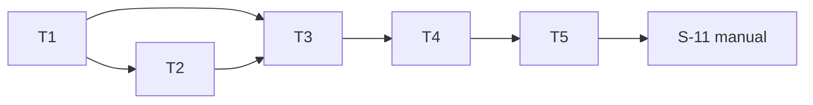

# tasks — embedding-rerank

任務依 test-file 收斂原則分組：`S-01`–`S-03` 共用 `embed_test.go`、
`S-04`–`S-06` 共用 `indexer_test.go`、`S-07`–`S-09` 共用
`retriever_test.go`——各為一個 task。

## T1 `[ ]` `S-01,S-02,S-03` [NEW] embed client 包

- 檔案：`internal/rag/embed/{embedder.go,remote.go,fixture.go}`＋
  `internal/rag/embed/embed_test.go`
- RED：`TestS01_OpenAIEmbed`（批次順序、值、key 在 header 不在 URL）＋
  `TestS02_GeminiEmbed`（同）＋`TestS03_ConstructorValidation`
  （provider 缺/非法→錯誤含 `MRI_EMBED_PROVIDER`；key 缺→錯誤含
  `MRI_RAG_EMBED_KEY`；零 HTTP 呼叫）；跑紅 → 標 `[wip]` → 引 RED 輸出
- GREEN：實作介面＋兩 remote（fake HTTP 伺服器驗證）＋fixture
  （決定性＋呼叫計數＋可注入錯誤）
- Verification command: `go test ./internal/rag/embed/ -run 'TestS01_OpenAIEmbed|TestS02_GeminiEmbed|TestS03_ConstructorValidation' -count=1 -v`

## T2 `[ ]` `S-04,S-05,S-06` [MODIFY] 索引時向量入庫

- 檔案：`internal/rag/sqlite/indexer.go`（`buildStore`，:107-128 一帶）、
  `internal/rag/sqlite/store.go`（:32-47 meta 寫入）＋
  `internal/rag/sqlite/indexer_test.go`
- 依賴 T1（fixture embedder）
- RED：`TestS04_IndexWritesEmbeddings`（3 chunk→3 列、blob 長度=dim×4、
  meta 實際值、`IndexStats.Embeddings==3`、成本 log 行）＋
  `TestS05_FlagOffIndexUnchanged`（0 列、meta 空、S-28 回歸）＋
  `TestS06_EmbedFailureLeavesStoreIntact`（既有 store sha256 前後相同）
- GREEN：批次嵌入（批 64）＋同 tx 寫入＋發佈前驗證（恰一向量/dim 一致/
  無 NaN、Inf）＋既有 `TestIndex_EmbeddingsOffByDefault` 等全數回歸
- Verification command: `go test ./internal/rag/sqlite/ -run 'TestS04_IndexWritesEmbeddings|TestS05_FlagOffIndexUnchanged|TestS06_EmbedFailureLeavesStoreIntact' -count=1 -v`

## T3 `[ ]` `S-07,S-08,S-09` [MODIFY] 查詢加寬、重排與降級

- 檔案：`internal/rag/sqlite/retriever.go`（`bm25` :108-132、`rerank`
  :146-182）＋`internal/rag/sqlite/retriever_test.go`
- 依賴 T1、T2（入庫路徑產生測試 store）
- RED：`TestS07_RerankWidensAndReorders`（12 chunk 分數嚴格相異、TopK=3、
  BM25 第 5 名餘弦最高→第 1；embed 恰 1 次；TopK=2 第 9 名>4×TopK 不得
  入選）＋`TestS08_RerankDegrades`（六列表驅動：key 缺/provider 非法/
  無向量/model 或 dim 不符含兩側值/embed 失敗 redacted/blob 損壞；
  flag-off store 列回報無向量非 mismatch）＋
  `TestS09_FlagOffRetrieveUnchanged`（TopK+1 語意、Truncated 規則、無
  降級字樣）
- GREEN：bm25 條件加寬＋rerank 重寫（單次查詢 embed→SELECT 候選向量→
  LE float32 解碼→餘弦→Score=餘弦）＋typed 降級碼；既有
  `TestRetrieve_RerankReordersWithinCandidates`、
  `TestRetrieve_NoEmbedKeyFallsBackToBM25`（key gate）、S-29 類全數回歸
- Verification command: `go test ./internal/rag/sqlite/ -run 'TestS07_RerankWidensAndReorders|TestS08_RerankDegrades|TestS09_FlagOffRetrieveUnchanged' -count=1 -v`

## T4 `[ ]` `S-10` [MODIFY] config 與生產 wiring

- 檔案：`internal/config/config.go`（`LoadForIndex` :201-214、共用
  load()）、`internal/ragwire/sqlite.go`（:14-19 注入點）與 `internal/ragwire/review_path.go`（:62 `rag.New` 一帶）＋
  `internal/ragwire/review_path_test.go`
- 依賴 T3
- RED：`TestS10_ProviderMissingDegradesThroughWiring`（flag 開、provider
  缺、store 正常→BM25 TopK、不回錯、`rag.Result.Degraded` 傳抵呼叫端
  狀態）
- GREEN：config 解析驗證（flag 開時 LoadForIndex 讀 key＋provider）＋
  ragwire 建 embedder 注入 retriever option（建構失敗轉降級原因）
- Verification command: `go test ./internal/ragwire/ -run TestS10_ProviderMissingDegradesThroughWiring -count=1 -v`

## T5 `[ ]` [INFRA] env example 與 docs

- 原因：文件工件；守門測試（envexample_test.go canonical 清單）本身即
  紅→綠，但內容為既定值謄寫、無設計判斷。
- `.env.example`＋`internal/config/envexample_test.go` canonical 清單補
  `MRI_RAG_EMBEDDINGS`、`MRI_RAG_EMBED_KEY`、`MRI_EMBED_PROVIDER`；
  `docs/{us,tw}/configuration.md` 各補三列（含資料外送揭露一句與
  「不宣稱品質提升」措辭紅線）。
- 依賴 T4（變數語意定稿）
- Verification command: `go test ./internal/config/ -run TestEnvExample -count=1 -v && grep -c MRI_EMBED_PROVIDER docs/us/configuration.md docs/tw/configuration.md`

## Manual verification checklist

- [ ] S-11：本機真 key（`MRI_RAG_EMBED_KEY`）＋`MRI_RAG_EMBEDDINGS=true`
  ＋`MRI_EMBED_PROVIDER`，重跑 `mrinspect index` 後跑
  `./bin/mrinspect eval`：Scope 行無降級字樣；改用未重建舊 store 再跑
  →出現無向量/不符降級且字樣不含 URL 或 key 片段。

## Task 依賴

## Requirements Checklist（引 design-be.md S-51 節，approval 時逐項對）

- [ ] REQ-01（T1/T4）、REQ-02（T2）、REQ-03（T3/T4）、env/docs（T5）、
  既有不變量回歸（T2/T3 GREEN 條件）
