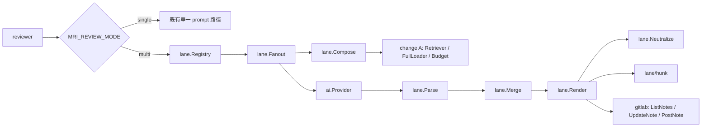
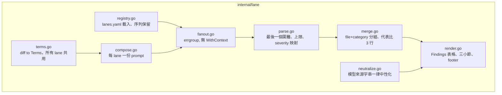
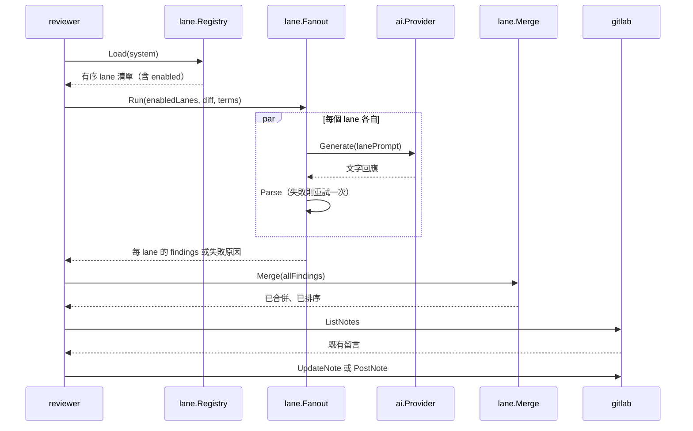

# design-be — multi-lane-review

實作 `STDD/multi-lane-review/spec.md`（status: approved，fingerprint
`01577b7d…23c8b86`）的 REQ-01 ~ REQ-08。Go only。

- **Table schema：N/A** — 本 change 不新增任何持久化資料表。狀態全部在單次執行的
  記憶體內，唯一的外部持久狀態是 MR 上那一則留言（REQ-06 的單一留言規則）。
- **`api.yml`／`design-fe.md`：N/A** — 本 change 不對外提供 HTTP 介面，只作為
  GitLab API 的用戶端。

## 本 change 在 repo 中是「第一次」做的三件事

現況調查（`internal/`、`cmd/` 全樹）確認以下三者目前皆不存在，故都屬新建而非沿用：

| 第一次 | 證據 | 影響 |
|---|---|---|
| 併發 | 全樹無 goroutine／`sync.`／`chan`／errgroup | REQ-03 的 fan-out 是本 repo 第一段併發程式碼，測試一律加 `-race` |
| 從模型回應解析 JSON | 既有 `json.Unmarshal` 只用於 GitLab／OpenAI 的 HTTP 回應與 metrics 檔 | REQ-04 的容錯解析無前例可循 |
| 測試替身 | 全樹無 `fake*`／`mock*`／`stub*` 型別，且 `internal/reviewer/` 連 `_test.go` 都沒有 | 需先建替身套件，否則每個 TDD task 都卡在同一件事上（T02） |

`golang.org/x/sync` 於 `go.mod:43` 存在但標記 `// indirect`，無任何 `.go` 檔匯入，
使用 `errgroup` 前需先提升為直接依賴（T01）。

## 兩處既有能力不足，需先補齊

### GitLab client 沒有「列出／更新留言」的能力

`internal/gitlab/client.go` 只有四個匯出方法：`GetMergeRequest`（:49）、
`GetMRChanges`（:58）、`PostNote`（:67）、`HealthCheck`（:77）。`PostNote`
（:67-75）只 POST 建立新留言，全檔無 `ListNotes`／`UpdateNote`／`EditNote`。
`internal/interfaces/interfaces.go:13,17` 的 `IGitLabClient` 同樣只有 `PostNote`。

REQ-06 的單一留言規則（S-41）因此需要：新增 `ListNotes` 與 `UpdateNote` 兩個方法、
擴充 `IGitLabClient`、並沿用既有的 `doWithRetry`（client.go:143-190，只對請求錯誤與
5xx 重試）。這是 T12，排在 T11 之前。

### diff 型別沒有 hunk／行範圍資訊

`internal/gitlab/types.go:21-32` 的 `Change` 只有 `OldPath`／`NewPath`／`Diff`／
`NewFile`／`RenamedFile`／`DeletedFile`；`Diff` 是一整串未解析的 unified diff。
S-39 要求「`line` 落在該檔案某個變更區塊的新側行號範圍內」，故需要一個把
`@@ -a,b +c,d @@` 標頭解析成新側行區間的小工具。這是 T13，排在 T08 之前。

## 與既有 retry 語意的一處差異（實作時必須明確）

`internal/reviewer/reviewer.go:195-215` 的既有重試迴圈對**AI 呼叫錯誤與驗證錯誤
一視同仁**地重試。REQ-04 的 lane 重試只針對**解析失敗**——provider 錯誤依
REQ-03／S-10 直接記為該 lane 失敗，不重試。兩者共用同一個
`AI_RETRY_ATTEMPTS`（`internal/config/config.go:152`，預設 3）但語意不同，
故 `single` 與 `multi` 兩條路徑的重試行為本就不同；此差異寫在此處，
避免實作者以為可以共用同一段迴圈。

## 套件配置

```
internal/lane/          registry.go   types.go      terms.go
                        compose.go    fanout.go     parse.go
                        merge.go      render.go     neutralize.go
internal/lane/hunk/     hunk.go                     ← unified diff 新側行區間
internal/testfake/      provider.go   gitlab.go     rag.go   ← 本 repo 第一組測試替身
internal/gitlab/        client.go（改：ListNotes / UpdateNote）
internal/interfaces/    interfaces.go（改：IGitLabClient 加兩個方法）
internal/reviewer/      reviewer.go（改：mode 分流、footer 聚合、單一留言）
internal/prompt/        composer.go（改：single 路徑維持逐位元組不變）
projects/lanes.yaml     ＋ projects/_lanes/*.tmpl.md
```

`internal/interfaces/interfaces.go` 收的是 `internal/reviewer` 跨套件依賴的
collaborator 介面（現有六個），故擴充後的 `IGitLabClient` 留在該處；
`internal/lane` 自己的型別不進 `interfaces.go`。

## Services relationship



## C3 — Component（`internal/lane` 內部）



## fan-out 的 sequence



## 實作順序的硬性依賴

1. T01 x/sync 提升、T02 測試替身 — 其後每個 TDD task 都依賴
2. T15 lanes.yaml ＋ 模板檔 → T03 registry
3. T04 terms → T05 compose（compose 也依賴 change A 的介面）
4. T06 parse → T07 merge → T13 hunk → T08 render
5. T09 fanout 依賴 T05 與 T06
6. T12 GitLab client 擴充 → T11 reviewer（S-41 需要它）
7. T10 composer 的 golden 必須在任何實作動到 `internal/prompt/` 之前擷取

## Requirements Checklist

- [ ] REQ-01 lane registry：序列保留、必填欄位、重複 id 拒絕、overlay 位置規則
- [ ] REQ-02 每 lane 一份 prompt：一 set 一次 Retrieve、空清單不檢索、full 走 FullLoader、
      檢索內容確實進入 prompt、Terms 由本 change 產生
- [ ] REQ-03 平行 fan-out：全部一起送、失敗隔離、組裝硬失敗分兩類處置
- [ ] REQ-04 輸出契約：容錯解析、上限、severity 映射、重試沿用 AI_RETRY_ATTEMPTS
- [ ] REQ-05 合併：file+category 分組、代表比 3 行、severity 取最高、六鍵全序
- [ ] REQ-06 渲染：既有結構、lane 出處、引用驗證、中性化、Verdict 含執行狀態、單一留言
- [ ] REQ-07 預設 single 且逐位元組不變、降級具名、multi 不做自我反思
- [ ] REQ-08 per-lane model 覆寫，預設沿用全域
