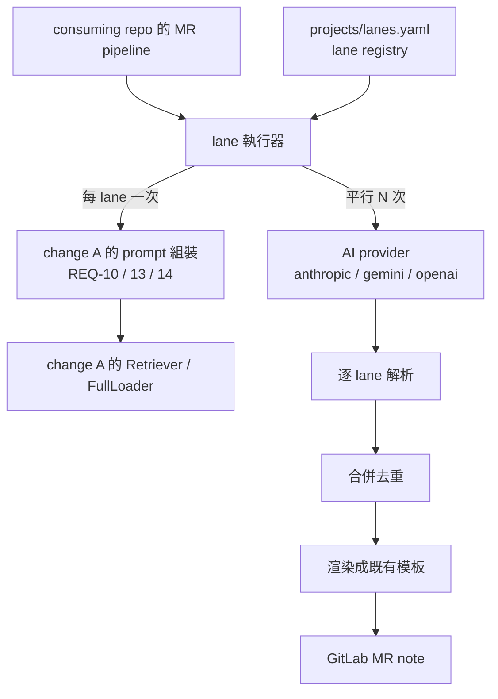

# multi-lane-review — 多 lane 分工審查與合併

## 背景與範圍

mrinspect 目前對一個 MR 只發一次 AI 呼叫（`internal/reviewer/reviewer.go:174-235`），
一份 prompt 同時要求檢查 spec、標準、程式碼與 contract，四件事都做得淺。
severity 只是 prompt 裡的 markdown 字串（`internal/prompt/composer.go:32-33,43,52,55`），
程式端不解析、不渲染，原文貼回 GitLab（`reviewer.go:256-263`）。

本 change 讓審查拆成多個專門 lane，各自取用不同的資源集、平行送出、
結果合併成一份帶等級與出處的審查。

## 與 change A 的邊界（唯一定義）

change A（`STDD/rag-resource-store/`，已核准）擁有**單一 prompt 的組裝**：
不可信文字的 nonce 界定（A/REQ-10）、`full` 集合的逐位元組注入（A/REQ-13）、
預算與整段移除（A/REQ-14），以及 `Retriever` / `FullLoader` 凍結介面（A/REQ-04）。

A 的 scenario 文字中的「lane prompt」讀作「一份組好的 prompt」——A 以單一 lane
的 fixture 即可獨立實作與驗證，B 之後供給 N 個真實 lane，不需改動 A 的程式或 spec。

**本 change 擁有**：有哪些 lane、每個 lane 取用哪些資源、平行執行、
單一 lane 的輸出契約與解析、跨 lane 合併去重、最終渲染與貼出。
**本 change 不重新定義** nonce、`full` 注入、預算與移除規則——一律呼叫 A 的實作。

## System context



## Requirements Checklist

- [ ] lane 在 config 宣告，新增第四個 lane 不需改程式碼
- [ ] lane 可組合多個資源集；空清單即為純 code-diff lane 且不呼叫檢索
- [ ] 各 lane 平行送出，且平行性可被觀察
- [ ] 單一 lane 失敗不影響其他 lane，且失敗在輸出中可見
- [ ] 每個 lane 回傳結構化輸出，解析容錯，格式錯誤可重試且不重跑檢索
- [ ] 跨 lane 重複發現被合併，嚴重度取最高，重複回報只反映在 `reportedBy`
- [ ] 輸出保留既有 Findings 表格與 High/Medium/Low 結構，並帶 lane 出處與引用
- [ ] 引用不存在的來源被標記，不被靜默採信
- [ ] 預設維持單一 prompt 行為，逐位元組相同
- [ ] 成本槓桿只做 per-lane model，預設不設即沿用全域
- [ ] 檢索到的內容確實進入該 lane 的 prompt，且 `Terms` 有明確產生者
- [ ] 模型文字無法偽造小節標題或表格列
- [ ] 引用的檔案位置經 diff 成員檢查，超出上限的回應判為失敗
- [ ] 同一個 MR 只留一則本工具的留言
- [ ] 沒有可執行的 lane 時不得貼出看似正常的空審查
- [ ] normative eviction 政策的失敗不被 lane 隔離吞掉

## REQ-01 — lane registry

lane 宣告於 `projects/lanes.yaml`，per-system 覆蓋檔為 `projects/<system>/lanes.yaml`，
依 `id` 合併。`lanes:` 為有序序列，順序即為輸出中的呈現順序（與 A 的資源集相同慣例：
序列本身即順序，不另設排序欄位）。

每個 lane 的欄位：`id`（必填、唯一）、`enabled`（必填）、`template`（必填，模板檔路徑）、
`intent`（必填，傳給 A 的 `Query.Intent`）、`resources`（必填，可為空清單）、
`topK`（選用，傳給 A 的 `Query.TopK`）、`model`（選用，見 REQ-08）。

`resources` 以 `sets:`（依名稱）與 `tags:`（依標籤）引用 A 宣告的資源集，兩者聯集。
**空的 `resources` 是合法且一等的情形**：該 lane 不做任何檢索，只看 diff。

### S-01 三個預設 lane 依宣告順序載入

- GIVEN `projects/lanes.yaml` 依序宣告 `spec-conformance`、`standards`、`code-diff`
- WHEN 載入 lane registry
- THEN 回傳三個 lane，順序嚴格為宣告順序，各欄位與檔案內容一致

Test mapping: `internal/lane/registry_test.go::TestLoad_PreservesDeclarationOrder`
Verification command: `go test ./internal/lane/ -run TestLoad_PreservesDeclarationOrder -count=5`

### S-02 新增第四個 lane 不需改動程式碼

- GIVEN 一份在既有三個 lane 之後新增第四個 lane 的 `lanes.yaml`
- WHEN 載入並執行
- THEN 四個 lane 都被執行且各自產出結果

Test mapping: `internal/lane/registry_test.go::TestLoad_FourthLaneNeedsNoCodeChange`
（「程式碼中不得有 lane id 分支」是一條 CI lint，不是 Go 測試，故獨立為 S-45——
把兩種驗證綁在同一個 scenario 會使其中一種永遠沒有明確的失敗定義）
Verification command: `go test ./internal/lane/ -run TestLoad_FourthLaneNeedsNoCodeChange -count=1`

### S-03 缺少必填欄位或重複 id 一律拒絕載入

- GIVEN 三份宣告：某 lane 缺 `enabled`；兩個 lane 使用相同 `id`；一份齊備的宣告
- WHEN 載入
- THEN 前兩者各回報具名的設定錯誤（不得把缺漏的 `enabled` 預設為 true 或 false），
  第三者成功

Test mapping: `internal/lane/registry_test.go::TestLoad_RejectsMissingFieldsAndDuplicateIDs`
Verification command: `go test ./internal/lane/ -run TestLoad_RejectsMissingFieldsAndDuplicateIDs -count=1`

### S-04 per-system 覆蓋依 id 合併且保留原序列位置

- GIVEN canonical 依序宣告 `a`、`b`、`c`
- AND `projects/margherita-pizza/lanes.yaml` 覆蓋 `b` 的 `template` 並新增 `d`
- WHEN 以該 system 載入
- THEN 順序為 `a`、`b`、`c`、`d`：`b` 保留原位置且套用新 `template`，
  新增的 `d` 接在 canonical 序列尾端

Test mapping: `internal/lane/registry_test.go::TestLoad_OverlayKeepsPositionAndAppendsNew`
Verification command: `go test ./internal/lane/ -run TestLoad_OverlayKeepsPositionAndAppendsNew -count=1`

## REQ-02 — 每個 lane 的 prompt 組裝

每個 lane 各自組一份 prompt：lane 的 `template` + MR metadata + 完整 diff
+ 該 lane 的資源內容。資源內容一律經由 change A 取得——`mode: full` 的集合走
`FullLoader`，`mode: retrieval` 的集合每個 set 各發一次 `Retrieve`（A/REQ-04 的
單一 `SetRef` 語意），並把 lane 的 `intent` 填入 `Query.Intent`。

**`Query.Terms` 由本 change 建立**（A 定義其語意為「由 diff 萃取的關鍵詞」但不產生它）：
自本次 MR 的 diff 萃取——變更檔案的路徑片段與副檔名、以及新增/刪除行中的識別字
（camelCase 與 snake_case 各自再拆出子詞），去除停用詞後取前 40 個。所有 lane 共用
同一組 `Terms`（`Terms` 來自 diff，與 lane 無關；lane 的差異表現在 `Intent` 與
`resources`）。`Terms` 為空時仍照常呼叫 `Retrieve`，由 A 決定如何回應。

nonce 界定、`full` 逐位元組注入、預算與整段移除全部由 A 的實作負責，本 change 不重寫。

### S-05 lane 依其 resources 對每個 set 各發一次 Retrieve

- GIVEN 某 lane 的 `resources.sets` 為 `[internal-specs, tech-docs]`（皆 `retrieval`）
- WHEN 組該 lane 的 prompt
- THEN `Retrieve` 恰被呼叫兩次，`SetRef` 分別為兩者，且兩次的 `Intent`
  皆等於該 lane 宣告的 `intent`

Test mapping: `internal/lane/compose_test.go::TestCompose_OneRetrievePerSet`
Verification command: `go test ./internal/lane/ -run TestCompose_OneRetrievePerSet -count=1`

### S-06 空 resources 的 lane 完全不呼叫檢索

- GIVEN 某 lane 的 `resources` 為空清單
- AND 注入的 `Retriever` 與 `FullLoader` 皆為記錄呼叫次數的 spy
- WHEN 組該 lane 的 prompt
- THEN 兩個 spy 的呼叫次數皆為 0，prompt 仍成功組出且含 diff
- AND 即使完全沒有可用的 store，該 lane 仍正常完成

Test mapping: `internal/lane/compose_test.go::TestCompose_EmptyResourcesSkipsRetrieval`
Verification command: `go test ./internal/lane/ -run TestCompose_EmptyResourcesSkipsRetrieval -count=1`

### S-07 full 集合走 FullLoader 而非 Retrieve

- GIVEN 某 lane 的 `resources.sets` 同時含一個 `mode: full` 與一個 `mode: retrieval` 集合
- WHEN 組該 lane 的 prompt
- THEN `FullLoader.LoadFull` 以該 `full` 集合被呼叫一次，
  `Retrieve` 只以該 `retrieval` 集合被呼叫一次，
  且不曾以 `full` 集合的名稱呼叫 `Retrieve`（A/REQ-04 對此會回 error）

Test mapping: `internal/lane/compose_test.go::TestCompose_FullSetsUseFullLoader`
Verification command: `go test ./internal/lane/ -run TestCompose_FullSetsUseFullLoader -count=1`

## REQ-03 — 平行執行與部分失敗

啟用的 lane 一律全部平行送出（實務規模為 3–4 個 lane，另設並行度上限只會是一個
永遠不綁定的旋鈕）。使用 `errgroup.Group`，**不使用 `WithContext`**——首個錯誤取消其餘 lane 與必須的部分失敗政策相反
（`golang.org/x/sync` 已在模組圖中，`go.mod:43`）。lane 函式一律回傳 nil，
失敗以結果值表達。

每個 lane 有獨立逾時。任一 lane 失敗（逾時、provider 錯誤、解析失敗達重試上限、
或 change A 組裝階段的硬失敗）不影響其他 lane，該 lane 在輸出中標記為失敗並具名原因。

**一個例外，不得被 lane 隔離吞掉**：change A 的 `MRI_RAG_ON_NORMATIVE_EVICTION=fail`
是操作者明示的「沒有規範就不要審」政策（A/REQ-14 第 3 種硬失敗）。任一 lane 因該政策
而失敗時，**整體審查必須可見地失敗**，不得只當成一列失敗紀錄然後照常貼出其他 lane
的結果——否則 A/S-64 的不變式（審查絕不在規範一段都沒進去的狀態下呈現為正常完成）
會被本 REQ 的隔離政策繞過。其餘所有失敗類型維持隔離。

### S-08 所有 lane 同時在飛

- GIVEN 三個啟用的 lane
- AND provider 測試替身在收到呼叫時先登記、待三個呼叫都登記後才一起放行
- WHEN 執行 fan-out
- THEN 三個呼叫都成功放行並完成（循序實作會在第一個呼叫上死結而使本條逾時失敗）

Test mapping: `internal/lane/fanout_test.go::TestFanout_AllLanesInFlightConcurrently`
（以 barrier 而非計時斷言並行，避免時間相關的不穩定）
Verification command: `go test ./internal/lane/ -run TestFanout_AllLanesInFlightConcurrently -count=1 -race -timeout 30s`

### S-10 單一 lane 失敗不影響其他 lane

- GIVEN 三個啟用的 lane，其中第二個的 provider 替身回傳錯誤
- WHEN 執行 fan-out
- THEN 第一與第三個 lane 的發現照常進入合併，
  第二個 lane 在結果中標記為失敗並具名錯誤原因，整體不回傳錯誤

Test mapping: `internal/lane/fanout_test.go::TestFanout_OneLaneFailureDoesNotAbortOthers`
Verification command: `go test ./internal/lane/ -run TestFanout_OneLaneFailureDoesNotAbortOthers -count=1 -race`

### S-12 全部 lane 都失敗時仍貼出可見的失敗說明

- GIVEN 所有啟用的 lane 的 provider 替身都回傳錯誤
- WHEN 執行完整流程
- THEN 貼出的留言明確說明所有 lane 都失敗與各自原因，
  **不得**貼出一份看起來正常但沒有任何發現的審查

Test mapping: `internal/reviewer/reviewer_test.go::TestRun_AllLanesFailedIsVisible`
Verification command: `go test ./internal/reviewer/ -run TestRun_AllLanesFailedIsVisible -count=1`

## REQ-04 — 單一 lane 的輸出契約與解析

每個 lane 被要求回傳單一 JSON 區塊。必填：`laneId`、`findings`（可為空陣列）；
每個 finding 必填 `title`、`severity`（`high`/`medium`/`low`）、`rationale`。
選用：`file`、`line`、`endLine`、`category`、`suggestion`、`citations`、
`summary`、`positives`、`notes`。

`category` 的值域限定為 `correctness`、`concurrency`、`security`、`performance`、
`testing`、`error-handling`、`maintainability`、`style`、`other`；解析時 trim＋
轉小寫後查表，非空但不在清單內的值一律映為 `other`，空值保持空
（2026-09-01 修訂，見 Adjudications）。

**契約中沒有 `confidence`**：那是模型自報、無法驗證的分數，而 REQ-06 的渲染從頭到尾
不輸出它——一個沒有讀者的數字。「跨 lane 一致代表更可信」由 `reportedBy` 列出多個
lane id 直接呈現，不需要浮點數。

解析採容錯順序，**位置優先於型別**：取回應中**最後一個**成對圍籬（不論是否標註
`json`）；其內容不是合法 JSON 時，退為花括號配對掃描取最後一段；再退為全文。

刻意不以圍籬型別分層（先找 ```json 再找無標註）：重試會回帶前一次的錯誤輸出，
若舊輸出是 ```json 而新答案是無標註圍籬，型別優先會解析到被回帶的舊錯誤——
正是 S-43 要防的失敗。解析後正規化：`severity` 轉小寫後必須落在 `high`/`medium`/`low`，
**落在列舉外的值（如 `critical`、`info`、空字串）一律映射到 `medium` 並計數回報**——
直接丟棄會讓模型常用的 `critical` 靜默消失，而 REQ-06 只渲染三個小節。
`line` 接受數字字串；缺 `title` 或 `rationale` 的 finding 丟棄並計數。

格式錯誤時該 lane 重試，次數沿用既有的 `AI_RETRY_ATTEMPTS`（預設 3，
`internal/config/config.go:152`，消費點 `internal/reviewer/reviewer.go:195`）——
本 change **不另設** retry 旋鈕，也不硬寫次數，否則 multi 模式會忽略操作者已有的設定。
**重試只重發 AI 呼叫，不重跑檢索**（沿用 `reviewer.go:195-215` 與 `:297-303` 的
追加提示形態）。

重試提示會回帶前一次的錯誤輸出，因此回應中可能出現多個 ```圍籬——萃取一律取
**最後一個**符合的圍籬，否則會解析到被回帶的舊錯誤內容。

**回應的硬性上限**（模型輸出是不可信輸入，`Provider.Generate` 回傳無界字串，
`internal/ai/provider.go:19`），預設值在此明定，皆可設定：

| 上限 | 預設 | 超限處置 |
|---|---|---|
| 回應位元組數 | 256 KiB | 該 lane 判為解析失敗 |
| findings 筆數 | 50 | 該 lane 判為解析失敗 |
| JSON 巢狀深度 | 16 | 該 lane 判為解析失敗 |
| 單一欄位字元數 | 4000 | **只截斷該欄位**並具名計數，其餘照常採用 |

前三項是結構性的，無法只丟一部分；第四項不是——一個過長的 `suggestion` 不該讓整個
lane 的其他有效發現一起消失（那會讓「誘使模型輸出一個超長欄位」成為抹除該 lane
覆蓋範圍的手段）。預設值必須寫在程式的具名常數中，測試 fixture 以那些常數為準
建構邊界案例。

選擇提示式 JSON 而非 provider 原生 structured output：`Provider.Generate` 回傳純字串
（`internal/ai/provider.go:19`），三家 provider 送上線的方式各不相同
（`anthropic.go:36-42`、`gemini.go:45-48`、`openai.go:17,44-48`），原生 schema 會在
最脆弱處增加六個接觸點。

### S-13 從雜訊中萃取出 JSON 區塊

- GIVEN 四種回應：純 JSON；前後包散文的 ```json 圍籬；無語言標註但以 `{` 開頭的圍籬；
  以及散文中直接嵌一段花括號 JSON
- WHEN 解析
- THEN 四種都取出同一組 findings

Test mapping: `internal/lane/parse_test.go::TestParse_ExtractsJSONFromNoise`
Verification command: `go test ./internal/lane/ -run TestParse_ExtractsJSONFromNoise -count=1`

### S-14 正規化與丟棄不完整的 finding

- GIVEN 一份回應含：`severity` 為 `HIGH`、`line` 為字串 `"42"`、且帶一個契約未定義的
  `confidence` 欄位的 finding，以及一個缺 `rationale` 的 finding
- WHEN 解析
- THEN 前者被保留且 `severity` 為 `high`、`line` 為數字 42，
  契約未定義的欄位被忽略且不出現在解析結果的任何欄位中；
  後者被丟棄且丟棄數為 1（丟棄數必須可觀察，不得靜默）

Test mapping: `internal/lane/parse_test.go::TestParse_NormalizesAndCountsDropped`
Verification command: `go test ./internal/lane/ -run TestParse_NormalizesAndCountsDropped -count=1`

### S-15 格式錯誤重試一次且不重跑檢索

- GIVEN 某 lane 的 provider 替身第一次回傳無法解析的內容、第二次回傳合法 JSON
- AND `Retriever` 為記錄呼叫次數的 spy
- WHEN 執行該 lane
- THEN 該 lane 成功產出 findings；`Provider.Generate` 被呼叫兩次；
  `Retrieve` 的呼叫次數與只跑一次時完全相同（重試重跑檢索的實作會使本條失敗）

Test mapping: `internal/lane/parse_test.go::TestParse_RetryReusesRetrieval`
Verification command: `go test ./internal/lane/ -run TestParse_RetryReusesRetrieval -count=1`

### S-16 重試上限後標記該 lane 失敗

- GIVEN `AI_RETRY_ATTEMPTS` 分別設為 2 與 3，某 lane 的 provider 替身每次都回傳
  無法解析的內容
- WHEN 執行該 lane
- THEN `Provider.Generate` 的呼叫次數恰等於 `AI_RETRY_ATTEMPTS` 的設定值
  （測試分別以 2 與 3 執行，斷言次數隨設定改變；硬寫 2 的實作會在設定為 3 時失敗），
  該 lane 標記為解析失敗並具名，其他 lane 不受影響

Test mapping: `internal/lane/parse_test.go::TestParse_GivesUpAtConfiguredAttempts`
Verification command: `go test ./internal/lane/ -run TestParse_GivesUpAtConfiguredAttempts -count=1`

## REQ-05 — 跨 lane 合併與去重

分兩步，不用 union-find：

**第一步，精確分組**（map 鍵，皆為相等比較）：
1. **正規化後的 `file`**：去除前導 `./`、去除 diff 的 `a/` 與 `b/` 前綴、
   統一為 repo 根相對路徑、大小寫**不**折疊（Linux 檔名區分大小寫）
2. **`category`**：使用解析層正規化後的值（見 REQ-04 值域）；`other` 與空字串**不參與分組**，各自獨立成群——未知類別彼此無語意關聯，誤併會吞掉其中一筆發現（2026-09-01 修訂）

**第二步，組內依行距歸併**：把組內發現依 `line` 由小到大排序，逐一比對——
與**該群目前代表**的 `line` 相差 ≤ 3 則併入該群，否則自成新群。

刻意不用行號桶（`line/4`）：桶會讓合併距離隨位置改變——行 3 與行 5 相差 2 卻落在
不同桶而不合併，行 4 與行 7 相差 3 卻同桶而合併。以代表比距離則距離恆為 ≤3，
與 S-17／S-18 的斷言一致，且因為只跟代表比（不是傳遞比對），
不會出現 10/13/16/19 串成一群、跨度 9 的情形。

無 `line` 的發現**不參與合併**，各自成群（原本的 `title` Jaccard fallback 已移除：
繁中標題以空白切詞會退化成單一 token，相似度非 0 即 1，形同沒有規則）。

群內代表依 lane 宣告順序取第一個，其 `title`/`rationale`/`file`/`line`/`category`
全部取自該代表；其餘 lane 只貢獻 `reportedBy` 與 `citations`。

`reportedBy` 是**事實紀錄**（哪些 lane 回報了這一筆），不是可信度背書：各 lane 讀的是
同一份 diff，輸入並不獨立，同一段被注入的內容可以同時誘發多個 lane 回報相同的錯誤
結論。渲染時不得把多個 lane 描述成「已交叉驗證」或提高其呈現權重。

嚴重度調和：取群內最高者（`high` > `medium` > `low`）。跨 lane 一致**不**提升嚴重度——
兩個 lane 都說 low 不會變成 medium；一致代表更可信，而「更可信」由 `reportedBy`
列出多個 lane 呈現，不另設分數。

排序鍵依序為：`severity`（high→low）、代表 lane 的宣告序位、`file`（位元組序）、
`line`（缺漏時視為 -1，排在所有有行號者之前）、`title`（位元組序）、
`category`（位元組序）。六個鍵構成**全序**——`category` 是合併鍵卻不是排序鍵時，
兩筆只差 `category` 的發現會在前五鍵全部相同，排序即非全序。

**與 REQ-01 呈現順序的關係**：REQ-01 的 lane 宣告順序決定的是「失敗 lane 清單」
與同嚴重度發現之間的先後，**不是**發現的第一排序鍵——發現一律先依嚴重度分組
（REQ-06 的三個小節），lane 順序只在組內生效。

### S-17 同一問題被兩個 lane 回報時合併為一筆

- GIVEN lane A 與 lane B 各回報同一 `file`、行號相差 2、同 `category` 的發現
- WHEN 合併
- THEN 結果為一筆，其 `reportedBy` 含兩個 lane 的 id
  （不去重的實作會產出兩筆而使本條失敗）

Test mapping: `internal/lane/merge_test.go::TestMerge_DeduplicatesAcrossLanes`
Verification command: `go test ./internal/lane/ -run TestMerge_DeduplicatesAcrossLanes -count=1`

### S-18 行號相差超過區間則不合併

- GIVEN 兩個 lane 回報同 `file`、同 `category`，但行號相差 9 的發現
- WHEN 合併
- THEN 結果為兩筆（把所有同檔案發現都併掉的實作會使本條失敗）

Test mapping: `internal/lane/merge_test.go::TestMerge_KeepsDistantFindingsSeparate`
Verification command: `go test ./internal/lane/ -run TestMerge_KeepsDistantFindingsSeparate -count=1`

### S-19 嚴重度取最高而非第一個

- GIVEN 同一問題由 lane A 回報為 `low`、由排序在後的 lane B 回報為 `high`
- WHEN 合併
- THEN 合併後為 `high`（取第一個 lane 的值的實作會得到 `low` 而使本條失敗）

Test mapping: `internal/lane/merge_test.go::TestMerge_SeverityTakesMaximum`
Verification command: `go test ./internal/lane/ -run TestMerge_SeverityTakesMaximum -count=1`

### S-21 相同輸入產生逐位元組相同的輸出

- GIVEN 一組固定的 lane 結果
- WHEN 連續合併並渲染五次
- THEN 五次的輸出字串完全相同（以 map 迭代決定順序的實作會間歇失敗）

Test mapping: `internal/lane/merge_test.go::TestMerge_OutputIsDeterministic`
Verification command: `go test ./internal/lane/ -run TestMerge_OutputIsDeterministic -count=5 -race`

## REQ-06 — 渲染、出處與引用

渲染由程式負責，不再要求模型輸出成品 markdown。輸出保留既有結構：Findings 表格
（`composer.go:32-33`）、`#### High` / `#### Medium` / `#### Low` 三個小節
（`composer.go:43,52,55`），以及 `ValidateReviewContent`（`validator.go:149-163`）
實際檢查的 `##` 與 `Verdict` 兩個子字串。

`Verdict` 的來源在此定義（模型不再自行輸出成品），**同時取決於發現與執行狀態**：

1. 有任何 lane 失敗、或沒有任何可執行的 lane、或整體可見地失敗 → `Incomplete`
2. 否則有 `high` → `Needs changes`
3. 否則有 `medium` → `Comments`
4. 否則（只有 `low` 或零發現，且所有 lane 都成功）→ `Approved`

第 1 條優先於其餘各條，且不可省略：只看發現數會讓「所有 lane 都失敗」與
「乾淨的程式碼」都算出零發現而印出 `Approved`——那正是 S-12、S-34、S-37 要防的
「看起來正常的審查」。

`Scope` 一節列出本次執行的 lane、各自涵蓋的資源集，以及失敗的 lane 與原因。

**footer 聚合**：change A 的 S-33 與 S-62 要求貼出的字串含 store 出處、被移除的區段、
`Degraded` 條目數與跳過檔數。multi 模式有 N 份組裝，本 change 定義聚合方式為：
被移除區段取所有 lane 的**聯集**並各自標註是哪個 lane 移除的；`Degraded` 條目與
跳過檔數取**總和**並標註涉及的 lane 數；store 出處只出現一次（所有 lane 共用同一個
store）。四項都不得只顯示其中一個 lane 的而隱藏其餘。

**模型產生的文字在渲染前一律中性化**：規則是**允許清單**而非欄位列舉——
凡是值來自模型回應的字串，渲染前一律中性化，包含但不限於 `title`、`rationale`、
`suggestion`、`category`、`citations[].sourceId`、`citations[].label` 與失敗原因。
列舉欄位會漏掉新增的欄位：`sourceId` 即為實例——S-24 要求未匹配的 `sourceId`
仍然渲染，若它不在中性化範圍內，注入即可繞過本規則。

`laneId` **不取自模型回應**，一律取自 registry 中該次派工的 lane id
（模型回傳的 `laneId` 僅用於比對，不一致即記為解析失敗）。

渲染前必須逐欄位處理：
移除換行（改為空白）、跳脫 markdown 表格分隔字元 `|`、使任何行首的 `#` 無法形成標題。
既有的 `SanitizeInput` 只處理 `<`/`>`（`internal/validator/validator.go:167-170`），
不足以防止偽造 `#### High` 小節或多插入表格列——而偽造表格列正好會讓 S-22 的
「表格列數等於發現數」失效。

每筆發現標示回報的 lane；有引用時標示來源檔案與位置（來自 A 的 `Chunk.Source`、
`Heading`、`StartLine`）。引用的 `sourceId` 若不在該 lane 實際收到的 chunk 之中，
保留該發現但標記為 `unverified`。

**誠實界定 `unverified` 的能力範圍**：它證明的是「這個 sourceId 曾被送給該 lane」，
不是「該來源支持這個論點」。模型把一個真實收到的 `sourceId` 貼到不相干的結論上，
本檢查無法察覺。這是已知限制，不假裝是完整的引用驗證。

**同一個 MR 只留一則本工具產生的留言**：留言帶固定的識別標記；貼出前先查詢既有留言，
有標記**且作者為本 token 對應的使用者**者更新其內容，沒有才新增。
作者綁定是必要的：只比對標記的話，MR 上任何人都能預先貼一則含該標記的誘餌留言，
使本工具去更新別人的留言。

**這需要擴充既有的 GitLab client 介面**：`internal/interfaces/interfaces.go:13,17`
目前只有 `PostNote`，沒有列出留言與更新留言的能力，故本 change 需為該介面新增
「列出本 MR 的留言」與「更新指定留言」兩個方法並實作之。

**並行執行的已知限制**（明文記載而非假裝解決）：同一個 MR 的兩條 pipeline 同時執行時，
兩者可能都觀察到「沒有已標記的留言」而各自新增一則。GitLab 沒有提供留言層級的
條件式更新，故此處不做分散式鎖；重跑造成的重複是本規則要防的主要情形，
而真正的同時競態留為已知限制。

### S-22 輸出保留既有 Findings 表格與三個小節

- GIVEN 一組已合併的發現，三種 severity 各至少一筆
- WHEN 渲染
- THEN 輸出含 Findings 表格與 `#### High`、`#### Medium`、`#### Low` 三個小節標題，
  且通過既有的 `ValidateReviewContent`
- AND 每一筆發現的標題出現在**與其 severity 相符的那個小節之內**，
  且 Findings 表格的列數等於發現總數
  （只印出三個空標題、把發現全丟掉的實作會使本條失敗）

Test mapping: `internal/lane/render_test.go::TestRender_PreservesExistingStructure`
Verification command: `go test ./internal/lane/ -run TestRender_PreservesExistingStructure -count=1`

### S-23 每筆發現標示 lane 與引用位置

- GIVEN 一筆由 `standards` lane 回報、引用某 chunk 的發現
- WHEN 渲染
- THEN 該筆輸出同時含 lane id 與該 chunk 的來源檔案與行號
- AND 另一筆引用 `StartLine` 為 0 的 chunk 的發現，其輸出只含檔名而**不含** `:0`
  （固定串接 `fmt.Sprintf("%s:%d", src, line)` 的實作會印出 `:0` 而使本條失敗）

Test mapping: `internal/lane/render_test.go::TestRender_ShowsLaneAndCitation`
Verification command: `go test ./internal/lane/ -run TestRender_ShowsLaneAndCitation -count=1`

### S-24 引用不存在的來源被標記為 unverified

- GIVEN 某 lane 回傳的發現引用了一個不在該 lane 收到的 chunk 之中的 `sourceId`
- WHEN 渲染
- THEN 該發現仍出現，但標記為 `unverified`
  （不做比對的實作會不標記而使本條失敗）

Test mapping: `internal/lane/render_test.go::TestRender_FlagsUnverifiedCitation`
Verification command: `go test ./internal/lane/ -run TestRender_FlagsUnverifiedCitation -count=1`

### S-25 失敗的 lane 在輸出中可見

- GIVEN 三個 lane，其中一個失敗
- WHEN 渲染
- THEN 輸出含一節列出失敗的 lane 與原因；不得只在 log 出現

Test mapping: `internal/lane/render_test.go::TestRender_ListsFailedLanes`
Verification command: `go test ./internal/lane/ -run TestRender_ListsFailedLanes -count=1`

## REQ-07 — 預設維持現況與模式切換

`MRI_REVIEW_MODE` 預設 `single`，此時行為與本 change 落地前**逐位元組相同**。
設為 `multi` 才走多 lane。`lanes.yaml` 不存在或無法載入時，自動降級為 `single`
並具名回報。

**降級不得走 `reviewer.go:187-191` 現有的那條路**：change A 的 S-64 明文要求移除
「組裝失敗即靜默改用不含資源的 legacy 模板」這條路徑。本 change 的降級是
**設定層的**（沒有 lane 設定 → 用單一 prompt 模式），與 A 禁止的
「組裝失敗 → 悄悄換模板」是兩件事，實作上必須是兩條分開的判斷，且降級一律具名回報。

自我反思（`reviewer.go:237-254`）只保留在 `single` 路徑。`multi` 路徑不做自我反思：
lane 專門化與跨 lane 佐證已涵蓋其目的，而對已渲染的 markdown 反推結構化發現不可靠。

### S-26 預設模式下 prompt 與落地前逐位元組相同

- GIVEN golden 檔已在本 change 任何程式碼落地**之前**、自當前 HEAD 產生並提交
- AND 未設定 `MRI_REVIEW_MODE`
- WHEN 組出 prompt
- THEN 與該 golden 逐位元組相同

Test mapping: `internal/prompt/composer_test.go::TestCompose_SingleModeUnchanged`
（golden 位於 `internal/prompt/testdata/golden-prompt-pre-lanes.txt`，必須是實作前擷取的；
實作後才擷取的 golden 從未紅過，等於零證據）
Verification command: `go test ./internal/prompt/ -run TestCompose_SingleModeUnchanged -count=1`

### S-27 lanes.yaml 缺失時降級為 single 並回報

- GIVEN `MRI_REVIEW_MODE=multi` 但 `projects/lanes.yaml` 不存在
- WHEN 執行審查
- THEN 以 `single` 路徑完成審查，且輸出具名說明已降級與原因；不得失敗

Test mapping: `internal/reviewer/reviewer_test.go::TestRun_MissingLaneConfigFallsBackToSingle`
Verification command: `go test ./internal/reviewer/ -run TestRun_MissingLaneConfigFallsBackToSingle -count=1`

### S-28 multi 模式不執行自我反思

- GIVEN `MRI_REVIEW_MODE=multi`、`IS_SELF_REFLECTION=true`，provider 為記錄呼叫的 spy
- WHEN 執行審查
- THEN `Provider.Generate` 的呼叫次數等於啟用的 lane 數，不多一次反思呼叫
- AND 同樣設定但 `MRI_REVIEW_MODE=single` 時，反思呼叫照常發生

Test mapping: `internal/reviewer/reviewer_test.go::TestRun_SelfReflectionOnlyInSingleMode`
Verification command: `go test ./internal/reviewer/ -run TestRun_SelfReflectionOnlyInSingleMode -count=1`

## REQ-08 — 成本槓桿：實作完成、預設關閉

本 change 只做 `model`（per-lane 覆寫，經 `GenerateOptions.Model`）一項槓桿，
預設不設即沿用全域 model。

**刻意不做 `diffScope`**（per-lane 限定看到的 diff 檔案）：三項槓桿中只有它是真機械
（glob 比對 + diff 切片 + 與組裝耦合），而本 spec 自承沒有任何量測。在量測之前先建
一個「讓審查少看檔案」的開關，方向上是增加漏審風險的那一側。`enabled` 本來就是
REQ-01 的必填欄位，不屬本 REQ。

N 個 lane 約為現況 N 倍的 token 量。本 spec 不給預估數字——repo 內沒有任何量測。
先以既有的 `logger.LogAPICall` seam（`internal/ai/anthropic.go:46,50`）量測，再調整設定。

### S-30 per-lane model 覆寫只影響該 lane

- GIVEN 三個 lane，其中一個宣告了與全域不同的 `model`
- WHEN 執行 fan-out
- THEN 該 lane 的 `GenerateOptions.Model` 為其宣告值，另外兩個維持全域值

Test mapping: `internal/lane/fanout_test.go::TestFanout_PerLaneModelOverride`
Verification command: `go test ./internal/lane/ -run TestFanout_PerLaneModelOverride -count=1`

### S-32 停用的 lane 完全不執行

- GIVEN 三個 lane，其中一個 `enabled: false`
- WHEN 執行 fan-out
- THEN provider 恰被呼叫兩次，停用的 lane 既不出現在結果也不出現在失敗清單

Test mapping: `internal/lane/fanout_test.go::TestFanout_DisabledLaneNotExecuted`
Verification command: `go test ./internal/lane/ -run TestFanout_DisabledLaneNotExecuted -count=1`

### S-33 change A 的組裝硬失敗使該 lane 失敗，其餘照常

- GIVEN 三個 lane，其中一個因該次 MR 的 diff 過大而在 change A 的預算階段硬失敗
  （change A 的第一種硬失敗，屬該次執行的資料條件）
- WHEN 執行 fan-out
- THEN 該 lane 未呼叫 provider，在失敗清單中具名為組裝失敗；
  另外兩個 lane 正常完成並進入合併
- AND 若失敗原因是「宣告的 model 不在上限表內」（change A 的第二種硬失敗），
  **整體在 fan-out 開始前即可見地失敗**，不逐 lane 隔離——那是設定錯誤而非資料條件，
  隔離它等於讓一個打錯字的 model 名稱靜默縮減審查範圍

Test mapping: `internal/lane/fanout_test.go::TestFanout_ComposeHardFailureIsolated`
Verification command: `go test ./internal/lane/ -run TestFanout_ComposeHardFailureIsolated -count=1`

### S-34 normative eviction 政策失敗使整體可見地失敗

- GIVEN `MRI_RAG_ON_NORMATIVE_EVICTION=fail`，三個 lane 中某一個因該政策而組裝失敗
- WHEN 執行完整流程
- THEN 整體審查可見地失敗，**不得**貼出一份含另外兩個 lane 結果、看起來正常的審查
- AND 同樣情境但該環境變數為 `warn` 時，該 lane 只列入失敗清單，其餘照常貼出

Test mapping: `internal/reviewer/reviewer_test.go::TestRun_NormativeEvictionFailIsNotSwallowed`
（本條是 change A 的 S-64 不變式在 multi 路徑的延伸；沒有它，B 的 lane 隔離政策
會把 A 明示的「沒有規範就不要審」繞過）
Verification command: `go test ./internal/reviewer/ -run TestRun_NormativeEvictionFailIsNotSwallowed -count=1`

### S-35 檢索到的內容確實出現在該 lane 的 prompt 中

- GIVEN 某 lane 的資源集含一段可辨識的獨特字串
- AND `Retriever` 替身回傳含該字串的 chunk
- WHEN 組該 lane 的 prompt
- THEN 該字串出現在組出的 prompt 中，且出現在 change A 的界定區塊之內
- AND 另一個未引用該資源集的 lane，其 prompt 中不含該字串

Test mapping: `internal/lane/compose_test.go::TestCompose_RetrievedContentReachesPrompt`
（本條是整份 spec 的地基：S-05/S-06/S-07 只斷言呼叫次數與參數，
`res, _ := ret.Retrieve(ctx, q); _ = res` 這種丟棄結果的實作可以通過那三條）
Verification command: `go test ./internal/lane/ -run TestCompose_RetrievedContentReachesPrompt -count=1`

### S-36 Terms 自 diff 萃取且非空

- GIVEN 一份含 `internal/service/batch.go` 且新增行含識別字 `beginTransaction` 的 diff
- WHEN 建立 `Query.Terms`
- THEN `Terms` 非空，且同時含路徑衍生詞（如 `batch`、`service`、`go`）
  與識別字衍生詞（如 `begin`、`transaction`）
- AND 所有 lane 收到的 `Terms` 相同

Test mapping: `internal/lane/terms_test.go::TestTerms_ExtractedFromDiff`
（`Terms: nil` 會使 BM25 回傳空結果，而本 change 若不指派 Terms 的所有權，
沒有任何 scenario 會紅）
Verification command: `go test ./internal/lane/ -run TestTerms_ExtractedFromDiff -count=1`

### S-37 沒有任何可執行的 lane 時不得貼出空審查

- GIVEN `lanes.yaml` 存在，但所有 lane 皆 `enabled: false`
- WHEN 執行審查
- THEN 明確回報沒有可執行的 lane 並降級為 `single` 模式完成審查
- AND **不得**貼出一份零發現、零失敗、看起來正常的審查
  （既有的 `ValidateReviewContent` 只檢查長度與三個子字串，擋不住這種空殼）

Test mapping: `internal/reviewer/reviewer_test.go::TestRun_NoExecutableLanesDoesNotPostEmptyReview`
Verification command: `go test ./internal/reviewer/ -run TestRun_NoExecutableLanesDoesNotPostEmptyReview -count=1`

### S-38 模型文字無法偽造小節標題或表格列

- GIVEN 某 finding 的 `title` 為 `x |\n#### High\n偽造的發現`，
  `rationale` 內含換行與 `|`，且另一筆 finding 的 `citations[].sourceId` 為
  `a |\n#### High\n偽造`（該 sourceId 未匹配，依 S-24 仍會被渲染）
- WHEN 渲染
- THEN 輸出中該 title 佔**一列**，其中的 `|` 已被跳脫、換行已被移除，
  且未產生第二個 `#### High` 小節
- AND 渲染後 `#### High` 的出現次數恰為 1，Findings 表格列數恰等於發現數

Test mapping: `internal/lane/render_test.go::TestRender_NeutralizesModelMarkdown`
Verification command: `go test ./internal/lane/ -run TestRender_NeutralizesModelMarkdown -count=1`

### S-39 引用的檔案與行號必須落在本次 diff 內

- GIVEN 四筆 finding：`file` 為不在本次 diff 中的 `.gitlab-ci.yml`；`file` 含 `../`；
  `file` 確實在 diff 中但 `line` 為 999999（該檔案實際只改到第 10 行）；
  以及一筆檔案與行號都落在變更區塊內的
- WHEN 渲染
- THEN 前三筆標記為位置無法驗證且不顯示為精確座標，第四筆正常顯示
- AND 三筆被標記者仍出現在輸出中（不靜默丟棄），但不得呈現成「已確認的程式碼位置」

成員判定規則（在此定義，否則只比對路徑的實作會通過而仍渲染虛構行號）：
`file` 需正規化後等於 diff 中某個變更檔案的**新側路徑**（`NewPath`；重新命名取
新名，刪除的檔案不算成員），且 `line` 需落在該檔案某個變更區塊的新側行號範圍內。

Test mapping: `internal/lane/render_test.go::TestRender_ValidatesFileAgainstDiff`
Verification command: `go test ./internal/lane/ -run TestRender_ValidatesFileAgainstDiff -count=1`

### S-40 超出上限的回應判為解析失敗

- GIVEN 四份回應分別超出：位元組上限、findings 筆數上限、JSON 巢狀深度上限、
  單一欄位字元上限
- WHEN 解析
- THEN 前三份判為該 lane 解析失敗並各自具名超出的是哪一項
- AND 第四份**不**失敗：只有該欄位被截斷並計數，同一回應中其他發現照常採用
  （把第四種也整個丟掉的實作會使本條失敗）

Test mapping: `internal/lane/parse_test.go::TestParse_RejectsOversizedResponses`
Verification command: `go test ./internal/lane/ -run TestParse_RejectsOversizedResponses -count=1`

### S-41 重跑不會在同一個 MR 疊上第二份審查

- GIVEN 同一個 MR 已有一則本工具產生、帶識別標記且作者為本 token 使用者的留言
- AND 另有一則由他人張貼、同樣含該識別標記的誘餌留言
- WHEN 再次執行完整審查
- THEN 本工具自己的那則被更新，誘餌留言完全不被觸碰
- AND MR 上由本工具作者張貼且帶標記的留言數仍為 1

Test mapping: `internal/reviewer/reviewer_test.go::TestPostReview_UpdatesExistingNote`
Verification command: `go test ./internal/reviewer/ -run TestPostReview_UpdatesExistingNote -count=1`

### S-42 列舉外的 severity 映射到 medium 並計數

- GIVEN 一份回應含 `severity` 為 `critical`、`info` 與空字串的三筆 finding
- WHEN 解析
- THEN 三筆都保留且 `severity` 皆為 `medium`，並回報映射筆數為 3
  （直接丟棄的實作會使本條失敗——模型輸出 `critical` 是常態而非邊緣情形）

Test mapping: `internal/lane/parse_test.go::TestParse_MapsUnknownSeverityToMedium`
Verification command: `go test ./internal/lane/ -run TestParse_MapsUnknownSeverityToMedium -count=1`

### S-43 多個圍籬時取最後一個

- GIVEN 一份重試回應，先回帶了前一次標註為 ```json 的錯誤輸出，
  再以**無標註**圍籬給出正確的 JSON
- WHEN 解析
- THEN 取到第二個圍籬的內容（取第一個的實作會解析到被回帶的錯誤輸出而失敗）

Test mapping: `internal/lane/parse_test.go::TestParse_TakesLastFence`
Verification command: `go test ./internal/lane/ -run TestParse_TakesLastFence -count=1`

### S-44 file 正規化後才比對

- GIVEN 兩個 lane 回報同一問題，`file` 分別為 `internal/foo.go` 與 `./internal/foo.go`，
  行號相同、`category` 相同
- WHEN 合併
- THEN 合併為一筆（未正規化前綴的實作會產出兩筆而使本條失敗）
- AND `Internal/Foo.go` 與 `internal/foo.go` **不**合併（大小寫不折疊）

Test mapping: `internal/lane/merge_test.go::TestMerge_NormalizesFilePaths`
Verification command: `go test ./internal/lane/ -run TestMerge_NormalizesFilePaths -count=1`

### S-45 程式碼中不存在以 lane id 分支的條件式

- GIVEN 本 change 的非測試 Go 原始碼（掃描範圍為 `internal/` 與 `cmd/` 全部）
- WHEN 執行 CI lint
- THEN 找不到任何「把 lane id 與字串字面值比較」的敘述
  （規則是結構性的，不是列舉三個已知 id——列舉會讓第四個 lane 的
  `if lane.ID == "security"` 通過，而那正是 S-02 的前提所禁止的）
- AND 掃描路徑不存在時視為失敗，不得因 grep 空手而回而算通過

Test mapping: CI lint 步驟（非 Go 測試），定義於 Makefile 的 `lint-lane-ids` target
Verification command: `test -d internal/lane && test -d cmd && ! grep -rnE '\.(ID|Id)\s*==\s*"' --include='*.go' internal/ cmd/ | grep -v '_test.go'`

## Retired scenario IDs

編號刻意不重用、不重排——重排會使抗辯紀錄指向錯誤的對象。

| ID | 原內容 | 停用原因 |
|---|---|---|
| S-09 | 並行度上限被遵守 | 測的是 `errgroup.SetLimit` 的文件行為；實務 3–4 個 lane、預設上限 4，永不綁定。上限設定一併移除 |
| S-11 | lane 逾時只中止該 lane | 逾時是 S-10 的一種失敗結果值，走同一條路徑；牆鐘斷言即使加倍數緩衝仍受 CI 負載影響，而 S-08 的 barrier 已釘住平行性 |
| S-20 | 佐證提升信心但不提升嚴重度 | `confidence` 整條鏈移除：模型自報、無法驗證，且 REQ-06 從不輸出它 |
| S-29 | 未設定時三項槓桿皆關閉 | 與 S-30 的後半斷言重複；`diffScope` 已移除 |
| S-31 | per-lane diffScope 只縮減該 lane 看到的檔案 | `diffScope` 移除：三項槓桿中唯一的真機械，且無任何量測支持 |

## Decision tables

lane 結果的處置矩陣。每列對應一個已定義的 scenario，判定由上而下，第一個命中者勝出。

| lane enabled | 組裝結果 | provider 結果 | 解析結果 | 進入合併 | 出現在失敗清單 | Scenario |
|---|---|---|---|---|---|---|
| false | 未組裝 | 未呼叫 | 不適用 | 否 | 否 | S-32 |
| true | A 的硬失敗（diff 超預算／model 不在表內） | 未呼叫 | 不適用 | 否 | 是（具名組裝失敗） | S-33 |
| true | A 的硬失敗（normative eviction 政策） | 未呼叫 | 不適用 | 否 | 是，且**整體可見地失敗** | S-34 |
| true | 成功 | 錯誤 | 不適用 | 否 | 是（具名原因） | S-10 |
| true | 成功 | 成功 | 超出結構性上限 | 否 | 是（具名超限項） | S-40 |
| true | 成功 | 成功 | 首次失敗、重試成功 | 是 | 否 | S-15 |
| true | 成功 | 成功 | 達重試上限仍失敗 | 否 | 是（解析失敗） | S-16 |
| true | 成功 | 成功 | 成功 | 是 | 否 | S-13 |

## Adjudications

抗辯小組（elf-archer 正確性／orc-saboteur 安全與失效模式／hobbit-gardener 簡化）
於 2026-08-26 對 draft 全文各自獨立審查。8 個 REQ 中 REQ-07 SURVIVED，其餘 REFUTED。
簡化面的結論是「結構對，四處明顯過建」，與 change A 第一輪的全面否決明顯不同。

- REQ-01: REFUTED → 修正與 REQ-05 的呈現順序矛盾（lane 順序只在同嚴重度組內生效，
  不是第一排序鍵）；S-02 把 Go 測試與 CI lint 綁在同一個 ID 上，lint 拆出為 S-45，
  並修正原指令中 `!` 只否定最後一段 pipeline、以及路徑不存在也算通過的問題。
- REQ-02: REFUTED → **最嚴重的發現**：S-05/S-06/S-07 只斷言呼叫次數與參數，
  `res, _ := ret.Retrieve(ctx, q); _ = res` 這種丟棄結果的實作可以全部通過，
  整個「各 lane 取用不同參考資料」的前提沒有任何 scenario 觀察。新增 S-35。
  另外 `Query.Terms` 在 A 有語意但無產生者，`Terms: nil` 也能全過——所有權在本 REQ
  明文指派，新增 S-36。
- REQ-03: REFUTED → 決策表缺少 change A 三種「provider 呼叫之前」硬失敗的列
  （新增 S-33）；且 B 的「任一 lane 失敗都隔離」會繞過 A 明示的
  normative-eviction 政策與 A/S-64 的不變式（新增 S-34，該類失敗必須整體可見地失敗）。
  並行度上限與 S-09、S-11 移除。
- REQ-04: REFUTED → 列舉外的 `severity`（模型常輸出 `critical`）原本會靜默消失，
  改為映射到 `medium` 並計數（S-42）；重試次數改用既有的 `AI_RETRY_ATTEMPTS`
  而非硬寫 2（原設計會讓 multi 模式忽略操作者已有的設定）；圍籬選取順序補上
  scenario（S-43，重試會回帶舊輸出而產生兩個圍籬）；補上回應大小、筆數、欄位長度、
  巢狀深度四項上限（S-40）——模型輸出是不可信輸入且 `Provider.Generate` 回傳無界字串。
- REQ-05: REFUTED → 合併規則五處欠明確，其中 Jaccard 分支零 scenario 覆蓋。
  union-find + Jaccard 降階為「正規化 file + 行號桶 + category」的 map 分群
  （`相差 ≤3` 不是等價關係才需要 union-find，量化成桶之後就是），
  `file` 正規化規則明文定義並新增 S-44，排序補上 `title` 作為第五鍵以構成全序。
- REQ-06: REFUTED → 模型產生的文字原本未經中性化即進入渲染，可偽造 `#### High`
  小節與表格列（正好使 S-22 的列數斷言失效），新增 S-38；`file`/`line` 未經
  diff 成員檢查，可產生看似精確的虛構座標，新增 S-39；`Verdict`/`Scope` 在多 lane
  路徑原本沒有來源，於 REQ-06 明文定義；A 的 footer 在 N 份組裝下的聚合方式補上定義；
  重跑會疊上第二份審查，新增 S-41（同一 MR 只留一則）。
  `unverified` 只能證明來源曾被送出、不能證明支持論點，此限制明文記載而非假裝完備。
- REQ-07: **SURVIVED** — S-26 的「golden 必須在實作前擷取」、S-27 的具名降級、
  S-28 的雙向斷言都擋得住懶惰實作。唯一修正是移除對 `reviewer.go:187-191` 的引用：
  那正是 A/S-64 要求移除的路徑，本 change 的降級是設定層的，必須是分開的判斷。
- REQ-08: REFUTED → `diffScope` 移除（三項槓桿中唯一的真機械，且無量測支持，
  方向上是增加漏審風險的那一側）；`enabled` 本就屬 REQ-01；只留 per-lane `model`。
- 新增 S-37：所有 lane 都 `enabled: false` 時，原本會貼出一份零發現零失敗、
  且能通過既有 `ValidateReviewContent` 的空殼審查——與 S-12 同類的失敗，
  但經由設定而非 provider 錯誤達成。
- REQ-04/REQ-05: 修訂（2026-09-01）——eval 報告揭露自由文字 category 使跨 lane
  去重失效（"Concurrency"/"concurrency"/"Concurrency & Immutability" 為三個不同
  字串、三群）；改為 allowlist＋解析時正規化，並將 `other`/空字串設為不可分組以
  防異類誤併。程式先行出貨、spec 隨碼修訂並重算 fingerprint。

### 第二輪抗辯（2026-08-26，僅針對第一輪的修正）

正確性與安全兩面各自再攻一次，皆 REFUTED，且正確性面明確回答「第一輪的修正互相矛盾：是」。
處置如下。矛盾三處與懸空引用兩處全部修掉；兩項需要判斷的由 Maia 裁決而非上呈。

- **`Verdict` 改為同時取決於執行狀態**（最嚴重）：原本只依合併後的最高嚴重度計算，
  而「所有 lane 失敗」「沒有可執行的 lane」「eviction 政策失敗」都產生零發現，
  於是印出 `Verdict: Approved` 配一段失敗說明——正是 S-12／S-34／S-37 要防的
  「看起來正常的審查」。新規則第 1 條為 `Incomplete` 且優先於其餘各條。
- **中性化改為允許清單**：原本列舉五個欄位，而 `citations[].sourceId` 是模型提供且
  依 S-24 未匹配時仍會渲染，注入即可繞過 S-38 自己的不變式。改為「凡值來自模型回應的
  字串一律中性化」，並明定 `laneId` 取自 registry 而非模型回應。
- **`confidence` 殘留清除**：S-14 仍在斷言 `confidence` 1.7→1.0，需求清單也仍寫著
  「佐證提升信心」——欄位已刪而斷言還在。S-14 改為斷言「契約未定義的欄位被忽略」。
- **合併距離改回均勻的 ±3**：第一輪把 union-find 換成 `line/4` 行號桶，但桶讓距離
  隨位置改變——行 3 與行 5 相差 2 卻跨桶不合併，行 4 與行 7 相差 3 卻同桶合併，
  S-17 的「相差 2 必須合併」在桶邊界為假。改為「先以 file+category 精確分組，
  組內與該群代表比行距 ≤3」：距離恆均勻，且只跟代表比，不會出現 10/13/16/19
  串成跨度 9 的一群。原 Rejected options 中「量化成桶即為等價關係」的說法不完整
  ——等價是真的，距離均勻不是——已一併更正。
- **懸空引用兩處**：S-08 仍寫「並行度上限設為 3」（上限已隨 S-09 移除）、
  REQ-02 仍寫 diff「依 `diffScope`」（欄位已移除）。兩處都是實作者會直接照著讀的地方。
- **S-45 由列舉改為結構性規則**：原本 grep 三個已知 lane id，第四個 lane 寫
  `if lane.ID == "security"` 照樣通過，而那正是 S-02 的前提所禁止的；掃描範圍也漏了
  `cmd/`。改為 grep「id 與字串字面值比較」的結構，並涵蓋 `internal/` 與 `cmd/`。
- **S-40 的欄位超長改為只截斷該欄位**：原本任一項超限即整個 lane 失敗，使
  「誘使模型輸出一個超長欄位」成為抹除該 lane 覆蓋範圍的手段。結構性上限
  （位元組／筆數／深度）維持整份失敗，並補上四個具體預設值——原本只寫「有預設值」
  而不給數字，測試 fixture 只能拿實作者自選的常數來建，永遠不會紅。
- **S-39 補上行號成員判定演算法**：原本只有壞路徑的案例，只比對路徑的實作會通過而
  仍渲染 `src/a.go:999999`。改為「新側路徑相等且行號落在變更區塊的新側範圍內」，
  並加入該反例。
- **S-41 補上作者綁定與介面擴充**：原本只比對標記，MR 上任何人都能預貼誘餌留言讓
  本工具去更新它；且 `internal/interfaces/interfaces.go:13,17` 只有 `PostNote`，
  沒有列出與更新留言的能力，S-41 原本無所依附。並行 pipeline 的競態明文記為已知限制。
- **`reportedBy` 的定位改寫**：各 lane 讀同一份 diff，輸入不獨立，多個 lane 回報
  同一結論不構成交叉驗證。改為明文的事實紀錄，並禁止渲染時描述為已交叉驗證。
- **S-33 的 A/B 不對稱補齊理由**：change A 的第二種硬失敗（model 不在上限表內）
  屬設定錯誤，改為整體在 fan-out 前可見地失敗；第一種（diff 超預算）屬該次執行的
  資料條件，維持逐 lane 隔離。原本兩者一律隔離，等於讓打錯字的 model 名稱靜默
  縮減審查範圍。
- **排序補第六鍵**：`category` 是合併鍵卻不是排序鍵，兩筆只差 `category` 的發現會在
  前五鍵全等，宣稱的「全序」為假；`line` 缺漏時的值也未定義。
- **圍籬選取改為純位置優先**：原本先找 ```json 再找無標註，而重試會回帶舊輸出——
  舊輸出若標了 `json` 而新答案沒標，型別優先會解析到舊的錯誤內容。
- **footer 聚合補上 `Degraded` 條目數與跳過檔數**：change A 的 S-33 要求這兩項，
  原本只定義了移除區段與 store 出處的聚合。

**未解決、明文記為已知限制**：同一 MR 的並行 pipeline 競態（GitLab 無留言層級的
條件式更新）；`MRI_RAG_ON_NORMATIVE_EVICTION=fail` 在嚴格模式下可被刻意觸發以阻斷
審查（該模式為 opt-in 且預設 `warn`，屬操作者在完整性與可用性之間的明示取捨）；
GitLab 對裸 CR 與零寬／雙向 Unicode 的實際渲染行為未經實測。

## Rejected options

- provider 原生 structured output — `Provider.Generate` 回傳純字串，三家 provider
  送上線方式各異，會在最脆弱的對等實作處增加六個接觸點。
- `errgroup.WithContext` 做 fan-out — 首個錯誤取消其餘 lane，與部分失敗政策相反。
- 在 multi 路徑保留自我反思 — 需從已渲染的 markdown 反推結構化發現，不可靠；
  且把呼叫次數從 N 變成 2N。
- 佐證提升 severity — 兩個 lane 都說 low 不代表比較嚴重，只代表比較可信。
- `confidence` 欄位與跨 lane 信心加成 — 模型自報、無法驗證，且渲染從不輸出它；
  「跨 lane 一致」由 `reportedBy` 列出多個 lane 直接呈現。
- per-lane `diffScope` — 三項成本槓桿中唯一的真機械，而 repo 內沒有任何 token 量測；
  在量測前先建一個讓審查少看檔案的開關，方向上是增加漏審風險的那一側。
  `LogAPICall` seam 已在，量到之後再補。
- 並行度上限設定 — 實務 3–4 個 lane、預設上限 4，永遠不綁定的旋鈕。
- union-find + `title` Jaccard 的合併 — 「相差 ≤3」不是等價關係才需要 union-find；
  行號量化成桶之後 map 分群即可。繁中標題以空白切詞會退化成單一 token，
  Jaccard 相似度非 0 即 1，形同沒有規則。
- 以 lane id 分支的程式碼 — 新增第四個 lane 就得改程式，違反 registry 的存在理由。
- 在本 change 重新定義 nonce 界定、`full` 注入與預算移除 — 那是 change A 已核准的
  範圍，重寫會產生兩份互相漂移的定義。
