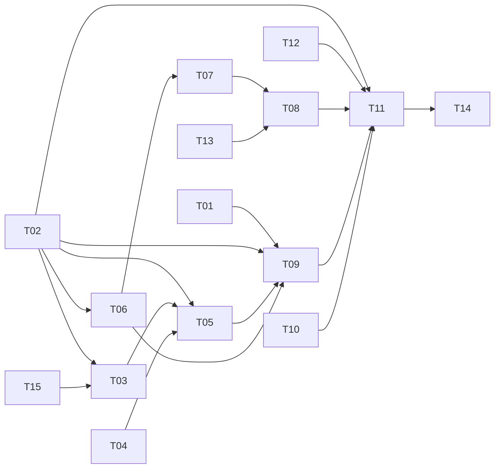

# tasks — multi-lane-review

依 `design-be.md` 的依賴順序排列。每個 TDD task 對應**一個測試檔**：RED 一次寫齊
該檔全部 scenario 的測試。狀態記號：`[ ]` / `[wip]` / `[x]`。

TDD 步驟每個 task 相同，不逐項複述：
RED → Verify RED → GREEN → Verify GREEN → REFACTOR（SOLID + DRY）→ Spec re-check。

**跨 change 引用的寫法**：指涉 change A 的 scenario 一律寫成 `A/S-NN`（例如 `A/S-64`），
與本 change 自己的 `S-NN` 區隔。coverage 檢查只計本 change 的 `S-NN`，
不得把 `A/S-NN` 誤計為本 change 的 scenario。

## T01 [x] [INFRA] 把 `golang.org/x/sync` 提升為直接依賴

理由：無 scenario 對應——`go.mod:43` 目前標記 `// indirect` 且無任何 `.go` 匯入，
T09 的 `errgroup` 需要它先成為直接依賴才能編譯。
Verification command: `go get golang.org/x/sync/errgroup && go build ./... && grep -c 'golang.org/x/sync' go.mod`

## T02 [x] [INFRA] `internal/testfake/` — 本 repo 第一組測試替身

理由：無 scenario 對應——全樹目前無任何 `fake*`／`mock*`／`stub*` 型別，
`internal/reviewer/` 連 `_test.go` 都沒有。其後每一個 TDD task 都需要
可控的 `ai.Provider`、`rag.Retriever`／`FullLoader`、`IGitLabClient` 替身，
先建一次勝過每個 task 各建一份。
替身需支援：可程式化的回應序列、呼叫次數與參數記錄、可注入的錯誤與延遲、
以及 barrier（T09 的併發斷言需要）。
Verification command: `go build ./internal/testfake/ && go vet ./internal/testfake/`

## T03 [x] [NEW] `S-01,S-02,S-03,S-04` — lane registry

Test file: `internal/lane/registry_test.go`
重點：`lanes:` 宣告序列必須保留（讀進 map 再輸出會使 S-01 間歇失敗，故 `-count=5`）；
缺 `enabled` 等必填欄位即設定錯誤，不得預設；重複 `id` 拒絕；
overlay 覆蓋既有 id 保留原序位、新增 id 接在 canonical 尾端。
Verification command: `go test ./internal/lane/ -run TestLoad -count=5`

## T04 [x] [NEW] `S-36` — Terms 自 diff 萃取

Test file: `internal/lane/terms_test.go`
重點：路徑衍生詞與識別字衍生詞都要有；camelCase／snake_case 拆子詞；
所有 lane 共用同一組 Terms。`Terms: nil` 會讓 BM25 回空，本 task 是唯一防線。
Verification command: `go test ./internal/lane/ -run TestTerms -count=1`

## T05 [x] [NEW] `S-05,S-06,S-07,S-35` — 每 lane 的 prompt 組裝

Test file: `internal/lane/compose_test.go`
重點：每個 `retrieval` set 各一次 `Retrieve` 且 `Intent` 正確；空 `resources` 完全不呼叫
檢索且無 store 也能完成；`full` 集合走 `FullLoader` 且絕不以其名呼叫 `Retrieve`；
**S-35 是地基**——檢索到的獨特字串必須確實出現在該 lane 的 prompt 內，且未引用該
資源集的 lane 看不到它。丟棄檢索結果的實作能通過 S-05/S-06/S-07，只有 S-35 擋得住。
Verification command: `go test ./internal/lane/ -run TestCompose -count=1`

## T06 [x] [NEW] `S-13,S-14,S-15,S-16,S-40,S-42,S-43` — 解析

Test file: `internal/lane/parse_test.go`
重點：四種雜訊形態都取出同一組 findings；契約未定義的欄位被忽略；缺 `title`/`rationale`
丟棄並計數；重試沿用 `AI_RETRY_ATTEMPTS`（測 2 與 3 兩種設定，硬寫 2 會失敗）且
**不重跑檢索**；三項結構性上限整份失敗、欄位超長只截斷該欄位；列舉外 severity 映射到
`medium` 並計數；多圍籬取**最後一個**（型別優先會解析到重試回帶的舊錯誤）。
Verification command: `go test ./internal/lane/ -run TestParse -count=1`

## T07 [x] [NEW] `S-17,S-18,S-19,S-21,S-44` — 合併

Test file: `internal/lane/merge_test.go`
重點：`file`+`category` 精確分組後，組內與**代表**比行距 ≤3（不用行號桶——桶會讓
距離隨位置改變）；相差 9 行不合併；severity 取最高而非第一個；`file` 正規化
（`./` 前綴、`a/`/`b/` 前綴）後才比對，大小寫不折疊；六鍵全序使五次輸出逐位元組相同。
Verification command: `go test -race ./internal/lane/ -run TestMerge -count=5`

## T13 [x] [INFRA] `internal/lane/hunk/` — unified diff 新側行區間

理由：無 scenario 直接對應（S-39 使用其結果）——`internal/gitlab/types.go:21-32` 的
`Change` 只有一整串未解析的 `Diff` 字串，沒有 hunk 或行範圍欄位，而 S-39 要求
「`line` 落在該檔案某個變更區塊的新側行號範圍內」。需解析 `@@ -a,b +c,d @@` 標頭。

Test file: `internal/lane/hunk/hunk_test.go`（本 task 自帶測試，不依賴 T08 間接覆蓋）
需涵蓋：多 hunk 的檔案、`@@ -a +c @@`（省略行數，等同 1）、新增檔（`0,0` 舊側）、
刪除檔、重新命名、以及不含任何 `@@` 的空 diff。
沒有自帶測試的話，`go test ./internal/lane/hunk/` 會在無測試檔時以「no test files」
通過，成為一條恆真的驗證指令。
Verification command: `go test ./internal/lane/hunk/ -count=1 && go test ./internal/lane/hunk/ -run TestHunk -count=1 | grep -qv 'no test files'`

## T08 [x] [NEW] `S-22,S-23,S-24,S-25,S-38,S-39` — 渲染

Test file: `internal/lane/render_test.go`
依賴 T13。重點：保留 Findings 表格與三個小節且通過既有 `ValidateReviewContent`
（`internal/validator/validator.go:149-163` 要求 `##`、`Findings`、`Verdict` 三個子字串）；
每筆標示 lane 與引用位置，`StartLine` 為 0 時只印檔名；未匹配的 `sourceId` 標
`unverified` 但仍渲染；失敗 lane 專節；**中性化涵蓋所有模型來源字串**（含
`citations[].sourceId`——只做欄位列舉會讓注入從 S-24 的渲染路徑穿過去）；
`file`/`line` 需通過 hunk 成員檢查，四種案例（不在 diff、含 `../`、行號超出、正常）。
Verification command: `go test ./internal/lane/ -run TestRender -count=1`

## T09 [x] [NEW] `S-08,S-10,S-30,S-32,S-33` — 平行 fan-out

Test file: `internal/lane/fanout_test.go`
依賴 T01、T02、T05、T06。重點：以 barrier 斷言三個 lane 同時在飛（循序實作會死結而
逾時，不用計時斷言）；單一 lane provider 錯誤不影響其他且具名記錄；per-lane `model`
覆寫只影響該 lane；`enabled: false` 完全不執行且不進失敗清單；
change A 的組裝硬失敗——diff 超預算逐 lane 隔離，model 不在上限表內則整體先失敗。
使用 `errgroup.Group` 但**不用** `WithContext`（首個錯誤取消其餘與部分失敗政策相反）。
Verification command: `go test -race ./internal/lane/ -run TestFanout -count=1 -timeout 60s`

## T12 [x] [INFRA] GitLab client 增加 `ListNotes` 與 `UpdateNote`

理由：無 scenario 直接對應（S-41 使用其結果）——`internal/gitlab/client.go` 目前只有
`GetMergeRequest`(:49)／`GetMRChanges`(:58)／`PostNote`(:67)／`HealthCheck`(:77)，
沒有任何列出或更新留言的方法，`internal/interfaces/interfaces.go:13,17` 的
`IGitLabClient` 亦然。S-41 的單一留言規則無此能力則無所依附。
沿用既有的 `doWithRetry`（client.go:143-190）。同時擴充 `IGitLabClient` 與 `testfake`。
Verification command: `go build ./internal/gitlab/ ./internal/interfaces/ && go test ./internal/gitlab/ -count=1`

## T10 [x] [MODIFY] `S-26` — single 模式逐位元組不變（`internal/prompt/composer.go`）

Test file: `internal/prompt/composer_test.go`
**先擷取 golden**：必須在本 change 任何實作動到 `internal/prompt/` 之前，自當前 HEAD
產生 `internal/prompt/testdata/golden-prompt-pre-lanes.txt` 並提交。實作後才擷取的
golden 從未紅過，等於零證據。
Verification command: `go test ./internal/prompt/ -run TestCompose_SingleModeUnchanged -count=1`

## T11 [ ] [MODIFY] `S-12,S-27,S-28,S-34,S-37,S-41` — reviewer 分流與貼出（`internal/reviewer/reviewer.go`）

Test file: `internal/reviewer/reviewer_test.go`
**跨 change 相依（重要）**：change A 的 T15 也對同一個檔案宣告「目前不存在，本 task 新建」。
兩者只有先執行的那一個是新建，後執行的是**擴充既有檔案**。此外本 task 的降級斷言
預設 `A/S-64` 的靜默 legacy 退回**已被 change A 的 T15 移除**；若 change B 先於
change A 實作，該路徑仍然存在，本 task 必須改為同時斷言「不使用該路徑」與
「該路徑仍在時也不得被觸發」。開始本 task 前先確認 change A 的 T15 是否已落地。
依賴 T12。重點：所有 lane 失敗時貼出可見的失敗說明，不得是零發現的正常審查；
`lanes.yaml` 缺失降級為 single 並具名（**不得**走 `reviewer.go:187-191` 那條靜默
legacy 退回——那是 `A/S-64` 要求移除的路徑，本降級是設定層的獨立判斷）；
`multi` 不做自我反思而 `single` 照做；normative eviction 政策失敗使整體可見失敗，
`warn` 時只列入失敗清單；所有 lane `enabled: false` 時不得貼出空殼審查；
單一留言需比對標記**且作者為本 token 使用者**，誘餌留言不得被觸碰。
Verification command: `go test ./internal/reviewer/ -run 'TestRun|TestPostReview' -count=1`

## T14 [ ] [MODIFY] `S-45` — lane id 分支的 CI lint（`Makefile`）

Target: `Makefile` 新增 `lint-lane-ids` target
重點：規則是結構性的（禁止 id 與字串字面值比較），不是列舉三個已知 id——
列舉會讓第四個 lane 的 `if lane.ID == "security"` 通過；掃描範圍需含 `internal/` 與 `cmd/`；
掃描路徑不存在時視為失敗，不得因 grep 空手而回而算通過。
Verification command: `make lint-lane-ids`

## T15 [x] [INFRA] `projects/lanes.yaml` ＋ `projects/_lanes/*.tmpl.md`

理由：無 scenario 對應——T03 的 registry 測試需要真實的宣告檔與模板檔作為 fixture。
內含三個預設 lane（spec+techdoc／standards／code-diff-only），
第三個的 `resources` 為空清單以驗證一等的純 diff lane。
Verification command: `test -f projects/lanes.yaml && ls projects/_lanes/*.tmpl.md`

## Manual verification checklist

（本 change 無 `[MANUAL]` scenario——所有 40 個 scenario 皆為可自動化驗證，
S-45 為 CI lint 步驟而非互動式驗證，故列為 TDD task T14 而非手動項目。）

## Task 依賴

