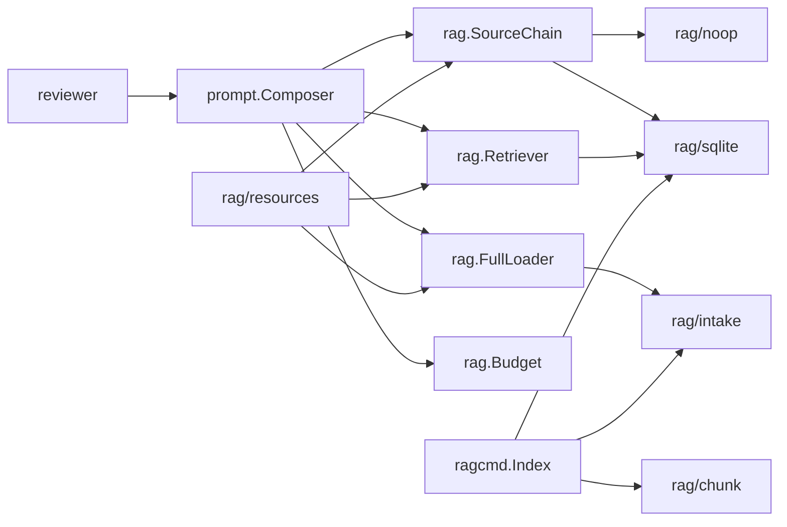
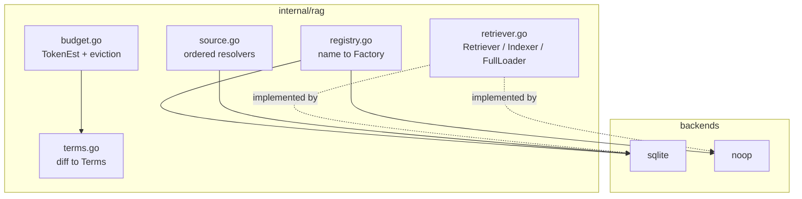
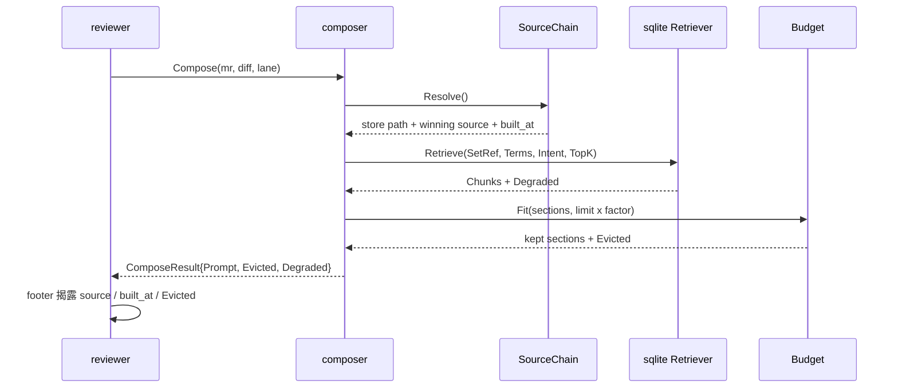

# design-be — rag-resource-store

實作 `STDD/rag-resource-store/spec.md`（status: approved，fingerprint
`c3cdad61…462ac2`）的 REQ-01 ~ REQ-14。Go only；TypeScript 對等實作延後為獨立 change。
無 HTTP surface，故 `api.yml` 與 `design-fe.md` 皆為 **N/A**。

## 與現況慣例的三處刻意分歧（使用者已裁決）

| 本 change | 現況慣例 | 分歧理由 |
|---|---|---|
| backend 以 map registry ＋ `Register()` 選用 | `switch` over 常數（`internal/ai/provider.go:23-39`） | REQ-02 要求新增後端只需一個 package ＋一行註冊，且 S-06 斷言未知名稱要列出已註冊者。switch 會把新增後端變成修改核心 |
| store 來源為有序 slice，回傳勝出者 | `FallbackDiffFetcher` 兩格包裝，勝出者只出現在 log（`internal/diff/fallback.go:22-29`） | REQ-09/S-33 要求 footer 具名勝出來源與其 `built_at`，log 取不出來 |
| chunk 策略以副檔名對應表選擇 | `SelectTemplate` switch（`internal/prompt/templates.go:69-82`） | 形狀相同，沿用即可；此列僅記錄「已比對過、決定沿用」 |

## 對 approved spec 的一處偏離（需知悉）

S-12（檔名 denylist）的 Test mapping 寫 `internal/rag/sqlite/walk_test.go`，
但 REQ-03 正文明定 denylist 實作於 `internal/rag/intake` 且所有後端共用，
S-13 也對應 `internal/rag/intake/walk_test.go`。本設計依 **REQ-03 正文**，
把兩者都放在 `internal/rag/intake/`。spec 已核准且指紋鎖定，故不改 spec；
此處記錄偏離，待 spec 下次修訂時一併更正該行 Test mapping。

## 套件配置

```
internal/rag/                 types.go retriever.go registry.go backends.go noop.go
                              terms.go budget.go compose.go source.go cache.go
internal/rag/resources/       types.go loader.go citrigger.go
internal/rag/intake/          walk.go denylist.go          ← 所有後端共用的收錄守門
internal/rag/chunk/           chunk.go markdown.go structured.go lines.go
internal/rag/sqlite/          schema.sql store.go retriever.go indexer.go
internal/rag/embed/           embedder.go fixture.go remote.go
internal/ragcmd/              index.go retention.go
cmd/mrinspect/                main.go（改：dispatch 早於 config.Load）
internal/prompt/              composer.go（改：nonce 界定、full 注入、預算移除）
internal/reviewer/            reviewer.go（改：footer、S-64 移除靜默 legacy 退回）
```

`Retriever` 介面放在 `internal/rag/`（與實作同套件層），沿用 `ai.Provider`
（`internal/ai/provider.go:18-21`）的先例，而非放進 `internal/interfaces/interfaces.go`
——後者收的是 `internal/reviewer` 跨套件依賴的 collaborator 介面。

## Table schema

SQLite，DDL 正本為 `internal/rag/sqlite/schema.sql`（以 `go:embed` 內嵌）。
**不設** `resource_sets.mode` 欄（REQ-04 第四輪裁決：mode 的唯一真相是 `resources.yaml`）。

**時間戳記欄位（`documents.indexed_at`／`chunks.indexed_at`／`resource_sets.indexed_at`／
`embeddings.created_at`／`schema_meta.built_at`）**：本 change 只做全量重建
（REQ-03，增量索引已於第三輪移除），因此在目前的行為下，這些值全部等於
`schema_meta.built_at`，`chunks` 也能經 `documents` join 取得——嚴格說是冗餘的。

仍然保留的兩個理由，都與「store 出問題時查得出來」有關：
1. **診斷寫入不全的 store**：REQ-11 要求寫入具原子性，但若原子性本身出了 bug，
   逐列時間戳記是唯一能看出「哪些列屬於哪一次寫入」的線索；只有一個
   `schema_meta.built_at` 時，半寫入的 store 看起來與完整的一樣。
2. **增量索引若回歸**：第三輪移除增量的理由是「image build 自乾淨 checkout 全量重建」，
   而該理由對本機開發與未來的外部後端不必然成立。屆時逐列時間戳記是必要的，
   而事後補欄位要動 schema 版本。

不因此改動 spec：spec 未列舉 DDL，只約束 `resource_sets` 無 `mode` 欄與
`schema_meta` 的內容，兩者皆不受影響。

### documents

| 欄位 | 型別 | 說明 |
|---|---|---|
| id | INTEGER PK | |
| set_id | INTEGER FK → resource_sets(id) | ON DELETE CASCADE |
| rel_path | TEXT NOT NULL | 相對 set root；發現引用的就是它 |
| doc_kind | TEXT NOT NULL | markdown / structured / text |
| content_sha256 | TEXT NOT NULL | |
| size_bytes | INTEGER NOT NULL | |
| indexed_at | TEXT NOT NULL | RFC3339 UTC |

UNIQUE (set_id, rel_path)

### chunks

| 欄位 | 型別 | 說明 |
|---|---|---|
| id | INTEGER PK | 等於 chunks_fts.rowid |
| document_id | INTEGER FK → documents(id) | ON DELETE CASCADE |
| ord | INTEGER NOT NULL | 文件內序位，0-based |
| heading | TEXT NOT NULL DEFAULT '' | "H1 > H2 > H3" |
| text | TEXT NOT NULL | |
| start_line | INTEGER NOT NULL | 1-based |
| end_line | INTEGER NOT NULL | |
| token_est | INTEGER NOT NULL | REQ-14 公式，預先算好供預算使用 |
| indexed_at | TEXT NOT NULL | RFC3339 UTC，本列寫入時間 |

UNIQUE (document_id, ord)

### resource_sets / tags / set_tags

`resource_sets(id, name UNIQUE, seq, indexed_at TEXT NOT NULL)` — `seq` 保存
`resources.yaml` 的宣告序位，`indexed_at` 為該 set 本次被索引的時間；
`tags(id, name UNIQUE)`；`set_tags(set_id, tag_id)` WITHOUT ROWID。

### chunks_fts（external content）

`fts5(text, heading, content='chunks', content_rowid='id',
tokenize='unicode61 remove_diacritics 2')`。external content **不會自動同步**，
故 `schema.sql` 內一併定義 insert/delete trigger，避免 Go 與 TS 各寫一份而漂移。

### embeddings / schema_meta

`embeddings(chunk_id PK, dim, vec BLOB, created_at TEXT NOT NULL)`；
`schema_meta(id=1, schema_version, tool_version, built_at, resources_sha256,
embed_model, embed_dim)`。

## Services relationship



## C3 — Component（`internal/rag` 內部）



## 檢索的 sequence



## 實作順序的硬性依賴

1. `resources`（載入與序列）→ 所有其他部分都要它
2. `intake`（走訪與 denylist）→ `chunk` → `sqlite/indexer`
3. `sqlite/store` + `schema.sql` → `sqlite/retriever`
4. `registry` → `source` → `compose`
5. `budget` 與 `terms` 可與 3、4 平行
6. `ragcmd`、`Dockerfile`、CI 觸發最後

## Requirements Checklist

- [ ] REQ-01 資源集宣告：序列保留、mode 必填、路徑不逃逸
- [ ] REQ-02 backend registry：map ＋ Register，未知名稱列出已註冊者
- [ ] REQ-03 索引：遞迴走訪、三種分塊、出處、denylist 於 intake
- [ ] REQ-04 凍結介面：無死欄位、TokenEst、Close、mode 由 config 判定
- [ ] REQ-05 index 子命令：dispatch 早於 config.Load，不需 review 憑證
- [ ] REQ-06 image 烘入保底 store，路徑為程式內常數而非 ENV
- [ ] REQ-07 降級：任何取用失敗都回零 chunk ＋ Degraded，不阻斷 review
- [ ] REQ-08 embedding：預設關閉，重排只在候選集內且順序須異於 BM25
- [ ] REQ-09 新鮮度：index job 觸發、artifact/package 發佈、footer 揭露
- [ ] REQ-10 檢索文字以 per-composition CSPRNG nonce 界定，位元組不改寫
- [ ] REQ-11 收錄守門可觀察；不做內容層密鑰掃描
- [ ] REQ-12 來源鏈可插拔、版本固定、開啟前驗摘要、逾時與位元組上限
- [ ] REQ-13 full 模式逐位元組注入，經 FullLoader，不分塊不檢索
- [ ] REQ-14 預算 = per-model 上限 × 安全係數；依宣告順序由尾端整段移除
