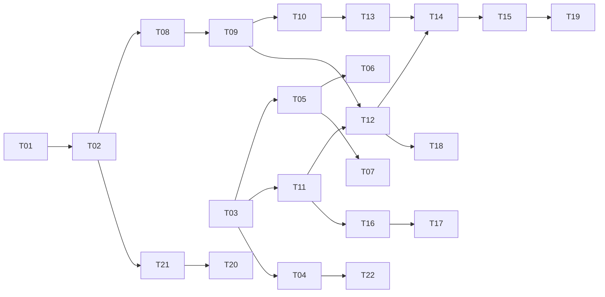

# tasks — rag-resource-store

依 `design-be.md` 的依賴順序排列。每個 TDD task 對應**一個測試檔**（module-convergence
rule）：RED 一次寫齊該檔所有 scenario 的測試。狀態記號：`[ ]` / `[wip]` / `[x]`。

TDD 步驟每個 task 相同，不逐項複述：
RED（寫齊該檔全部 scenario 測試）→ Verify RED（跑指令，必須紅且理由正確）→
GREEN（最小實作）→ Verify GREEN（同一指令轉綠）→ REFACTOR（SOLID + DRY）→
Spec re-check（逐條回讀該 task 的 S-XX 原文）。

## T01 [x] [INFRA] 加入 CGO-free SQLite driver 並對齊 toolchain

理由：無 scenario 對應——這是讓其後所有 sqlite task 能編譯的前置依賴。

**Plan drift 修正（2026-08-26）**：原本要求「`modernc.org/sqlite` 為 direct
dependency」且「不得新增或修改任何 `.go` 檔」。這兩者在 Go 下不可能同時成立——
Go 只有在某個 `.go` 檔實際 import 時才會把 require 標為 direct，而 `go mod tidy`
會把未被 import 的相依整個移除。故 T01 改為：加入相依並確保建置通過，
direct/indirect 的分類在 T02 建立第一個 import 後自然解決；**T01 不執行
`go mod tidy`**，tidy 移到 T02。

**Toolchain 對齊**：`modernc.org/sqlite v1.57.0` 需要 go 1.25，而 repo 原本
在 `Dockerfile:1` 與 `.gitlab-ci.yml:7` 都釘 `golang:1.23-alpine`。使用者裁決
升級而非改釘舊版 driver，故本 task 一併把兩處 image 與 `go.mod` 的 go directive
升到 1.25，spec 的 S-23 同步修訂。`go get` 連帶升級的七個 x/* 相依經使用者裁決保留。

Verification command: `CGO_ENABLED=0 go build ./... && go list -m modernc.org/sqlite && grep -q 'golang:1.25-alpine' Dockerfile && grep -q 'golang:1.25-alpine' .gitlab-ci.yml`

## T02 [x] [INFRA] `internal/rag/sqlite/schema.sql` ＋ go:embed

理由：無 scenario 對應——DDL 正本，其後的 store/indexer/retriever task 都依賴它。
含 documents / chunks / resource_sets / tags / set_tags / chunks_fts（external content
＋ 同步 trigger）/ embeddings / schema_meta。**不含** `resource_sets.mode` 欄。
本 task 建立第一個 `modernc.org/sqlite` 的 import，故在此執行 `go mod tidy`（T01 刻意不執行），使該相依成為 direct。

**Plan drift 修正（2026-08-26）**：原標題只講「schema.sql ＋ go:embed」，但
`go:embed` 本身不 import 任何東西——tidy 不會因為多了一個嵌入字串就把
`modernc.org/sqlite` 標為 direct，光嵌入而不使用等於 T01 的 indirect 問題原地
重演。故 T02 範圍內含 `internal/rag/sqlite/store.go` 的最小 `Open()`／`Close()`：
`Open()` 帶 `_ "modernc.org/sqlite"` blank import 並實際執行 DDL，這才是讓相依
成為 direct 的必要條件；一份沒有人套用的內嵌 schema 也沒有意義。`Open()` 的 DDL
語句一律加 `IF NOT EXISTS`，讓重複開啟既有 store（後續 indexer／retriever 的
正常用法）不出錯——這點原task敘述未提及，屬本 task 內合理的最小實作判斷，非
新增 scope。索引、檢索、embeddings 寫入不在本 task 範圍。

Verification command: `go mod tidy && CGO_ENABLED=0 go build ./... && grep -c 'CREATE' internal/rag/sqlite/schema.sql && ! grep -E 'modernc.org/sqlite.*// indirect' go.mod && ! grep -n 'mode' internal/rag/sqlite/schema.sql | grep -v journal_mode | grep -v embed_model && go test ./...`

## T03 [x] [NEW] `S-01,S-02,S-03,S-04,S-36,S-56,S-69` — resources loader

Test file: `internal/rag/resources/loader_test.go`
重點：`sets:` 宣告序列必須保留（讀進 map 再輸出會使 S-69 間歇失敗，故以 `-count=5` 跑）；
`mode` 缺漏即設定錯誤；路徑一律以 repo 根為基準解析且不得逃逸；overlay 覆蓋既有 name
保留原序位，新增 name 接在 canonical 尾端。
Verification command: `go test ./internal/rag/resources/ -run 'TestLoad|TestResolve' -count=5`

## T04 [x] [NEW] `S-31,S-46` — CI 觸發路徑比對

Test file: `internal/rag/resources/citrigger_test.go`
重點：以程式比對 `resources.yaml` 宣告的路徑集合與 `.gitlab-ci.yml` 的 `rules.changes`
清單；宣告了新路徑但未同步 `rules.changes` 必須失敗。CI lint 只檢語法，觀察不到命中語意。
Verification command: `go test ./internal/rag/resources/ -run TestCITriggers -count=1`

## T05 [x] [NEW] `S-12,S-13` — intake 走訪與檔名 denylist

Test file: `internal/rag/intake/walk_test.go`
**偏離註記**：S-12 的 Test mapping 寫 `internal/rag/sqlite/walk_test.go`，但 REQ-03
正文明定 denylist 於 `internal/rag/intake` 由所有後端共用；本 task 依正文，兩者同置 intake。
重點：九種密鑰檔名全部拒收並具名；symlink 不跟隨、深度上限、超大檔、FIFO 四類各自
可觀察地跳過並計數。
Verification command: `go test ./internal/rag/intake/ -run TestWalk -count=1`

## T06 [x] [NEW] `S-08,S-09` — markdown 分塊

Test file: `internal/rag/chunk/markdown_test.go`
重點：heading 階層字串與起訖行號要對得上原始檔；fenced code block 內的 `#` 不得
形成 chunk 邊界。
Verification command: `go test ./internal/rag/chunk/ -run TestChunk_Heading -count=1 && go test ./internal/rag/chunk/ -run TestChunk_Fenced -count=1`

## T07 [x] [NEW] `S-10,S-11` — structured 分塊

Test file: `internal/rag/chunk/structured_test.go`
重點：OpenAPI 依 operation 切且不因字數上限再切；無法解析的 YAML 退回 `lines`
並在 `IndexStats.Failures` 具名該檔。
Verification command: `go test ./internal/rag/chunk/ -run TestChunk_OpenAPI -count=1 && go test ./internal/rag/chunk/ -run TestChunk_Unparseable -count=1`

## T08 [x] [NEW] `S-23` — FTS5 在 CGO-free alpine 可用

Test file: `internal/rag/sqlite/store_test.go`
重點：斷言必須在 alpine 容器內跑——本機 darwin 的 `go test` 不構成 musl 環境的證據。
**追加範圍（T02 驗證時發現）**：T02 的 FTS5 同步 trigger 與 `Open()` 冪等性當時只由
兩份用完即刪的臨時測試證實，repo 內沒有留下任何常設測試——trigger 被改壞時，
要到 T10 的檢索測試以「查詢結果為空」的形式失敗才會被發現，而那看起來像查詢 bug
不像 schema bug。本 task 既然已經擁有 `store_test.go`，一併補上三項常設回歸測試：
external-content FTS5 的 insert／update／delete 同步、對同一路徑重複 `Open()` 不報錯
且不重複寫入 `schema_meta`、以及 `SchemaVersion` 可被讀回。

Verification command: `docker run --rm -v "$PWD":/src -w /src -e CGO_ENABLED=0 golang:1.25-alpine go test ./internal/rag/sqlite/ -run TestStore_FTS5AvailableCGOFree -count=1`

## T09 [x] [NEW] `S-28,S-38,S-53` — indexer

Test file: `internal/rag/sqlite/indexer_test.go`
重點：embeddings 預設關閉時 `IndexStats.Embeddings` 為 0 且 embeddings 表無列；
寫入失敗不得留下可讀但不全的 store（暫存檔 ＋ rename）；`mode: full` 的集合不建 chunk。
Verification command: `go test ./internal/rag/sqlite/ -run TestIndex -count=1`

## T10 [x] [NEW] `S-14,S-15,S-16,S-17,S-24,S-25,S-26,S-29,S-30,S-39,S-40,S-41` — sqlite retriever

Test file: `internal/rag/sqlite/retriever_test.go`
本檔最大（12 個 scenario），RED 一次寫齊。重點：BM25 排序與可引用出處；SetRef 隔離；
TopK；`-race` 下併發安全；store 缺失／版本不符／未知 SetRef 三種降級皆 nil error；
embedding 重排順序必須**異於** BM25；`TokenEst` 精確等於公式；`Close()` 冪等。
Verification command: `go test -race ./internal/rag/sqlite/ -run TestRetrieve -count=1`

## T11 [x] [NEW] `S-05,S-06,S-07` — backend registry

Test file: `internal/rag/registry_test.go`
重點：未設定時預設 `sqlite`；未知名稱回 error 且訊息含已註冊名稱清單；
`MRI_RAG_ENABLED=false` 得到 noop 且 `Degraded` 含 `rag not configured`。
以 map ＋ `Register()` 實作（與 `ai/provider.go` 的 switch 分歧，理由見 design-be）。
Verification command: `go test ./internal/rag/ -run TestNew -count=1`

## T12 [x] [NEW] `S-42,S-43,S-44,S-47,S-48,S-49,S-66,S-67` — 來源鏈

Test file: `internal/rag/source_test.go`
重點：有序 slice 依序解析、先成功者勝出且**回傳勝出者**（非只寫 log）；
逐一失敗具名回報狀態碼；逾時與位元組上限；未知來源名稱列出已註冊者；
package 版本選取；下載在**開啟 SQLite 之前**先驗摘要（以檔案讀取層 spy 斷言順序）；
`path` 只在 `MRI_RAG_STORE` 明確設定時可用；發佈端 allowlist。
Verification command: `go test ./internal/rag/ -run TestResolveStore -count=1 && docker build -t mrinspect:t12 . && test -z "$(docker run --rm --entrypoint sh mrinspect:t12 -c 'printf %s "$MRI_RAG_STORE"')" && test "probe" = "$(docker run --rm --entrypoint sh -e PROBE=probe mrinspect:t12 -c 'printf %s "$PROBE"')"`
（第二段起是 S-66 的容器層斷言：process 內的 go test 觀察不到 Dockerfile `ENV`。
必須 `--entrypoint sh` 覆寫，否則 `sh -c` 會被當成 mrinspect 的參數而 stdout 恆空、
`test -z` 恆成立。最後一段是正控制，證明這條讀環境變數的管線本身有效。
T21 的 docker 指令斷言的是「store 檔存在」，與本條不同，不能互相取代。）

## T13 [x] [NEW] `S-58,S-59,S-60,S-61,S-63,S-70,S-72` — 預算與整段移除

Test file: `internal/prompt/budget_test.go`
重點：預算 = per-model 上限 × 安全係數，floor 取整；依宣告順序由尾端往前移除，
`retrieval` 先於 `full`；永不截斷；diff 與 metadata 不可移除；只剩 diff 仍超預算才硬失敗；
移除順序在五次執行間一致；框架開銷逐字精確計入。
Verification command: `go test -race ./internal/prompt/ -run TestBudget -count=5`

## T14 [x] [MODIFY] `S-27,S-34,S-35,S-52,S-55,S-65` — composer（`internal/prompt/composer.go`）

Test file: `internal/prompt/composer_test.go`
**先做 S-27 的 golden**：必須在本 change 任何實作落地**之前**自當前 HEAD 擷取並提交到
`internal/prompt/testdata/golden-prompt-pre-rag.txt`，否則該測試從未紅過等於零證據。
其餘重點：per-composition CSPRNG nonce（長度 ≥32 hex、每次不同、衝突重試）；
內容位元組不被改寫；`full` 逐位元組且經 `FullLoader`；`full` 區塊排在 `retrieval` 之前
並標示為規範。
Verification command: `go test ./internal/prompt/ -run TestCompose -count=1 && ! grep -rnE '"math/rand(/v2)?"' ./internal ./cmd`

## T15 [x] [MODIFY] `S-33,S-45,S-62,S-64,S-68` — reviewer（`internal/reviewer/reviewer.go`）

Test file: `internal/reviewer/reviewer_test.go`
**跨 change 相依**：change B 的 T11 也對同一個檔案宣告新建。兩者只有先執行的那一個
是新建，後執行的是擴充既有檔案。本 task 的 S-64 負責**移除** `reviewer.go:187-191`
的靜默 legacy 退回；change B 的 T11 只是要求不得再走該路徑，不重複移除。
重點：footer 揭露 store 出處、`built_at`、資源指紋前 8 碼與降級摘要；
被移除區段逐項具名；**移除 `reviewer.go:187-191` 的靜默 legacy 退回**（S-64）；
以 spy 斷言 review 路徑呼叫索引次數為 0；未固定版本時 footer 標示，已固定時不標示。
Verification command: `go test ./internal/reviewer/ -run 'TestRun|TestPostReview' -count=1`

## T16 [x] [MODIFY] `S-18,S-20,S-21` — index 子命令（`cmd/mrinspect/main.go`）

Test file: `internal/ragcmd/index_test.go`
重點：`main()` 的子命令 dispatch 必須早於 `config.Load()`——現況 `main.go:24` 首行即
`config.Load()`，且 `os.Args` 全檔未讀；index 路徑改用 `config.LoadForIndex()`；
裸 `mrinspect` 行為完全不變；四種 exit code 兩兩可區分；`--dry-run` 不寫任何檔案。
Verification command: `go test ./internal/ragcmd/ -run 'TestDispatch|TestIndex' -count=1`

## T17 [x] [MODIFY] `S-19` — index 不需 review 憑證（真實二進位，`cmd/mrinspect/main.go`）

Test file: `cmd/mrinspect/main_integration_test.go`（`-tags integration`）
重點：必須執行 `go build` 產出的**二進位**，不得只呼叫套件函式——套件內測試觀察不到
`main.go` 的 dispatch 順序，而那正是本 scenario 要防的失敗。
Verification command: `go test -tags integration ./cmd/mrinspect/ -run TestBinary_IndexNeedsNoReviewCredentials -count=1`

## T18 [x] [NEW] `S-50,S-51` — package 保留份數

Test file: `internal/ragcmd/retention_test.go`
重點：以替身攔截 registry API，斷言 DELETE 目標為最舊版本；刪除失敗只記警告不影響
本次發佈；保留份數設為 0 或負數視為設定錯誤，不得刪光所有版本。
Verification command: `go test ./internal/ragcmd/ -run TestRetention -count=1`

## T19 [x] [MODIFY] `S-32` — template 以不可變 tag 指定 image

Target: `templates/ai-review-template.yaml`
理由：驗證手段是靜態檢查而非 Go 測試，但仍為可自動化的 CI 步驟，故不列為 [MANUAL]。
重點：以 `$CI_COMMIT_SHORT_SHA` 指定 image 並保留 `:latest`；`pull_policy` 是否生效
取決於 runner 的 `allowed_pull_policies`，屬 repo 外因素，以註解記為已知限制。
Verification command: `grep -nE 'CI_COMMIT_SHORT_SHA' templates/ai-review-template.yaml`

## T20 [MANUAL] `S-22` — image 內 store 可用

理由：容器建置屬 build 階段行為，無對應單元測試；需實際建置 image 後在容器內執行。
列入下方手動驗證清單。

## T21 [INFRA] Dockerfile builder stage 執行索引

理由：無 scenario 直接對應（S-22 驗證其結果）——建置步驟本身。
builder stage 於編譯後執行索引，最終 image 於 `/app/.rag/mrinspect-rag.sqlite` 持有
保底 store。**保底路徑由程式內常數持有，不得寫成 `ENV MRI_RAG_STORE`**（S-66）。
Verification command: `docker build -t mrinspect:t21 . && docker run --rm --entrypoint sh mrinspect:t21 -c 'test -f /app/.rag/mrinspect-rag.sqlite'`

## T22 [INFRA] `.gitlab-ci.yml` index job

理由：無 scenario 直接對應（S-31/S-46 驗證其 rules 與 artifacts 設定）——job 本身。
排程（每週）＋ 命中任一已宣告資源路徑的 push ＋ 手動；發佈 artifact 或 package；
`expire_in` 為排程週期三倍。既有 `test` 與 `mrinspect` job 不得改動。
Verification command: `git diff --stat .gitlab-ci.yml && grep -c 'rules:' .gitlab-ci.yml`

## T23 [ ] [NEW] REQ-01 — `Resolve` 的 tag 選取（spec 覆蓋缺口）

理由：無對應 `S-XX`——這正是缺口本身。REQ-01 正文說消費端「以 name 或 tag 引用」，
但 spec 的 68 個 scenario 沒有任何一個斷言 tag 那一半；T03 交付的 `Resolve`
因此把 `tags` 參數整個忽略（`internal/rag/resources/loader.go:58`，簽章有、函式體從未讀取）。
change B 的 lane registry 明文以 `sets:` 與 `tags:` 兩者的**聯集**引用資源集
（`STDD/multi-lane-review/spec.md:85`），故 B 一旦傳 tag 就會靜默取得零筆，
而 A 的任何測試都不會紅。

這與 round 1 刪掉五個 interface 欄位的理由同一類：不可否證的死欄位。
差別只在這次它出現在實作而非契約。

本 task 以 REQ-01 正文為驗收依據（非某個 `S-XX`）：`Resolve` 需以 name 與 tag 的
聯集比對，未命中的 selector 仍列入 `unknown`；tag 與 name 同名時不得重複回傳同一個 set。
需自帶測試，涵蓋：只給 tag、name 與 tag 混合、tag 未命中、以及 name 與 tag 指向
同一個 set 時的去重。

Test file: `internal/rag/resources/resolve_tags_test.go`
Verification command: `go test ./internal/rag/resources/ -run TestResolve -count=5`

## T24 [ ] [NEW] REQ-03／REQ-11 — denylist 樣式的真實世界涵蓋範圍

理由：無對應 `S-XX`——S-12 只列舉九個**字面檔名**，實作全部命中，spec 因此已被滿足；
本 task 處理的是 spec 沒說、但真實 repo 會遇到的命名。T05 驗證時逐一比對樣式與
真實命名慣例，發現三個樣式是精確比對而真實檔案不是：

| 樣式 | 漏接的真實檔名 |
|---|---|
| `kubeconfig` | `admin.kubeconfig`、`kubeconfig.yaml` |
| `terraform.tfvars` | `prod.tfvars`、`secret.auto.tfvars` |
| `*.pem` | `server.pem.bak` |

為什麼現在值得做：第五輪把內容層密鑰掃描整項移除（門檻無法校準，見 spec 的
Rejected options），檔名 denylist 因此是本 change **唯一**的密鑰防護。
一個看起來綠、實際漏接 `prod.tfvars` 的 denylist，比沒有 denylist 更危險。

本 task 以 REQ-03／REQ-11 正文為驗收依據：把三個樣式放寬到涵蓋常見前後綴，
並為每個放寬後的樣式各補一個正例與一個反例（避免放寬到誤殺一般文件）。
`internal/rag/intake/denylist.go` 已把樣式集中在 `secretDenylist` 一處，改動範圍限於該處。

Test file: `internal/rag/intake/denylist_test.go`
Verification command: `go test ./internal/rag/intake/ -run TestDenylist -count=1`

## T25 [ ] [NEW] REQ-03 — markdown 分塊的兩個資料遺失情形

理由：無對應 `S-XX`——S-08 與 S-09 都被滿足，這兩個情形在 spec 的 68 個 scenario
之外，由 T06 的驗證以獨立 fixture 探測發現。

**一、第一個標題之前的內文被靜默丟棄。** 文件若在第一個 ATX 標題之前有前言
（「本文件說明……」這類開場，規範文件極常見），該段完全不進入任何 chunk，
於是在檢索中不存在。這不是格式瑕疵而是資料遺失：內容在 store 裡查不到，
而沒有任何錯誤或 `Degraded` 訊息指出它被丟掉了。

**二、巢狀圍籬使用不同標記時解析錯誤。** `internal/rag/chunk/markdown.go:16-18`
的 `isFence` 對任何一行 ``` 或 ~~~ 都翻轉狀態，因此 ``` 區塊內的一行 ~~~ 會提前
關閉外層圍籬，其後的 `#` 行被誤判為真標題，產生假的 chunk 邊界。
S-09 只要求 ``` 這一種情形，故不算違反 spec，但規範文件裡巢狀圍籬並不罕見。

驗收依據為 REQ-03 正文（標題感知分塊須保留文件內容）：
第一個標題前的內文必須成為一個 chunk（breadcrumb 可為空字串或文件名），
且圍籬狀態必須依標記種類配對，不得以單一布林開關處理。

Test file: `internal/rag/chunk/markdown_preamble_test.go`
Verification command: `go test ./internal/rag/chunk/ -run 'TestChunk_Preamble|TestChunk_NestedFence' -count=1`

## T26 [ ] [NEW] REQ-03 — operation 邊界的常設回歸測試

理由：無對應 `S-XX`——S-10 的 fixture 之後沒有任何內容，因此兩個真實缺陷都通過了
frozen 測試。兩者都在 GREEN 之後才被獨立探測發現：

1. **多吃**：最後一個 operation 原本延伸到 EOF，把其後的 `components:`、全部 schema
   一起吞進該 chunk。真實 OpenAPI 檔案都有 `components:`，所以這在正式語料上必然發生。
   後果是 chunk 內容與其 heading 不符、token 成本被整個 schema 區段灌大、
   引用該 operation 的發現指向它並不包含的內容。
2. **少吃**：第一次修正改用縮排啟發式，於是合法 YAML 的 flow collection 跨行到第 0 欄
   （`tags: [a,` 換行 `b]`）被誤判為 sibling 邊界，`b]` 與其後的 `summary:` 從所有 chunk
   中靜默消失。縮排不等於結構巢狀——flow collection 與 block scalar 都會使兩者分離。

最終修法是不再從文字推導邊界，改用 parser 已知的資訊：走訪 operation value node 的
整個子樹取最大 `Line`（scalar 另加其換行數）。`gopkg.in/yaml.v3` 對每個 node 都給
`Line`，邊界因此是解析結果而非猜測。

本 task 把上述五個情形寫成常設測試，避免日後有人「簡化」回文字啟發式：
sibling operation、最後一個 operation 後接 `components:`、flow collection 跨行到第 0 欄、
block scalar、以及檔尾無換行的最後一個 operation。

Test file: `internal/rag/chunk/structured_boundary_test.go`
Verification command: `go test ./internal/rag/chunk/ -run TestStructured_Boundary -count=1`

## T27 [ ] [NEW] REQ-02／REQ-12 — production 組裝（發現於 T21 執行期）

理由：無對應 `S-XX`——元件層 68 個 scenario 全數以注入的 seam 驗證，沒有任何
scenario 斷言 production 的組裝存在。現況：`reviewer.rag.ReviewPath` 在 production
恆為 nil（`internal/reviewer/reviewer.go:300`），四個內建來源（path/package/
artifact/baked）沒有任何 production 實作與 `RegisterSource` 呼叫（grep 全 repo
僅 `source.go:128` 的定義），`ResolveStore`→`rag.New`→`ComposeLanePrompt` 的
接線不存在。整條 RAG 管線在出貨二進位中是死碼。
範圍：內建來源的 production 實作（path 讀 `MRI_RAG_STORE`；baked 讀程式內常數
`/app/.rag/mrinspect-rag.sqlite`；package/artifact 走 GitLab API 並吃 REQ-12 的
逾時／位元組上限／allowlist 設定）、`init()` 或 main 組裝處的註冊、reviewer 的
production ReviewPath 組裝。以整合測試驗證：真實二進位在 `MRI_RAG_STORE` 指向
真 store 時，留言 footer 揭露 provenance。
Verification command: `go test -tags integration ./cmd/mrinspect/ -run TestBinary_ReviewUsesBakedStore -count=1`

## T28 [x] [NEW] REQ-03 — include/exclude 從未接線＋FilesIndexed 恆為 0（發現於 T21 執行期）

理由：無對應 `S-XX`——REQ-03 正文說索引「套用 include/exclude」，但 68 個 scenario
沒有一個斷言它。實況兩項：
1. `resources.Set` 沒有 Include/Exclude 欄位（types.go:12-17），loader 靜默丟棄
   YAML 的 `include:` 鍵；`sqlite.Index` 呼叫 `intake.Walk` 時只傳 Paths
   （indexer.go:128），`intake` 的 Include 支援（walk.go:174）從未被餵。
   後果：resources.yaml 宣告 `include: "*.md"` 完全無效，registry.yaml 與
   system.yaml 一併被索引（實測 5 個 .md 卻有 7 份 documents）。
2. `ragcmd.IndexStats.FilesIndexed` 從未被填值（sqlite.IndexStats 無對應欄位，
   adapter 也不計），CLI 恆印 `files indexed=0`，操作者無法從輸出分辨空 store
   與正常 store。
範圍：Set 增 Include/Exclude 欄位、loader 解析、indexer 傳遞給 Walk、
FilesIndexed 以實際入庫 documents 數回填；測試斷言 include 過濾生效與統計非零。
Verification command: `go test ./internal/rag/resources/ ./internal/rag/sqlite/ ./internal/ragcmd/ -run 'TestLoad|TestIndex' -count=1`

## Manual verification checklist

- [ ] `S-22` — `docker build -t mrinspect:spec-check .` 後
      `docker run --rm mrinspect:spec-check index --check`：exit 0，
      且輸出的 chunk 數等於 `schema_meta` 記錄的 manifest 數（不是「大於 0」）。

## Task 依賴


