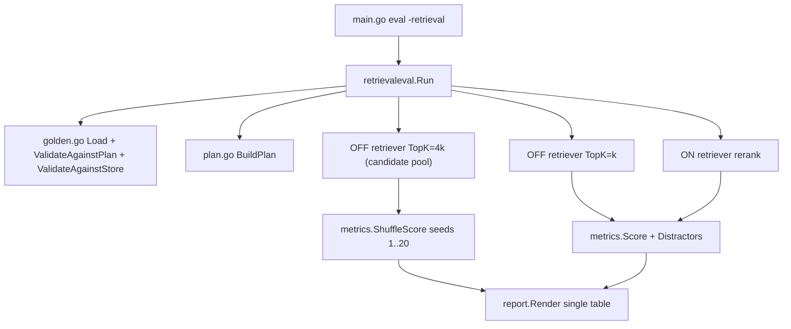
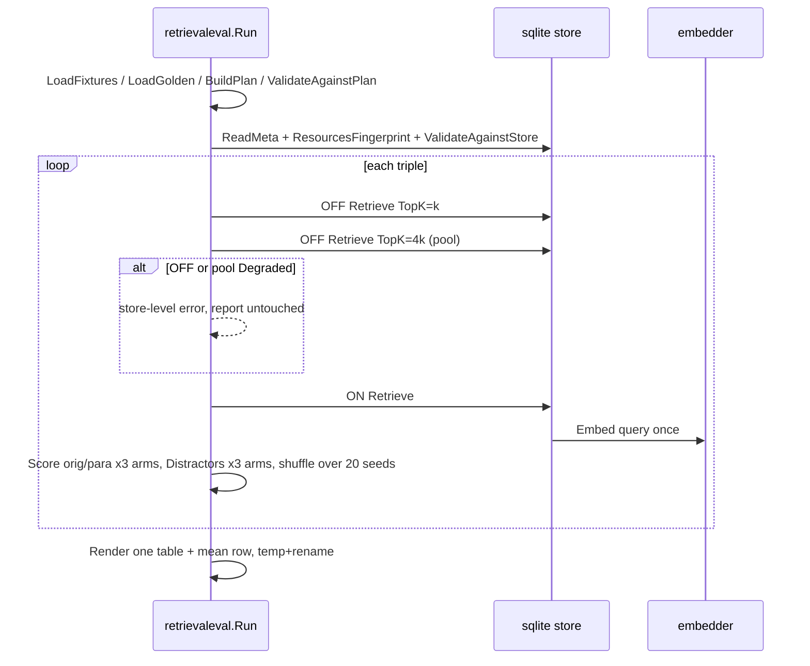

# design-be — retrieval-golden-discrimination

Implements `REQ-01`–`REQ-04`（spec.md，fingerprint `58641e3ceea4b85d…`）。純 backend/CLI：
**design-fe.md 與 api.yml 均 N/A**（無 HTTP 面；embedding API 是既有 client 呼叫別人）。

## 模組配置

| 位置 | 內容 | 對應 REQ |
|---|---|---|
| `internal/retrievaleval/golden.go`（MODIFY：`Entry` :38 加 `Paraphrase`、`Distractors []Target`；`validateCoverage` :129 改為對三元組驗證；`ValidateAgainstStore` :79 三清單一併查） | 新增 `(Golden) ValidateAgainstPlan(triples []Triple) error`：對每個三元組 (fixture, lane, set) 檢查三清單各 ≥1 個 `Set==set` 的目標；目標 set 不在該 lane 解析到的 set 集合 → 錯；同清單重複、跨清單重疊 → 錯。`requiredSets` 最低數量表 :23-29 由三元組規則取代並刪除。錯誤前綴 `load golden: ` 沿用；`Run` 在 `BuildPlan` 之後呼叫 `ValidateAgainstPlan` | REQ-01 |
| `internal/retrievaleval/metrics.go`（MODIFY：新增函式，`Score` :7 不動） | `Distractors(hits []rag.Chunk, distractors []Target, k int) int`（同 :22 三欄比對）；`ShuffleScore(pool []rag.Chunk, relevant []Target, k int, seeds []int64) (recall, mrr float64)`：對每個 seed 以 `rand.New(rand.NewSource(seed))` 做 Fisher–Yates 重排 pool 副本、截 k、`Score`，回傳平均；`ShuffleDistractors(pool, distractors, k, seeds) float64` 同法回傳平均整數計數。`DefaultShuffleSeeds = 1..20` | REQ-03 |
| `internal/retrievaleval/run.go`（MODIFY：`Run` :37；per-triple 迴圈 :145-190） | 每三元組三臂：`off` 既有（:118-123 retriever，Query TopK=k）；`pool` 以**同一 OFF retriever** 再查一次 `Query{TopK: 4*k}` 取候選池（OFF 路徑 :164/:188 取 TopK+1 截 TopK，TopK=4k 即得前 4k 筆）；`on` 既有（:138）。原層／改寫層各以 `Score` 對 `relevant`／`paraphrase`；`distractors` 對三臂計數；shuffle 臂以 `ShuffleScore`／`ShuffleDistractors`。OFF 或 pool 查詢 `Degraded` 非空 → store 級整趟拒（既有政策）；ON `rerank degraded: ` → 該列五個 on 格 `degraded: <code>`。`Row` 建構 :166-173 改填新欄。嵌入次數不變（pool 查詢走 OFF retriever） | REQ-03 |
| `internal/retrievaleval/report.go`（MODIFY：`Row` :20-29、`Cell` :15-18、`Render` :40、`renderCell` :122-127、`meanCell` :129-150、pool 行 :49） | `Row` 改為 `Metrics [5]Triplet`（orig_recall、orig_mrr、para_recall、para_mrr、distractors），`Triplet{Off, Shuf, On Cell}`；`Cell` 加 `Integer bool`（true 時 `%d`，shuffle 平均仍 `%.2f`）；表頭固定為 spec 的 15 欄；mean 列每欄獨立計 n、排除 degraded；pool 行改 `pool: off=TopK+1 on=4xTopK shuffle=4xTopK×20`；`escapeCell` :113-120 沿用 | REQ-03 |
| `projects/margherita-pizza/*.md`、`projects/_shared/*.md`（MODIFY 內容；可新增檔） | 每三元組 ≥1 改寫層段落（名次帶 (k,4k]）、≥1 干擾層段落（名次 ≤k）；REQ-01（前 change）規則不變；`fried-chicken/` 不動 | REQ-02 |
| `eval/retrieval-golden.yaml`（MODIFY） | 8 條目各加 `paraphrase`、`distractors` | REQ-01/02 |
| `internal/retrievaleval/corpus_test.go`（MODIFY：新增 `TestCorpus_TierRankBands`） | 以 `run_test.go` 的暫存 store 建置法（`sqlite.Index`＋`embed.NewFixture` :180-182）對真 corpus 建店；`BuildPlan` 取三元組；`OpenRetriever(WithReadOnly)` OFF、`Query{TopK: 4k}`；對每目標找名次並依層檢查；違反逐筆列出 | REQ-02 |
| `eval/README.md`、`docs/{us,tw}/configuration.md` 離線檢索段（MODIFY 一句） | 說明三臂與單表欄位；無結論措辭 | checklist |

## Table schema

無新表、無 schema 變更；只讀既有 `chunks`／`documents`／`resource_sets`／`schema_meta`。

## 服務關係

## 執行序

## 關鍵設計決定

1. **候選池經同一 OFF retriever 取得**（`Query.TopK = 4k`），不新增 retriever 介面：OFF 路徑取 TopK+1
   截 TopK，設 TopK=4k 恰得 BM25 前 4k 筆，與 ON 的候選池同源（`retriever.go:164-166`）。代價：每三元組多
   一次 SQLite 查詢，零 embedding。
2. **shuffle 在 harness 內計算**，不進 retriever：retriever 契約不變（凍結介面）。
3. **三清單放同一條目**而非 `tier` 欄位：沿用重複 fixture+lane 拒收，不引入可推得欄位。
4. **`Cell.Integer` 而非新型別**：`distractors` 只是格式差異，共用 degraded／mean 邏輯。
5. **層歸屬守門走真檢索**（corpus_test 建暫存店查名次）而非切詞規則：與生產同源，避免 panel 指出的
   FTS5／lane 切詞漂移。
6. **S-52 模式檢視**：三臂是對同一 hits 集合的三次計分，一個 `for arm in [off, shuf, on]` 迴圈即可，
   不設 Strategy；`Triplet` 是資料形狀，不是模式。無新 GoF 模式。
