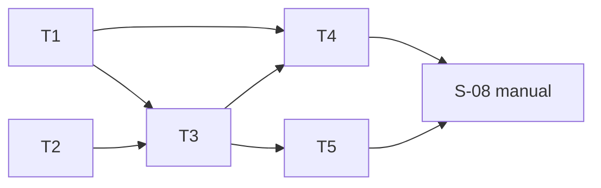

# tasks — retrieval-golden-discrimination

任務依 test-file 收斂：`S-01,S-02` 共用 `golden_test.go`；`S-06,S-07` 共用 `run_test.go`；
`S-03,S-04` 共用 `corpus_test.go`；`S-05` 一檔。corpus 內容（T4）排在 harness 之後，因為名次守門
測試要用 T3 完成的三元組驗證與既有 retriever。

## T1 `[x]` `S-01,S-02` [MODIFY] golden 三清單與三元組驗證

- 檔案：`internal/retrievaleval/golden.go`（`Entry` :38、`validateCoverage` :129、`ValidateAgainstStore` :79、
  刪 `requiredSets` :23-29）＋`internal/retrievaleval/golden_test.go`
- RED：`TestGolden_RequiresEveryTierPerTriple`（空 `paraphrase`；`distractors` set 為 `fried-chicken-docs`；
  lane 解析兩 set 但 `relevant` 只覆蓋一個 → 三份各回錯含 `load golden:`、fixture、lane、清單名、set）＋
  `TestGolden_RejectsDuplicatesOverlapAndMissingTargets`（同清單重複；`relevant`∩`distractors`；
  `paraphrase` 目標不在 store）。三元組以測試用 `lanes.yaml`／`resources.yaml` 寫入 `t.TempDir()` 後
  `BuildPlan` 產生
- GREEN：`Entry` 加兩清單；`ValidateAgainstPlan(triples)`；`ValidateAgainstStore` 三清單；既有
  `TestGolden_*` 改接新規則（`minimumTargets` helper 改為三元組形式）
- Verification command: `go test ./internal/retrievaleval/ -run 'TestGolden_RequiresEveryTierPerTriple|TestGolden_RejectsDuplicatesOverlapAndMissingTargets' -count=1 -v`

## T2 `[x]` `S-05` [MODIFY] shuffle 臂與 distractors 計分

- 檔案：`internal/retrievaleval/metrics.go`（`Score` :7 不動；新增 `Distractors`、`ShuffleScore`、
  `ShuffleDistractors`、`DefaultShuffleSeeds`）＋`internal/retrievaleval/metrics_test.go`
- 依賴：無（與 T1 不同檔，但 Codex 批次不平行）
- RED：`TestMetrics_ShuffleArmAndDistractorCount`（k=4、16 筆池：relevant 第 1、paraphrase 第 6、
  distractor 第 3 → off：orig_recall 1.00／para_recall 0.00／distractors 1；shuffle：para_recall 平均
  ∈ (0,1)、同 seed 可重現；空命中全 0）
- GREEN：Fisher–Yates on copy、`rand.NewSource(seed)`、平均
- Verification command: `go test ./internal/retrievaleval/ -run TestMetrics_ShuffleArmAndDistractorCount -count=1 -v`

## T3 `[x]` `S-06,S-07` [MODIFY] 三臂主流程與單表報告

- 檔案：`internal/retrievaleval/run.go`（`Run` :37，per-triple 迴圈 :145-190，`Row` 建構 :166-173）、
  `internal/retrievaleval/report.go`（`Row` :20-29、`Cell` :15-18、`Render` :40、`renderCell` :122-127、
  `meanCell` :129-150、pool 行 :49）＋`internal/retrievaleval/run_test.go`
- 依賴：T1、T2
- RED：`TestRun_RendersThreeArmTable`（兩三元組，一個 ON `rerank degraded: embed-call-failed (…)`；測試
  `resources.yaml` 的 set 名含 `|` → 恰一張表、`| mean |` 含 `(n=1)`、降級列五個 on 格 `degraded: embed-call-failed`
  而 off／shuf 為數字、`|` 已轉義、標頭 `pool:` 含 `shuffle=`、全文無 better／worse／improve／good／bad
  及中文對應）；既有 `TestRun_EmbedsOncePerRerankedTriple` 為 S-07 的守門（加 shuffle 後須仍綠）
- GREEN：pool 查詢（OFF retriever `TopK=4k`）、三臂計分、`Row.Metrics [5]Triplet`、`Cell.Integer`、表頭
  15 欄、mean 各欄獨立 n；既有 `TestRun_*` 全綠（`TestRun_WritesReportAndSanitizesHeader` 等改接新表頭）；
  `Run` 在 `BuildPlan` 後呼叫 `ValidateAgainstPlan`
- Verification command: `go test ./internal/retrievaleval/ -run 'TestRun_RendersThreeArmTable|TestRun_EmbedsOncePerRerankedTriple' -count=1 -v && go test ./internal/retrievaleval/ -count=1`

## T4 `[x]` `S-03,S-04` [MODIFY] 分層 corpus、golden 擴寫與名次守門

- 檔案：`projects/margherita-pizza/*.md`、`projects/_shared/*.md`（新增段落，可新增檔）、
  `eval/retrieval-golden.yaml`（8 條目各加 `paraphrase`、`distractors`）、`internal/retrievaleval/corpus_test.go`
- 依賴：T1（golden 三清單載入）、T3（`Run` 不在此測，但守門用同一 `BuildPlan`＋OFF retriever 路徑）
- RED：`TestCorpus_TierRankBands`（真 corpus 建暫存 store 於 `t.TempDir()`——沿用 `run_test.go:180-182` 的
  `sqlite.Index`＋`embed.NewFixture`；`BuildPlan` 取三元組；OFF retriever `Query{TopK: 4k}`；改寫層目標
  名次 k<r≤4k、干擾層與原層 r≤k；違反逐筆列出 `fixture / lane / set/path#heading / 名次或「不在前 4k」`）。
  RED 時 golden 尚無新清單 → `LoadGolden` 報缺清單而紅
- GREEN：撰寫 8 個三元組各 ≥1 改寫層、≥1 干擾層段落（用測試輸出的實際名次迭代到落帶）、填 golden；
  `TestCorpus_MeetsSizeAndUniqueBreadcrumbs`、`TestCorpus_GoldenCoversAllFixtures` 仍綠；
  `git diff --quiet HEAD~1 -- projects/fried-chicken/`
- 內容約束：全虛構；不含工作機或內部 repo 名；heading 不含 ` > `；檔內 breadcrumb 唯一
- Verification command: `go test ./internal/retrievaleval/ -run 'TestCorpus_TierRankBands|TestCorpus_MeetsSizeAndUniqueBreadcrumbs|TestCorpus_GoldenCoversAllFixtures' -count=1 -v`

## T5 `[x]` [INFRA] docs 一句更新

- 原因：文件工件，無可單測行為；措辭紅線由 eagle 讀回
- 檔案：`eval/README.md` Offline retrieval check 段、`docs/us/configuration.md`、`docs/tw/configuration.md`
  離線檢索段——各改一句：三臂（off／shuffle／on）與單表欄位；無品質結論
- 依賴：T3
- Verification command: `grep -c 'shuffle' eval/README.md docs/us/configuration.md docs/tw/configuration.md && grep -ciE 'better|worse|improve' eval/README.md`

## Manual verification checklist

- [x] S-08：本機 `MRI_RAG_EMBEDDINGS=true`＋Gemini key；`./bin/mrinspect index` 後等 ≥60 秒；
  `./bin/mrinspect eval -retrieval && ! grep -q 'degraded' eval/RETRIEVAL.md`；以 spec REQ-04 表套用判準，
  結果與 mean 列記入 `docs/decisions_log.md` 新條目；報告 commit

## Task 依賴

## Requirements Checklist（引 spec 尾節，approval 時逐項對）

- [x] golden 三清單、每三元組最低數量、set 歸屬、清單內重複、跨清單重疊、存在性、錯誤前綴（T1）
- [x] 每三元組各 ≥1 改寫層／干擾層段落；層歸屬以 BM25 名次守門、各目標獨立失敗（T4）
- [x] 既有 corpus 規則仍綠；fried-chicken 不動（T4）
- [x] 三臂、shuffle 不呼叫 embedding、seed 固定、單表、mean、降級格、轉義、標頭（T2/T3）
- [x] 去留判準只在 spec 與 decisions_log；報告只印數字（T5 讀回、S-08）
- [x] 全部測試為資料有效性守門、隔離；凍結介面零變更（每 task GREEN 條件）
