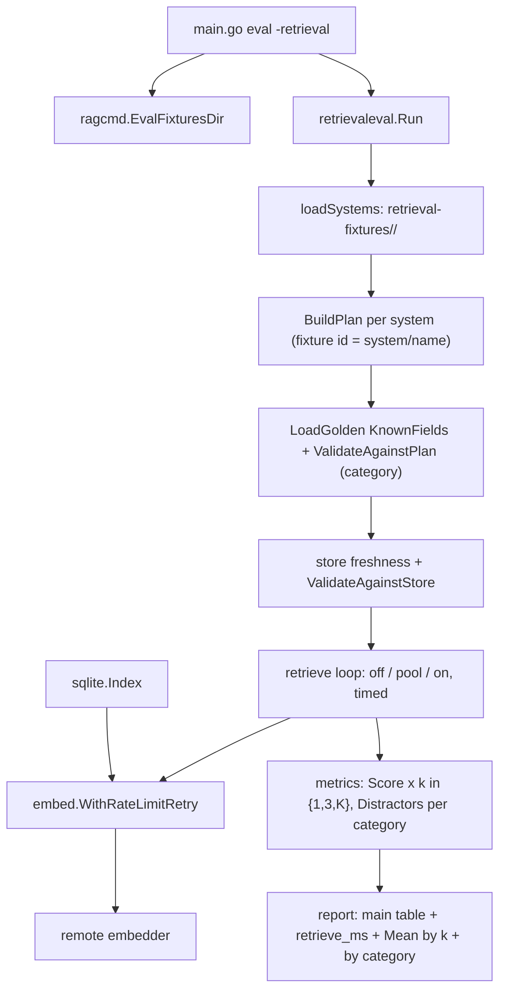

# design-be — retrieval-golden-scale

Implements `REQ-01`–`REQ-06`（spec.md，fingerprint 見 frontmatter；REQ-05 措辭修訂見本檔第 7 條）。純 backend/CLI：
**design-fe.md 與 api.yml 均 N/A**（無 HTTP 面；embedding API 是既有 client 呼叫別人）。

## 模組配置

| 位置 | 內容 | 對應 REQ |
|---|---|---|
| `internal/retrievaleval/run.go`（MODIFY：`Options` :24-34 刪 `System`；`Run` :37 重排為「預檢→檢索」兩段；fixtures 載入 :38、`fixtureNames` :46-49、新鮮度 :83、embedder 接線 :137-139、per-triple 迴圈 :148-205、`Row` 建構 :179-184、header :105-111） | 新增 `loadSystems(fixturesDir) ([]systemFixtures, error)`：`os.ReadDir` 排序、`Lstat` 一般目錄、名稱 regexp `^[a-z0-9][a-z0-9-]*$`、`projects/<system>` 為目錄；三個錯誤字串照 spec，不含路徑。`fixtureID(system, name) = system + "/" + name`。**預檢段**：全部 system 的 fixtures→`BuildPlan`→`ValidateAgainstPlan`→store `ReadMeta`／`ResourcesFingerprint`／`ValidateAgainstStore`，任一錯即回，零 `Retrieve`。**檢索段**：對每個 (system, triple) 跑三臂；OFF／ON `Retrieve` 前後 `time.Now`／`time.Since` 記 `Row.OffMs`／`Row.OnMs`；每 k∈{1,3,K} 以同一 hits／同一 shuffle 池算 `Row.RecallByK`；對 golden 該三元組的每個 category 算命中數三臂 `Row.Categories`。`Render` 前由 rows 算 `Header.RetrieveMs`。ON embedder 以 `embed.WithRateLimitRetry` 包裝（第 7 條）。`scoringTargetsFor`／`targetsInSet` :236-264 改讀 `d.Target`。新鮮度 `resources.Load(root, systems[0])`：loader :44-50 **支援** per-system `resources.yaml` overlay，今日 `projects/*/resources.yaml` 不存在，故結果與 system 無關——此不變量由 S-03 守門（第 9 條） | REQ-01, REQ-03, REQ-04, REQ-05 |
| `internal/retrievaleval/report.go`（MODIFY：`reportPool` :11 不動；`Header` :48-54 加 `RetrieveMs`；`Row` :40-46 加 `System`、`OffMs`、`OnMs`、`RecallByK`、`Categories`；標頭字面 :68 前加 `system`；`renderCell` :140-148 改 `math.Round`；新增 `renderMeanByK`、`renderByCategory`——**執行期漂移（T4）**：兩表改內嵌於 `Render`，抽出 `meanRecallAtK`／`meanCategory`／`meanOfCells` helper，行為相同） | header 新行 `retrieve_ms: off_mean=<int> on_mean=<int> (n=<int>)`，全 ON 降級印 `on_mean=- (n=0)`；`validateHeader` 接受該行。`## Mean by k` 表：列 `k=1`、`k=3`、`k=<K>`，六格 `meanCell`。`## Distractors by category` 表：五列固定順序，`n` 由 `Golden` 統計，三臂格對含該類的三元組 `meanCell`，無則 `- (n=0)`。`escapeCell` :131-138 沿用於 `system`／`category` 格 | REQ-04 |
| `internal/retrievaleval/golden.go`（MODIFY：`Target` :25-29 不動；`Entry` :31-37 的 `Distractors` 改 `[]Distractor`；`LoadGolden` :102-131 改 `yaml.NewDecoder(...).KnownFields(true)`；`ValidateAgainstPlan` :43 加 category 檢查；新增 `CategoryCounts() map[string]int`） | `type Distractor struct { Target \`yaml:",inline"\`; Category string \`yaml:"category"\` }`；五類常數切片 `Categories = []string{"scope","version","responsibility","lexical","neighbor"}`；錯誤字串照 spec。計分處一律傳 `d.Target`（`metrics.go` 不動） | REQ-03 |
| `internal/retrievaleval/plan.go`（MODIFY：`Triple.Fixture` :74） | `BuildPlan(repoRoot, system, fixtures)` 簽名不變；`Run` 對每個 system 呼叫後把 `Triple.Fixture` 覆成 `fixtureID`。或 `BuildPlan` 內部直接組 `system + "/" + fixture.Name`——原擇後者；**執行期漂移（T3）**：改為前者，前綴由 `Run` 在每個 system 的 `BuildPlan` 之後統一加上（`run.go` `fixtureID`），因 RED harness 的 `validateSetup` 直接呼叫 `BuildPlan` 後自行加前綴；`plan.go`／`corpus_test.go` 不動，行為相同 | REQ-01 |
| `internal/rag/embed/retry.go`（NEW）＋`retry_test.go`（NEW） | `func WithRateLimitRetry(inner Embedder, o RetryOptions) Embedder`；`RetryOptions{MaxRetries int (3); BaseDelay time.Duration (20s，第 n 次等 n×BaseDelay); Wait func(ctx, time.Duration) error; OnRetry func(attempt int, delay time.Duration)}`。`Embed`：呼叫 inner；`IsRateLimited(err)` 且 attempt≤MaxRetries → `OnRetry`、`Wait`、重試；其他錯誤或用盡 → 回傳原錯誤。`Model()`／`Dim()` 透傳。**Decorator（GoF）**：使用者於 S-52 選定，理由＝eval 與 index 兩個批次呼叫方共用同一重試策略，query 路徑不包 | REQ-05 |
| `internal/rag/sqlite/indexer.go`（MODIFY：`embedChunks` :227-249 的內嵌重試迴圈刪除，改在**同一迴圈內每批**建一個 `embed.WithRateLimitRetry(embedder, RetryOptions{Wait: embedRetryWait, OnRetry: func(attempt, delay){ fmt.Fprintf(progress, "embedding batch %d/%d rate limited (HTTP 429); retrying in %ds\n", i+1, n, int(delay.Seconds())) }})` 再 `Embed` 該批） | 行為零變更：批次序號由迴圈閉包供給（decorator 本身不知批次）；`embedRetryWait` var :190-200 保留供測試注入；訊息字面不變；既有 `TestIndex_RetriesRateLimitedBatch`／`TestIndex_GivesUpAfterThreeRateLimitRetries`（`indexer_test.go:223-299`，斷言含 `batch 2/`）必須原樣綠。`buildStore` :75 不動 | REQ-05 |
| `internal/ragcmd/fixtures.go`（NEW）＋`fixtures_test.go`（NEW） | `func EvalFixturesDir(retrieval, explicit bool, value string) string`：`retrieval && !explicit` → `"eval/retrieval-fixtures"`，否則 `value` | REQ-01 |
| `cmd/mrinspect/main.go`（MODIFY：`-retrieval` 分支 :79-115；`flags.Visit` :82-86 加 `fixtures` 偵測；`Options` 字面 :100-108 刪 `System`、`FixturesDir` 改 `ragcmd.EvalFixturesDir(true, fixturesPassed, *fixturesDir)`；:95 `SystemDirectory` 呼叫移出此分支） | index 分支不動 | REQ-01 |
| `eval/retrieval-fixtures/margherita-pizza/*.diff`（NEW 14：4 個 `cp eval/fixtures/*.diff` 複本＋10 新）、`eval/retrieval-fixtures/fried-chicken/*.diff`（NEW 10） | 純 diff，首行 `# mrinspect-fixture:` 前綴沿用；檔名 `NN-name.diff`；全虛構 | REQ-02 |
| `projects/_shared/*.md`、`projects/margherita-pizza/*.md`、`projects/fried-chicken/*.md`（MODIFY／NEW 檔） | 依 20 個新 diff 補相關段、改寫段、五類干擾段；`_shared` 承 24 個 `standards` query；heading 不含 ` > `；breadcrumb 唯一；`eval/fixtures/` 不動 | REQ-02 |
| `eval/retrieval-golden.yaml`（MODIFY） | 48 條目；`fixture` 值為 fixture id；`distractors[].category` 必填 | REQ-02, REQ-03 |
| `internal/retrievaleval/corpus_test.go`（MODIFY：`TestCorpus_TierRankBands` :111-208 改迭代 `eval/retrieval-fixtures/<system>/`；新增 `TestCorpus_GoldenScale`） | 單一暫存 store（:119-126 做法）；`GoldenScale` 統計 14/10、48、雙 lane、五類 ≥6、4 複本 `bytes.Equal`、全三元組 K 相同 | REQ-02 |
| `eval/README.md`、`docs/{us,tw}/configuration.md` 離線檢索段（MODIFY 各一句） | 說明 `eval/retrieval-fixtures/<system>/`、system 欄、兩張聚合表、`retrieve_ms` 行；無結論措辭 | checklist |
| `STDD/retrieval-golden-scale/spec.md`（MODIFY，重算 fingerprint）：REQ-05 首句；REQ-01 新鮮度句；S-03 THEN | (a) 「eval 專用 decorator」→「`embed.WithRateLimitRetry` decorator，eval 與 index 兩個批次呼叫方共用」（使用者 2026-09-07 於 S-52 選定）；(b) REQ-01「loader 無 per-system overlay」→「loader 支援 per-system `resources.yaml` overlay（`loader.go:44-50`），今日 `projects/*/resources.yaml` 不存在，S-03 守門此不變量」（eagle 讀回指出原句與程式相反）；(c) S-03 THEN 加「`projects/*/resources.yaml` 不存在」 | REQ-01, REQ-02, REQ-05 |

## Table schema

無新表、無 schema 變更；只讀既有 `chunks`／`documents`／`resource_sets`／`schema_meta`。

## 服務關係



## 執行序

```mermaid
sequenceDiagram
    participant R as retrievaleval.Run
    participant FS as retrieval-fixtures
    participant S as sqlite store
    participant E as embedder (retry-wrapped)
    R->>FS: ReadDir, Lstat, name regexp, projects/<system> exists
    loop each system (preflight)
        R->>R: LoadFixtures / BuildPlan / prefix fixture id
    end
    R->>R: LoadGolden(KnownFields) / ValidateAgainstPlan / CategoryCounts
    R->>S: ReadMeta + ResourcesFingerprint + ValidateAgainstStore
    Note over R: any failure above returns before first Retrieve
    loop each (system, triple)
        R->>S: OFF Retrieve TopK=k (timed)
        R->>S: OFF Retrieve TopK=4k (pool, untimed)
        R->>S: ON Retrieve (timed)
        S->>E: Embed query (429 -> wait 20/40/60 -> retry)
        R->>R: Score at k=1,3,K; Distractors per category; shuffle x20
    end
    R->>R: Header.RetrieveMs from rows; Render 3 tables; temp+rename
```

## 關鍵設計決定

1. **子目錄即 system、fixture id 在 `Run` 組成**（T3 漂移，原為 `BuildPlan`）：單一落點仍成立——`Triple.Fixture` 與 golden 名單都由 `Run` 的同一個 `fixtureID` 前綴；`BuildPlan` 與 `evalrun.Fixture.Name` 不動。
2. **預檢與檢索兩段式**：把既有的「載入即驗」抽成先跑完全部 system 的驗證，再進檢索迴圈；付費呼叫只在全部驗過後發生（orc）。
3. **`Distractor` 包 `Target` 而非擴 `Target`**：`Target` 是 `metrics.go` 的 map key；計分傳 `d.Target`（elf）。
4. **Decorator 放 `embed` 包、index 改用**（S-52 使用者選定）：消除 indexer 內嵌迴圈的重複；`embedRetryWait` 與訊息字面保留，兩個既有 indexer 測試零改動即為行為不變的守門。query 路徑（`retriever.go:210`）不包。
5. **Mean by k 在計分時一次算好**：`Row.RecallByK` 存 k=1,3,K 三組，渲染只聚合；不重跑檢索。
6. **By-category 的 `n` 來自 golden、均值來自 rows**：`Golden.CategoryCounts()` 給 `n`，避免渲染層回頭讀 golden。
7. **spec 三處修訂（T0）**：(a) 因第 4 條決定，REQ-05 首句「eval 專用 decorator」改為「`embed.WithRateLimitRetry` decorator，eval 與 index 兩個批次呼叫方共用；生產查詢路徑不變」；(b) REQ-01 新鮮度句改為正確描述 loader overlay 能力＋今日不變量；(c) S-03 THEN 加不變量守門。Requirements Checklist 對應項同步；重算 `approved_fingerprint`，`approved_date` 不變（同日、使用者於 S-52 回答與 eagle 讀回後確認）。
8. **Decorator 在 indexer 內逐批建構**：批次序號只在 `embedChunks` 迴圈內可知，`OnRetry` 簽名不帶批次參數，故每批包一次（成本為一個小 struct），既有測試斷言的 `batch 2/` 字面得以保留。
9. **新鮮度不變量守門**：`resources.Load` 對不同 system 結果相同的前提是「無 per-system `resources.yaml`」，S-03 用 `filepath.Glob("projects/*/resources.yaml")` 為空斷言；一旦有人加 overlay，測試先紅而不是新鮮度靜默漂移。
10. **S-52 檢視**：唯一引入的 GoF 模式是 Decorator，重複結構＝兩個批次呼叫方的同一重試策略；其餘（`loadSystems`、兩張表）是函式與資料形狀，不設模式。
