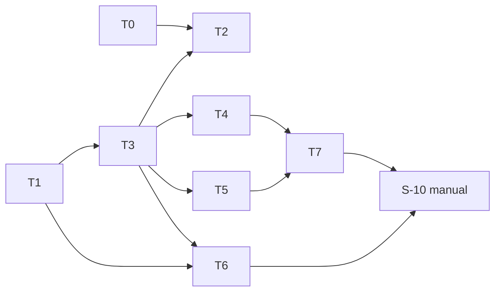

# tasks — retrieval-golden-scale

任務依 test-file 收斂，例外：`run_test.go` 承 `S-01`、`S-06,S-07,S-08`、`S-09` 三個任務——三者改動不同程式區
（system 載入／報表／embed 重試），合併會超過單一 agent 約 5 檔的範圍，且需分開 commit 以便回退（module-convergence
例外，理由如上）。內容撰寫（T6）排在 harness 之後，名次守門要用 T1 的 category 載入與 T3 的 system 目錄。

## T0 `[x]` [INFRA] spec REQ-05 措辭修訂與重算 fingerprint

- 原因：文件工件，無可單測行為；修訂 (a) 由使用者於 stdd-plan 模式建議選定（Decorator 放 `embed`、index 共用），(b)(c) 由 plan 階段 eagle 讀回指出（原句「loader 無 per-system overlay」與 `loader.go:44-50` 相反）
- 檔案：`STDD/retrieval-golden-scale/spec.md`：(a) REQ-05 首句、Requirements Checklist 第 5 項；(b) REQ-01 新鮮度句；(c) S-03 THEN 加「`projects/*/resources.yaml` 不存在」。逐字措辭見 design-be 第 7 條
- 步驟：改句 → `tail -n +8 spec.md | shasum -a 256` → 寫回 `approved_fingerprint`（`approved_date` 不變）→ eagle 讀回
- Verification command: `test "$(tail -n +8 STDD/retrieval-golden-scale/spec.md | shasum -a 256 | cut -d' ' -f1)" = "$(sed -n 's/^approved_fingerprint: //p' STDD/retrieval-golden-scale/spec.md)" && echo fp-ok`

## T1 `[x]` `S-05` [MODIFY] golden `Distractor` 型別、`KnownFields`、category 驗證

- 檔案：`internal/retrievaleval/golden.go`（`Entry.Distractors` :31-37、`LoadGolden` :102-124、`ValidateAgainstPlan` :43）＋
  `internal/retrievaleval/golden_test.go`；計分呼叫端 `run.go`／`corpus_test.go` 改傳 `d.Target`
- RED：`TestGolden_DistractorCategory`（四份 golden：缺 category／`fuzzy`／`Scope`／`relevant` 帶 category → 各回錯，
  斷言字串照 spec S-05）
- GREEN：`Distractor{Target inline; Category}`、`yaml.NewDecoder(bytes.NewReader(content)).KnownFields(true)`、
  精確 enum、`CategoryCounts()`；既有 `TestGolden_*` 與 `eval/retrieval-golden.yaml` 8 條目暫時各加 `category`（T6 再擴）
- Verification command: `go test ./internal/retrievaleval/ -run 'TestGolden_' -count=1 -v`

## T2 `[ ]` `S-09` [NEW] `embed.WithRateLimitRetry` decorator；index 改用；eval 接線

- 檔案：`internal/rag/embed/retry.go`＋`retry_test.go`（NEW）；`internal/rag/sqlite/indexer.go`（`embedChunks` :227-249
  刪內嵌迴圈、同迴圈內每批包一次 decorator，閉包供批次序號）；`internal/retrievaleval/run.go`（embedder 接線 :137-139）＋`run_test.go`
- 依賴：T0、T3
- RED：`run_test.go` `TestRun_RetriesRateLimitedEmbedding`（fixture `FailOn` 前兩次回 `&embed.StatusError{Code: 429}`；
  `Options.RetryWait` 零等待並記錄；斷言 ON 不降級、呼叫 3 次、等待 `[20s,40s]`、Progress 兩行含 `rate limited`）；
  `retry_test.go` `TestWithRateLimitRetry_StopsAfterMaxRetries`（第四次仍 429 → 回原錯誤）
- GREEN：decorator；indexer 改用（`embedRetryWait` 傳入 `Wait`、`OnRetry` 印既有字面）；`Options` 加 `RetryWait`
  （nil → `time.NewTimer` 實等）；既有 `TestIndex_RetriesRateLimitedBatch`、`TestIndex_GivesUpAfterThreeRateLimitRetries`
  零改動仍綠
- Verification command: `go test ./internal/rag/embed/ ./internal/rag/sqlite/ -run 'Retry|RateLimit' -count=1 -v && go test ./internal/retrievaleval/ -run TestRun_RetriesRateLimitedEmbedding -count=1 -v`

## T3 `[ ]` `S-01` [MODIFY] 子目錄即 system、fixture id、預檢兩段式

- 檔案：`internal/retrievaleval/run.go`（`Options` :24-34、`Run` :37、:38-49、:83、:105-111）、`plan.go`（:75 組 fixture id）、
  `run_test.go`（`newRunHarness` :48 改建 `retrieval-fixtures/<system>/`；既有 `TestRun_*` 全數改接）
- 依賴：T1（`d.Target`）
- RED：`TestRun_LoadsFixturesPerSystemDir`（alpha 合格、beta 無 `projects/beta`、`gamma` symlink、`notes.txt`；斷言錯誤字串、
  embedder 呼叫 0、報告不存在、無 `t.TempDir()` 路徑；子案「無合格子目錄」）
- GREEN：`loadSystems`、`fixtureID`、預檢段、`Options.System` 刪除、`resources.Load(root, systems[0])`；
  `TestRun_EmbedsOncePerRerankedTriple` 等既有測試改接新目錄結構後全綠
- Verification command: `go test ./internal/retrievaleval/ -run 'TestRun_LoadsFixturesPerSystemDir|TestRun_' -count=1`

## T4 `[ ]` `S-06,S-07,S-08` [MODIFY] system 欄、`retrieve_ms`、Mean by k、Distractors by category

- 檔案：`internal/retrievaleval/report.go`（`Header` :48-54、`Row` :40-46、標頭 :68、`renderCell` :140-147、新增兩個 render）、
  `run.go`（per-triple 迴圈 :148-205 計時與 k∈{1,3,K}、category 命中）、`run_test.go`
- 依賴：T3
- RED：`TestRun_RendersSystemColumnAndRetrieveMs`（20 欄標頭字面、`system` 欄、set 含 `|` 轉義、fixture 第二次呼叫失敗
  → 降級列五個 `_on` 格、header `retrieve_ms` 含 `(n=1)`、禁字掃描、各表列 `|` 數相等）；`TestRun_RendersMeanByK`
  （三列、`k=8` 列六格＝主表 mean、`TestRun_EmbedsOncePerRerankedTriple` 仍綠）；`TestRun_RendersDistractorsByCategory`
  （scope n=2 `1.00 (n=1)`、lexical n=1 `1.00 (n=1)`、其餘 `- (n=0)`）
- GREEN：`Row` 新欄、`Header.RetrieveMs`、`math.Round`、`renderMeanByK`、`renderByCategory`；既有
  `TestRun_RendersThreeArmTable`／`TestRun_WritesReportAndSanitizesHeader` 改接 20 欄
- Verification command: `go test ./internal/retrievaleval/ -run 'TestRun_RendersSystemColumnAndRetrieveMs|TestRun_RendersMeanByK|TestRun_RendersDistractorsByCategory|TestRun_EmbedsOncePerRerankedTriple' -count=1 -v && go test ./internal/retrievaleval/ -count=1`

## T5 `[ ]` `S-02` [NEW] `ragcmd.EvalFixturesDir` 與 main 接線

- 檔案：`internal/ragcmd/fixtures.go`＋`fixtures_test.go`（NEW）；`cmd/mrinspect/main.go`（:82-86 加 `fixtures` 偵測、:100-108
  改 `Options`、:95 移出）
- 依賴：T3（`Options.System` 已刪）
- RED：`TestEvalFixturesDir`（三組輸入 → `eval/retrieval-fixtures`／`x`／`eval/fixtures`）
- GREEN：helper；main 接線；`go build ./cmd/mrinspect` 過；`go vet ./...`
- Verification command: `go test ./internal/ragcmd/ -run TestEvalFixturesDir -count=1 -v && go build ./cmd/mrinspect`

## T6 `[ ]` `S-03,S-04` [MODIFY] 24 diff、corpus 三系統擴寫、48 條 golden、守門

- 檔案：`eval/retrieval-fixtures/{margherita-pizza,fried-chicken}/*.diff`（NEW 24）、`projects/_shared/*.md`、
  `projects/margherita-pizza/*.md`、`projects/fried-chicken/*.md`、`eval/retrieval-golden.yaml`、
  `internal/retrievaleval/corpus_test.go`（`TestCorpus_TierRankBands` :111-208 改迭代；新增 `TestCorpus_GoldenScale`）
- 依賴：T1、T3
- RED：`TestCorpus_GoldenScale`（14/10、48、雙 lane、五類 ≥6、4 複本 `bytes.Equal`、K 唯一、`projects/*/resources.yaml` 不存在；違反逐項列出）；
  `TestCorpus_TierRankBands` 改迭代 system 子目錄（RED 時目錄只有 4 複本 → 計數不足而紅）
- GREEN：`cp eval/fixtures/*.diff eval/retrieval-fixtures/margherita-pizza/`；撰寫 10＋10 新 diff；`_shared` 依 20 新 diff 補
  三類段落（承 24 個 `standards` query）；pizza／chicken 各補三類；golden 48 條目含 category；用 `TierRankBands` 輸出的
  實際名次迭代到落帶。分批派工：每批 ≤5 個 diff 及其段落，批間跑守門
- 內容約束：全虛構；不含工作機或內部 repo 名；heading 不含 ` > `；檔內 breadcrumb 唯一；`eval/fixtures/` 不動；
  `git diff --quiet HEAD -- eval/fixtures/`
- Verification command: `go test ./internal/retrievaleval/ -run 'TestCorpus_' -count=1 -v`

## T7 `[ ]` [INFRA] docs 一句更新

- 原因：文件工件，無可單測行為；措辭紅線由 eagle 讀回
- 檔案：`eval/README.md` Offline retrieval check 段、`docs/us/configuration.md`、`docs/tw/configuration.md`——各改一句：
  `eval/retrieval-fixtures/<system>/`、system 欄、兩張聚合表、`retrieve_ms` 行；無品質結論
- 依賴：T4、T5
- Verification command: `grep -c 'retrieval-fixtures' eval/README.md docs/us/configuration.md docs/tw/configuration.md && ! grep -ciE 'better|worse|improve' eval/README.md`

## Manual verification checklist

- [ ] S-10：本機 `MRI_RAG_EMBEDDINGS=true`＋Gemini key；`./bin/mrinspect index` 後等 ≥60 秒；
  `./bin/mrinspect eval -retrieval && ! grep -q 'degraded' eval/RETRIEVAL.md`；以 spec REQ-06 兩條判定 citable，
  結果與三張表、`retrieve_ms` 行記入 `docs/decisions_log.md` 新條目；報告 commit；citable 時方可更新引用數字

## Task 依賴

## Requirements Checklist（引 spec 尾節，approval 時逐項對）

- [ ] retrieval fixture 子目錄即 system（grammar、Lstat、`projects/` 存在）；預檢先於檢索；fixture id 前綴；`-fixtures` 明確值偵測可測；review eval 不受影響（T3、T5）
- [ ] 24 diff、48 條目、14/10 分佈、五類各 ≥6、4 複本位元組相同、K 唯一、`_shared` 擴寫、兩系統名次守門（T6）
- [ ] `Distractor` 型別、`KnownFields`、精確 enum、錯誤前綴（T1）
- [ ] 主表 system 欄、header `retrieve_ms` 行、Mean by k 六格、Distractors by category、零額外 Retrieve、`math.Round`、轉義、措辭（T4）
- [ ] `embed.WithRateLimitRetry` 3 次、可注入等待、index 共用、生產查詢路徑不變（T0、T2）
- [ ] 可引用門檻兩條只在 spec 與 decisions_log；報告只印數字（T7 讀回、S-10）
- [ ] Supersedes 兩條明文；凍結介面零變更；`eval/fixtures/` 原檔不動；錯誤訊息不含路徑（T3、T6）
