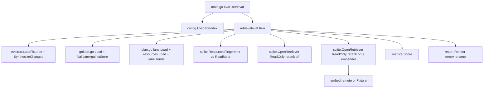
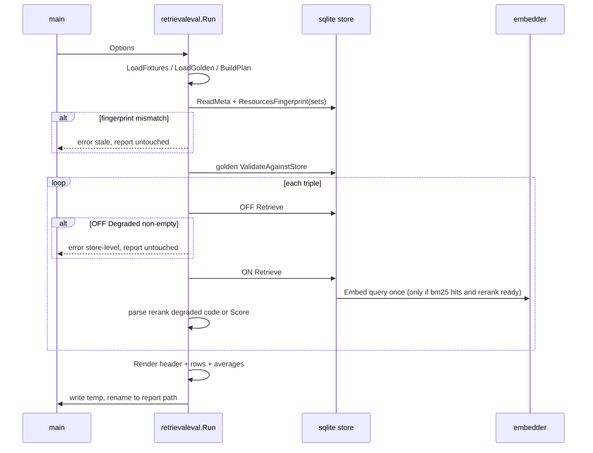

# design-be — retrieval-quality-eval

Implements `REQ-01`–`REQ-03`（spec.md，fingerprint `7054be9ee2454b4f…`）。純
backend/CLI：**design-fe.md 與 api.yml 均 N/A**（無 HTTP 面；embedding API 是既有
`internal/rag/embed` client 呼叫別人，不是本 change 的契約面）。

## 模組配置

| 位置 | 內容 | 對應 REQ |
|---|---|---|
| `projects/margherita-pizza/*.md`、`projects/_shared/*.md`（MODIFY/NEW 內容檔） | 虛構示範文件擴寫到 ≥200 標題段落；四主題各有相關段落；heading 不含 ` > `、檔內 breadcrumb 唯一。可新增檔案（如 `runtime.md`、`configuration.md`、`observability.md`），`resources.yaml` 的 `include: ["*.md"]` 不動 | REQ-01 |
| `eval/retrieval-golden.yaml`（NEW） | 結構化 `{fixture, lane, relevant:[{set,path,heading}]}`；每 fixture pizza ≥2、shared ≥1 | REQ-02 |
| `internal/retrievaleval/golden.go`（NEW） | `LoadGolden(path string, fixtures []string) (Golden, error)`：≤1 MiB、UTF-8、yaml 解析、覆蓋與每 set 最低數量；`(Golden) ValidateAgainstStore(ctx, storePath) error`：以單一 `SELECT s.name, d.rel_path, c.heading FROM chunks c JOIN documents d JOIN resource_sets s` 建集合比對，缺漏排序後最多 50 筆＋`and N more`。人讀鍵 `set/path#heading` 只在訊息中組字 | REQ-02 |
| `internal/retrievaleval/plan.go`（NEW） | `BuildPlan(repoRoot, system string, fixtures []evalrun.Fixture) ([]Triple, error)`：`lane.Load`＋`resources.Load`；只取 `Enabled` 且解析出 set 的 lane；TopK≤0 → `lane.DefaultLaneTopK`；每 fixture `terms := lane.Terms(fixture.Changes)`（`Fixture.Changes` 已由 `evalrun.LoadFixtures` 以 `SynthesizeChanges` 填好）；`Triple{Fixture, LaneID, Set, Terms, K}` | REQ-03 步 3 |
| `internal/retrievaleval/metrics.go`（NEW） | `Score(hits []rag.Chunk, relevant []Target, k int) (recall, mrr float64)`：hits 先截前 k，命中比對三欄 `ResourceSet/Source/Heading` | REQ-03 步 6 |
| `internal/retrievaleval/report.go`（NEW） | `Header{BuiltAt, ResourcesSHA, EmbedModel, Pool, GeneratedAt}` 驗證（RFC3339／64 hex／可列印 ASCII ≤64）；`Row{Fixture, Lane, Set, K, Off Cell, On Cell}`，`Cell{Value float64; Degraded string}`；`Render(w, Header, []Row) error` 轉義 `|` 與換行；平均列排除 degraded；寫檔 = 同目錄 temp＋`os.Rename` | REQ-03 步 7 |
| `internal/retrievaleval/run.go`（NEW） | `Run(ctx, Options) error`，`Options{RepoRoot, System, FixturesDir, GoldenPath, StorePath, ReportPath, Embedding config.RAGEmbeddingConfig, Embedder embed.Embedder(可注入，nil 時依 Embedding 建 remote)}`。順序：fixtures→golden→plan→**freshness**（`sqlite.ResourcesFingerprint(sets)` vs `schema_meta.resources_sha256`）→ 開兩個 retriever（`sqlite.OpenRetriever(store, sets, sqlite.WithReadOnly(), ...)`）→ 逐三元組 OFF/ON → 失敗政策（OFF Degraded 非空或 ON 非 `rerank degraded:` 前綴 → 回錯，報告不動；ON 前綴匹配 → cell.Degraded=code）→ Render。**不呼叫 CIGuard、不 import internal/ai** | REQ-03 |
| `internal/evalrun/evalrun.go`（MODIFY：`synthesizeChanges` :546 → 匯出 `SynthesizeChanges`，內部呼叫點 :357 改名） | 讓 harness 與 eval 共用同一 diff→changes 合成器（生產同構） | REQ-03 步 3 |
| `internal/rag/sqlite/indexer.go`（MODIFY：抽出 :162-179 的行雜湊為 `ResourcesFingerprint(sets []resources.Set) (string, error)`，indexer 內部改呼叫同一函式） | 新鮮度比對的單一真相；走訪與 index 同一 walker（`intake.Walk`）與 `relativePath`/`contentHash` | REQ-03 步 2 |
| `internal/rag/sqlite/retriever.go`（MODIFY：新增 `WithReadOnly() RetrieverOption`；`OpenRetriever` :73 依選項把 DSN 改為 `file:<path>?mode=ro`） | 唯讀開啟 store；預設路徑行為不變 | 硬約束 |
| `internal/rag/sqlite/store.go` 或新 `meta.go`（MODIFY/NEW：`ReadMeta(path) (Meta{BuiltAt, ResourcesSHA256, EmbedModel, EmbedDim}, error)`） | 報告標頭與新鮮度共用的 schema_meta 讀取；`ragwire/review_path.go:137` 現有 ad-hoc SELECT 不動（非本 change 範圍） | REQ-03 步 2、7 |
| `cmd/mrinspect/main.go`（MODIFY：eval 旗標組 :61-63 加 `-retrieval` bool、`-store`；`-retrieval` 為真 → `config.LoadForIndex()`＋`retrievaleval.Run`，`-report` 預設改 `eval/RETRIEVAL.md`） | CLI 入口；CIGuard :57 已在前 | REQ-03 |
| `docs/{us,tw}/configuration.md`、`eval/fixtures/README.md` | 一段說明 `eval -retrieval` 與 golden 檔位置；措辭無品質結論 | checklist |

## Table schema

無新表、無 schema 變更。只讀既有 `schema_meta`（`schema.sql`）：

| 欄位 | 用法 |
|---|---|
| `built_at TEXT` | 標頭；MUST RFC3339 |
| `resources_sha256 TEXT` | 新鮮度比對＋標頭前 8 碼；MUST 64 小寫 hex |
| `embed_model TEXT` | 標頭；MUST 可列印 ASCII ≤64 |

golden 存在性校驗讀 `chunks`／`documents`／`resource_sets` 三表（既有）。

## 服務關係

## 執行序

## 關鍵設計決定

1. **harness 不碰 `internal/ai`、不呼叫 CIGuard**：guard 留在 `main.go:57`（已在旗標解析前），
   所以 S-08/S-09 等自動化測試可直接呼叫 `Run` 而不受 `CI=true` 影響（elf F1）。
2. **失敗政策二分**：`rerank degraded: <code> (` 前綴＝rerank 家族（allowlist 內的 code，
   `retriever.go:366-373`）→ 逐格；其他 `Degraded` 文字＝store 級（可能含路徑）→ 整趟拒，
   永不寫進報告（orc 7、elf F3）。
3. **新鮮度以同一份雜湊實作**：把 indexer 的行雜湊抽成 `ResourcesFingerprint`，indexer 與
   harness 共用；避免兩份實作漂移（D2）。
4. **唯讀開啟以選項實現**，不改預設 DSN；modernc sqlite 的 `?mode=ro` 需 `file:` URI 形式——
   T4 GREEN 時實測，若不支援改用 `_pragma=query_only(1)`，並記回本檔。
5. **golden 存在性一次 SELECT 全表三欄**（≤數百列），在記憶體比對，不逐鍵查詢。
6. **S-52 模式檢視**：既有 `RetrieverOption` 函式選項模式沿用（`WithReadOnly`）；無新 GoF
   模式——報告 Render 是單一模板，不設 Strategy；三元組展開是單一巢狀迴圈，不設 Builder。

## Requirements Checklist（S-51，plan 版）

- [ ] corpus ≥200 chunk、breadcrumb 檔內唯一、heading 不含 ` > `（T5）
- [ ] golden 結構化欄位、覆蓋、每 set 最低數量、存在性、大小與列出上限（T1、T5）
- [ ] `SynthesizeChanges`／`ResourcesFingerprint`／`WithReadOnly`／`ReadMeta` 匯出（T3、T4）
- [ ] 生產同構解析（Enabled、registry、TopK）（T3）
- [ ] 新鮮度檢查、失敗政策、雙欄報告、標頭驗證與轉義、嵌入次數（T4）
- [ ] `eval -retrieval` 旗標與 docs（T6）
- [ ] harness 套件不 import `internal/ai`（T4 讀回檢查）
- [ ] 措辭紅線：報告只有數字與標頭；docs 不宣稱品質（T6 讀回檢查）
- [ ] 測試全部隔離：臨時 store、`embed.Fixture`、`t.Setenv` 清憑證（每 task GREEN 條件）
- [ ] 凍結介面零變更；既有測試全綠（每 task GREEN 條件）
