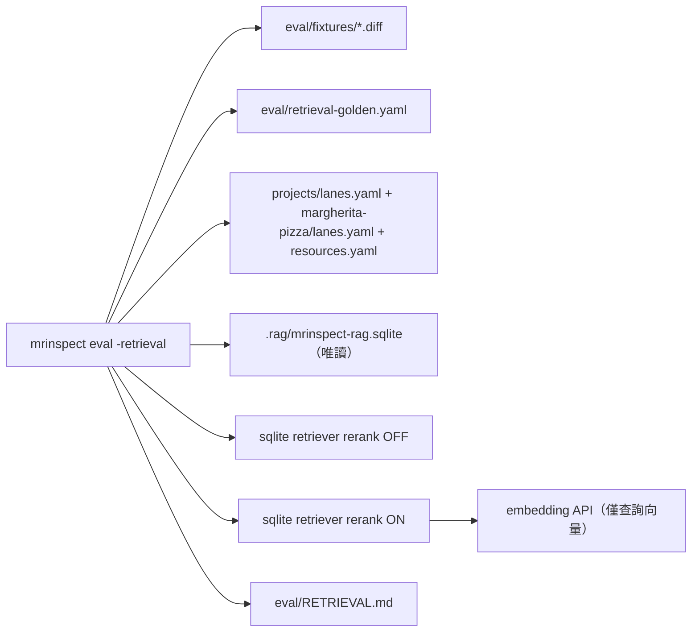

# retrieval-quality-eval — 離線檢索品質量測

## 背景與範圍

embedding-rerank 以「功能正確即可」驗收，並把品質對照留待「資源集擴大後另議」
（`STDD/embedding-rerank/spec.md:23-24`）。本 change 就是那個另議：把示範專案
文件擴到有鑑別力的規模，建一份 golden 對照表，提供一條**零生成呼叫**的離線路徑，
對每個 eval fixture × lane 跑檢索，輸出 rerank 關／開兩欄的 recall@k 與 MRR。
與 review-quality-eval 的 D5 deferred（`STDD/review-quality-eval/spec.md:236-238`，
審查**發現**的 precision/recall，無答案卷）不同軸：本 change 量的是**檢索命中**，
答案卷就是 golden 檔。

**接手措辭紅線**（使用者裁決 2026-09-05）：embedding-rerank checklist
「報告與 docs 不得出現 benchmark 類字樣」（`spec.md:263`）縮為「不得出現**結論性**
措辭」——`eval/RETRIEVAL.md` 只列數字與 n，不寫「提升／較佳／改善」；README 與
configuration.md 仍不宣稱品質。這是文件審查規則，列於 Requirements Checklist，
不做成單元測試。

硬約束：
- 凍結介面（`rag.Retriever`／`rag.FullLoader`／`rag.Query`／`rag.Chunk`／`rag.Result`，
  `STDD/rag-resource-store/spec.md:291,324,954`）零變更；harness 只呼叫既有方法。
- 零生成呼叫：harness 套件不得 import `mrinspect/internal/ai`；唯一對外流量是
  rerank ON 欄的 embedding 查詢向量呼叫。
- 生產同構：查詢詞取 `lane.Terms(changes)`（`internal/reviewer/multilane.go:40` 的生產
  形式），`changes` 由既有 diff 合成器產生（`internal/evalrun/evalrun.go:546
  synthesizeChanges`，本 change 匯出為 `SynthesizeChanges`）；lane 宣告取
  `lane.Load(repoRoot, system)`（`internal/lane/registry.go:63-95`），只取 `Enabled` 的
  lane（同 `internal/lane/fanout.go:111`），set 與 TopK 依 `internal/lane/compose.go:307-336`
  規則以 `resources.Load` 建的 registry 解析。不得自行造查詢。
- 不設分數門檻、不 fail CI、不進 `.gitlab-ci.yml`／GitHub Actions。CI 誤觸防護沿用
  `cmd/mrinspect/main.go:57` 既有 `evalrun.CIGuard()` 呼叫點（它在 `eval` 旗標解析之前），
  harness 函式本身**不**呼叫 guard。
- 自動化測試 MUST 隔離：臨時建的 store、`embed.Fixture` embedder、清空憑證環境、無網路；
  只有 S-10 手動情境可碰真 store／真 key。
- 本地單人工具：store 以唯讀模式開啟；報告寫入採同目錄臨時檔＋rename。不做跨程序
  快照鎖（見 Rejected options）。
- corpus 與 golden 只擴 `projects/margherita-pizza/` 與 `projects/_shared/`（fixtures 的
  system 是 margherita-pizza；`fried-chicken` 不被任何 fixture 查詢，不動）。
- 公開工件不得含工作機或內部 repo 名；示範文件內容為虛構。

## System context（C2）



## REQ-01 — 示範 corpus 擴到有鑑別力的規模

`projects/margherita-pizza/*.md` 與 `projects/_shared/*.md` 合計 MUST 產生 ≥200 個
標題段落 chunk（chunker 一標題一 chunk，`internal/rag/chunk/markdown.go:7-53`），內容
MUST 為虛構示範專案文件。每個 chunk 的 heading breadcrumb（`markdown.go:83`，
`H1 > H2 > H3`）MUST 在同一檔內唯一，且 heading 文字 MUST NOT 含 ` > `（避免與
breadcrumb 分隔符混淆）。四個 fixture 主題（回應清洗 marker 語意、併發 metrics 鎖、
lane overlay 設定語意、零值 TopK 預設）的相關段落分布由 golden 檔規定並驗證（REQ-02
S-02），不另設干擾比例門檻（≥200 減去至多十餘個相關段落，干擾比例是算術必然）。

### S-01 corpus 規模與 breadcrumb 唯一

- GIVEN `projects/resources.yaml` 宣告的 `margherita-pizza-docs` 與 `shared-standards` 路徑
- WHEN 以 `chunk.Markdown` 走訪兩組路徑下所有 `*.md`
- THEN chunk 總數 ≥200
- AND 每個檔案內的 breadcrumb 無重複，且無任何 heading 文字含 ` > `

Test mapping: `internal/retrievaleval/corpus_test.go::TestCorpus_MeetsSizeAndUniqueBreadcrumbs`
Verification command: `go test ./internal/retrievaleval/ -run TestCorpus_MeetsSizeAndUniqueBreadcrumbs -count=1`

## REQ-02 — golden 對照檔

`eval/retrieval-golden.yaml` MUST 為每個 fixture × 每個會檢索的 lane（現況
`spec-conformance`、`standards`）列出相關段落。每個相關段落以**結構化欄位**
`{set, path, heading}` 表示（heading 為完整 breadcrumb）；`set/path#heading` 只是
報告與錯誤訊息的人讀呈現，不是識別鍵（`path` 或 heading 可含 `#`）。每個 fixture
MUST 在 `margherita-pizza-docs` 有 ≥2 個、在 `shared-standards` 有 ≥1 個相關段落。
golden 不宣告 k——k 一律取該 lane 解析後的 TopK（`compose.go:324-329`）。

載入 MUST 驗證並在任一不符時回錯、不產生報告：
(a) 檔案 ≤1 MiB、UTF-8、可解析；(b) 每個 `eval/fixtures/NN-*.diff` 都有兩個 lane 的
條目，且 fixtures 目錄非空；(c) 每 fixture 的 set 最低數量如上；(d) 每個相關段落在
store 中存在（`ResourceSet`＋`Source`＋`Heading` 三欄完全相符，
`internal/rag/sqlite/retriever.go:181-190`）——缺漏全部列出，最多列 50 筆並附省略總數。
golden 不綁 chunk id。

格式：

```yaml
entries:
  - fixture: 01-echo-cut-earliest-marker.diff
    lane: spec-conformance
    relevant:
      - set: margherita-pizza-docs
        path: architecture.md
        heading: Response pipeline > Marker precedence
```

### S-02 golden 覆蓋與每 set 最低數量

- GIVEN `eval/fixtures/` 有 N≥1 個合法 fixture
- WHEN 載入一份缺某 fixture `standards` 條目的 golden
- THEN 回錯，訊息含該 fixture 檔名與 `standards`
- AND 載入一份某 fixture 在 `margherita-pizza-docs` 只有 1 個相關段落的 golden → 回錯，
  訊息含該 fixture 與 `margherita-pizza-docs`
- AND fixtures 目錄為空 → 回錯 `no fixtures`，不產生報告

Test mapping: `internal/retrievaleval/golden_test.go::TestGolden_RejectsIncompleteCoverage`
Verification command: `go test ./internal/retrievaleval/ -run TestGolden_RejectsIncompleteCoverage -count=1`

### S-03 golden 段落必須存在於 store，缺漏有界列出

- GIVEN golden 有 60 個相關段落在 store 中不存在
- WHEN 載入 golden 並對 store 校驗
- THEN 回錯，訊息列出 50 筆 `set/path#heading` 並含 `and 10 more`
- AND 一份 2 MiB 的 golden → 回錯 `golden exceeds 1 MiB`，不解析內容

Test mapping: `internal/retrievaleval/golden_test.go::TestGolden_RejectsUnknownEntriesBounded`
Verification command: `go test ./internal/retrievaleval/ -run TestGolden_RejectsUnknownEntriesBounded -count=1`

## REQ-03 — `mrinspect eval -retrieval` 離線量測路徑

在既有 `eval` 旗標組（`cmd/mrinspect/main.go:61-63`）新增 `-retrieval` bool 與
`-store`（預設 `.rag/mrinspect-rag.sqlite`）；`-retrieval` 為真時改走 harness，`-report`
預設改為 `eval/RETRIEVAL.md`。fixtures 目錄固定 `eval/fixtures`、golden 固定
`eval/retrieval-golden.yaml`、system 取 `cfg.Service.Name`（不設旗標）。設定以
`config.LoadForIndex()`（`config.go:211-233`，不要求 `AI_PROVIDER_KEY`，已驗證
embedding provider/key）取得。不新增 `Dispatch` 路徑、不新增 config loader。

執行 MUST 依序：
1. 載入 fixtures 與 golden（REQ-02 驗證）；以 `resources.Load` 建 registry、`lane.Load`
   取 lane；任一失敗 → 回錯、既有報告不動。
2. **新鮮度**：以現行已解析 set 的檔案重算 resources 指紋（`internal/rag/sqlite/indexer.go`
   的排序行雜湊，本 change 匯出為 `sqlite.ResourcesFingerprint(sets)`），MUST 等於 store
   `schema_meta.resources_sha256`；不等 → 回錯 `store is stale; rerun mrinspect index`，
   報告不動。
3. 對每個 fixture：`changes := evalrun.SynthesizeChanges(diff)`、`terms := lane.Terms(changes)`；
   對每個 Enabled 且解析出 set 的 lane，逐 set 形成 (fixture, lane, set) 三元組，k＝該 lane TopK。
4. 每個三元組呼叫兩個 retriever（`sqlite.OpenRetriever` 直開，不經 `rag.New`）：
   OFF＝`WithEmbeddingConfig(false, keyPresent)`；ON＝`WithEmbeddingConfig(true, keyPresent)`
   ＋`WithEmbedder(e)`（有 key 時）。
5. **失敗政策**：OFF 側 `Result.Degraded` 非空（store 級降級，`retriever.go:127-145`）→
   整趟回錯、報告不動。ON 側 `Degraded` 條目以 `rerank degraded: <code> (` 前綴解析出
   `<code>`；有此前綴 → 該格印 `degraded: <code>`、平均排除該列、**繼續**下一三元組；
   無此前綴（store 級）→ 整趟回錯。
6. 指標：recall@k＝|hits∩relevant|/|relevant|；MRR＝首個相關命中的 1/rank，無命中＝0；
   hits 取 `Result.Chunks` 前 k 個。
7. 報告 `eval/RETRIEVAL.md`（臨時檔＋rename）：標頭列 store `built_at`（MUST 為 RFC3339，
   否則回錯）、`resources_sha256` 前 8 碼（MUST 為 64 小寫 hex，否則回錯）、embed model
   （MUST 為可列印 ASCII ≤64 字，否則回錯）、候選池說明字串
   `pool: off=TopK+1 on=4xTopK`（`retriever.go:151-153`，兩欄差異含候選池寬度）、產生時間；
   每列 (fixture, lane, set, k) 的 `recall_off | recall_on | mrr_off | mrr_on`；末列各欄平均
   與 `n=`。所有寫入表格的字串 MUST 轉義 `|` 與換行。報告與錯誤訊息 MUST NOT 含
   `MRI_RAG_EMBED_KEY` 值、絕對路徑、URL。
8. embedding 呼叫數：每個 ON 側 bm25 回傳 ≥1 chunk 且 rerank 未降級的三元組恰一次
   （`retriever.go:193-196` 零候選時不嵌入），其餘為零。

### S-04 store 過期即拒跑

- GIVEN 以 fixture embedder 建好的測試 store、對應的 corpus 目錄與完整 golden
- WHEN 修改 corpus 中一個檔案的一個位元組後執行 harness（不重建 store）
- THEN 回錯，訊息含 `stale` 與 `rerun mrinspect index`
- AND 若報告檔已存在，其 sha256 不變

Test mapping: `internal/retrievaleval/run_test.go::TestRun_RefusesStaleStore`
Verification command: `go test ./internal/retrievaleval/ -run TestRun_RefusesStaleStore -count=1`

### S-05 lane／set／TopK 解析與生產同構

- GIVEN 測試用 `lanes.yaml`（三 lane：一個 `enabled: false`、一個 tags 解析到 set A、
  一個 sets 明列 set B 且 `topK: 3`）與對應 `resources.yaml`
- WHEN harness 推導三元組清單
- THEN 只得兩個三元組：(lane₂, A, k=DefaultLaneTopK) 與 (lane₃, B, k=3)
- AND 停用 lane 不出現；無 set 的 lane 不出現

Test mapping: `internal/retrievaleval/plan_test.go::TestPlan_MatchesProductionLaneResolution`
Verification command: `go test ./internal/retrievaleval/ -run TestPlan_MatchesProductionLaneResolution -count=1`

### S-06 指標計算含 k 截斷

- GIVEN relevant={A,B}
- WHEN k=4、命中 [C,A,D,E] → recall=0.5、MRR=0.5；命中 [A,B,C,D] → 1.0、1.0
- THEN 上述成立
- AND k=2、命中 [C,D,A,B] → recall=0、MRR=0（第 3 名起不計）
- AND relevant={A}、命中 [] → 0、0

Test mapping: `internal/retrievaleval/metrics_test.go::TestMetrics_RecallMRRAndTruncation`
Verification command: `go test ./internal/retrievaleval/ -run TestMetrics_RecallMRRAndTruncation -count=1`

### S-07 雙欄報告與標頭淨化

- GIVEN 以 fixture embedder 建的測試 store（有向量）、兩個 fixture、完整 golden、
  環境 `MRI_RAG_EMBED_KEY=SENTINEL-KEY-8f3a`
- WHEN 執行 harness
- THEN 報告含標頭五欄位（built_at、resources_sha256 前 8 碼、embed model、pool 字串、產生時間）、
  每列四個數字欄、末列平均與 `n=`
- AND 報告全文不含 `SENTINEL-KEY-8f3a`、不含 store 的絕對路徑、不含 `http`
- AND 若 store 的 `embed_model` 含換行 → 回錯，報告不產生

Test mapping: `internal/retrievaleval/run_test.go::TestRun_WritesReportAndSanitizesHeader`
Verification command: `go test ./internal/retrievaleval/ -run TestRun_WritesReportAndSanitizesHeader -count=1`

### S-08 失敗政策：ON 逐列降級、OFF 整趟拒絕

- GIVEN 四個三元組、fixture embedder 設定第 3 次呼叫回錯
- WHEN 執行 harness
- THEN 報告 ON 欄第 3 列為 `degraded: embed-call-failed`，第 4 列仍為數字，OFF 欄四列皆數字，
  ON 平均列 `n=3`
- AND 改用無向量 store → ON 欄四列皆 `degraded: no-vectors`、ON `n=0`、OFF 欄四列數字
- AND 改用缺少某 set 的 store（OFF 側 store 級降級）→ 整趟回錯，既有報告 sha256 不變

Test mapping: `internal/retrievaleval/run_test.go::TestRun_DegradationPolicy`
Verification command: `go test ./internal/retrievaleval/ -run TestRun_DegradationPolicy -count=1`

### S-09 嵌入呼叫次數

- GIVEN 三元組中有一組的 terms 在 store 無任何 bm25 命中、其餘 M 組有命中，store 有向量
- WHEN 執行 harness
- THEN 計數型 fixture embedder `Calls()` 恰為 M
- AND 改用無向量 store → `Calls()` 為 0

Test mapping: `internal/retrievaleval/run_test.go::TestRun_EmbedsOncePerRerankedTriple`
Verification command: `go test ./internal/retrievaleval/ -run TestRun_EmbedsOncePerRerankedTriple -count=1`

### S-10 [MANUAL] 真 key 端對端

- GIVEN 本機 `MRI_RAG_EMBEDDINGS=true`、`MRI_EMBED_PROVIDER=gemini`、`MRI_RAG_EMBED_KEY`、
  已用擴大後 corpus 重跑 `mrinspect index`
- WHEN 執行 `./bin/mrinspect eval -retrieval`
- THEN `eval/RETRIEVAL.md` 產生，ON 欄無 `degraded`，`.ai-log` 不新增檔案（零生成呼叫）
- AND `CI=true ./bin/mrinspect eval -retrieval` 以非零碼結束（既有 guard）
- AND 報告 commit 進 repo，內容只有數字與標頭

Test mapping: manual
Verification command: `./bin/mrinspect eval -retrieval && grep -c degraded eval/RETRIEVAL.md; ls .ai-log | wc -l`

## Rejected options

- 以 mrinspect 自身 docs/STDD 當 corpus——使用者選假專案，保持示範專案設定、避免 repo 自我參照
- 純 Go test harness——flag-on 欄需真 key，CI 不可跑；無人讀報告
- 塞進既有 `eval` 報告——檢索量測被綁在生成配額上，失去離線優勢
- LLM 標註 golden——吃配額且量測工具依賴被量測的供應商
- 純人工標註——corpus 每變動就要重標，不可維護
- 只擴 corpus 不量測——違反 Delete First，擴多少無依據
- 分數門檻／CI fail——n 小、量測尚未驗證有訊號（D6）
- 新 `eval retrieval` 子命令＋新 `Dispatch` 路徑——hobbit：既有 eval 旗標組加 bool 即可，guard 位置不變
- 新 `config.LoadForRetrievalEval()`——hobbit：`LoadForIndex` 已不要求生成 key 且驗證 embedding 設定
- golden 頂層 `k`——elf/hobbit：與 lane TopK 雙來源，必分歧
- 決策表——hobbit/elf：欄位恆值、四列同引一情境；改為 REQ-03 第 5 步文字規則
- 干擾比例 ≥80% 門檻——elf/hobbit：算術必然，不可能獨立失敗
- `go list -deps` 與禁語 grep 單元測試——hobbit：測試自身模板；改列 checklist
- 跨程序快照鎖／報告鎖——orc 提出；本地單人工具，唯讀開啟＋temp+rename 足夠，鎖屬過度設計

## Adjudications

- REQ-01: REFUTED（elf F5／hobbit 7／orc 1）→ 刪 ≥80% 比例；主題覆蓋改由 golden 每 set 最低數量（S-02）落實；唯一性改為 breadcrumb 且禁 ` > `
- REQ-02: REFUTED（orc 2、3；elf F6／hobbit 4）→ 結構化 `{set,path,heading}`；刪 `k`；1 MiB 上限；缺漏列 50 筆＋省略數
- REQ-03: REFUTED（elf F1、F2、F3、F4、F7；hobbit 1、2、3、5、6；orc 4、5、7、8）→ 改 `-retrieval` bool、guard 留在 main.go；重用 `LoadForIndex`；`lane.Terms(SynthesizeChanges)`＋Enabled 過濾＋registry；新鮮度檢查；OFF 降級整趟拒、ON 逐列；嵌入次數依有命中三元組；標頭驗證與轉義；測試隔離
- hobbit 建議刪 MRR：不採——使用者裁決兩指標
- orc 建議快照鎖：不採——見 Rejected options

## Requirements Checklist

- [ ] corpus ≥200 chunk、breadcrumb 檔內唯一、heading 不含 ` > `（REQ-01）
- [ ] golden 結構化欄位、覆蓋與每 set 最低數量、存在性、大小與列出上限（REQ-02）
- [ ] `eval -retrieval` 旗標、`LoadForIndex` 重用、`SynthesizeChanges` 與 `ResourcesFingerprint` 匯出、
      新鮮度檢查、生產同構解析、雙欄報告、失敗政策、嵌入次數（REQ-03）
- [ ] harness 套件不 import `mrinspect/internal/ai`（code review 檢查，非測試）
- [ ] 措辭紅線：`eval/RETRIEVAL.md` 只有數字與標頭；README/configuration.md 不宣稱品質
- [ ] 自動化測試全部隔離（臨時 store、fixture embedder、清空憑證、無網路）
- [ ] 凍結介面零變更；既有測試全綠
