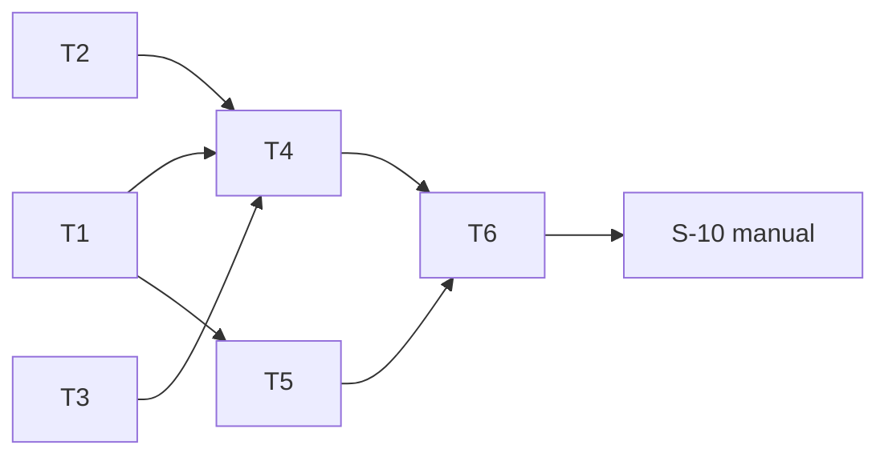

# tasks — retrieval-quality-eval

任務依 test-file 收斂原則分組：`S-02`–`S-03` 共用 `golden_test.go`；
`S-04`、`S-07`–`S-09` 共用 `run_test.go`；其餘各一檔。corpus 內容（T5）排在
loader 之後，讓真 golden 能被 T1 的驗證器直接檢查。

## T1 `[x]` `S-02,S-03` [NEW] golden 載入與驗證

- 檔案：`internal/retrievaleval/golden.go`＋`internal/retrievaleval/golden_test.go`
- RED：`TestGolden_RejectsIncompleteCoverage`（缺 lane 條目→錯含檔名與 `standards`；
  pizza 只 1 筆→錯含 fixture 與 `margherita-pizza-docs`；fixtures 空→`no fixtures`）＋
  `TestGolden_RejectsUnknownEntriesBounded`（60 筆不存在→列 50 筆＋`and 10 more`；
  2 MiB 檔→`golden exceeds 1 MiB` 且不解析）；store 以 `sqlite.Index`＋`embed.NewFixture`
  建於 `t.TempDir()`
- GREEN：`LoadGolden`、`ValidateAgainstStore`（單一三表 SELECT 建集合）
- Verification command: `go test ./internal/retrievaleval/ -run 'TestGolden_RejectsIncompleteCoverage|TestGolden_RejectsUnknownEntriesBounded' -count=1 -v`

## T2 `[x]` `S-06` [NEW] 指標計算

- 檔案：`internal/retrievaleval/metrics.go`＋`internal/retrievaleval/metrics_test.go`
- RED：`TestMetrics_RecallMRRAndTruncation`（k=4 兩例；k=2 截斷例；空命中例）
- GREEN：`Score(hits, relevant, k)`，三欄比對
- Verification command: `go test ./internal/retrievaleval/ -run TestMetrics_RecallMRRAndTruncation -count=1 -v`

## T3 `[x]` `S-05` [MODIFY] 三元組規劃與 SynthesizeChanges 匯出

- 檔案：`internal/retrievaleval/plan.go`＋`internal/retrievaleval/plan_test.go`；
  `internal/evalrun/evalrun.go:synthesizeChanges`（:546 匯出為 `SynthesizeChanges`，:357 呼叫點改名）
- 依賴：無（可與 T1/T2 平行，但不同 Codex 批次）
- RED：`TestPlan_MatchesProductionLaneResolution`（測試用 `lanes.yaml`／`resources.yaml`
  寫入 `t.TempDir()`：停用 lane、tags 解析 set A、sets 明列 set B `topK: 3` → 恰兩個三元組）
- GREEN：`BuildPlan`；`lane.Load`＋`resources.Load`＋Enabled 過濾＋`lane.Terms`
- Verification command: `go test ./internal/retrievaleval/ -run TestPlan_MatchesProductionLaneResolution -count=1 -v && go test ./internal/evalrun/ -count=1`

## T4 `[x]` `S-04,S-07,S-08,S-09` [MODIFY] harness 主流程、報告、sqlite 匯出

- 檔案：`internal/retrievaleval/{run.go,report.go}`＋`internal/retrievaleval/run_test.go`；
  `internal/rag/sqlite/indexer.go`（:162-179 抽為 `ResourcesFingerprint`）、
  `internal/rag/sqlite/retriever.go:OpenRetriever`（:73 加 `WithReadOnly`）、
  `internal/rag/sqlite/meta.go`（NEW `ReadMeta`）
- 依賴：T1、T2、T3
- RED：`TestRun_RefusesStaleStore`、`TestRun_WritesReportAndSanitizesHeader`
  （`t.Setenv("MRI_RAG_EMBED_KEY","SENTINEL-KEY-8f3a")`；embed_model 含換行→錯）、
  `TestRun_DegradationPolicy`（`Fixture.ErrAt=3`→第 3 列 degraded、`n=3`；無向量 store→
  四列 `no-vectors`；缺 set store→整趟錯且報告 sha 不變）、
  `TestRun_EmbedsOncePerRerankedTriple`（一組零 bm25 命中→`Calls()==M`；無向量→0）
- GREEN：`Run`＋`Render`＋三個 sqlite 匯出；既有 `internal/rag/sqlite` 測試全綠；
  `WithReadOnly` DSN 實測（`?mode=ro` 不支援則改 `_pragma=query_only(1)` 並記回 design-be 第 4 條）
- Verification command: `go test ./internal/retrievaleval/ -run 'TestRun_RefusesStaleStore|TestRun_WritesReportAndSanitizesHeader|TestRun_DegradationPolicy|TestRun_EmbedsOncePerRerankedTriple' -count=1 -v && go test ./internal/rag/sqlite/ -count=1`

## T5 `[x]` `S-01` [NEW] corpus 擴寫與真 golden

- 檔案：`projects/margherita-pizza/*.md`（擴寫既有兩檔、可新增檔）、`projects/_shared/coding-standards.md`
  （擴寫、可新增檔）、`eval/retrieval-golden.yaml`；測試 `internal/retrievaleval/corpus_test.go`
- 依賴：T1（真 golden 用 `LoadGolden` 做結構驗證）
- RED：`TestCorpus_MeetsSizeAndUniqueBreadcrumbs`（走 `resources.Load` 解析的兩 set 路徑；
  `chunk.Markdown` 總數 ≥200；檔內 breadcrumb 唯一；heading 不含 ` > `）＋同檔
  `TestCorpus_GoldenCoversAllFixtures`（真 `eval/retrieval-golden.yaml` 對真 `eval/fixtures`
  通過 `LoadGolden` 的覆蓋與每 set 最低數量檢查；不碰 store）
- GREEN：撰寫虛構文件（四主題各 ≥2 pizza、≥1 shared 相關段落，其餘干擾）＋ golden；
  內容不得含工作機或內部 repo 名
- Verification command: `go test ./internal/retrievaleval/ -run 'TestCorpus_MeetsSizeAndUniqueBreadcrumbs|TestCorpus_GoldenCoversAllFixtures' -count=1 -v`

## T6 `[x]` [INFRA] CLI 旗標與 docs

- 原因：`main.go` 旗標接線無獨立行為可單測（guard 與 flag 解析屬既有路徑，S-10 手動覆蓋）；
  docs 為文件工件。
- 檔案：`cmd/mrinspect/main.go:61-63`（`-retrieval`、`-store`；為真時 `LoadForIndex`＋`retrievaleval.Run`，
  `-report` 預設 `eval/RETRIEVAL.md`）；`docs/us/configuration.md`、`docs/tw/configuration.md`、
  `eval/fixtures/README.md` 各一段（無品質結論措辭）
- 依賴：T4、T5
- Verification command: `go build ./... && go vet ./... && grep -c "eval -retrieval" docs/us/configuration.md docs/tw/configuration.md eval/fixtures/README.md`

## Manual verification checklist

- [ ] S-10：本機 `MRI_RAG_EMBEDDINGS=true`＋`MRI_EMBED_PROVIDER=gemini`＋`MRI_RAG_EMBED_KEY`，
  以擴大後 corpus 重跑 `./bin/mrinspect index`，執行 `./bin/mrinspect eval -retrieval`：
  `eval/RETRIEVAL.md` 產生、ON 欄無 `degraded`、`.ai-log` 檔數不變；
  `CI=true ./bin/mrinspect eval -retrieval` 非零碼；報告 commit。

## Task 依賴

## Requirements Checklist（引 design-be.md S-51 節，approval 時逐項對）

- [ ] REQ-01（T5）、REQ-02（T1/T5）、REQ-03（T3/T4/T6）、docs 與措辭（T6）、
  既有不變量回歸（T3/T4 GREEN 條件）
