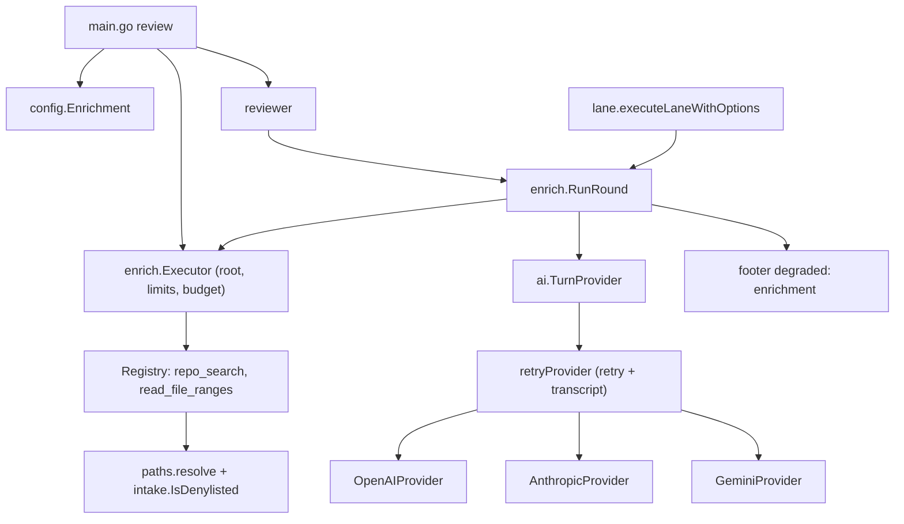
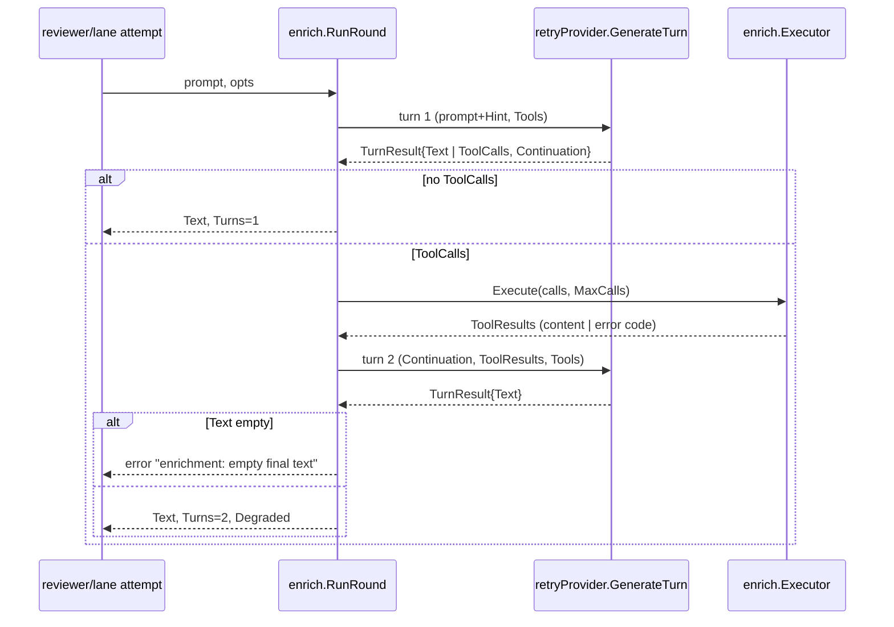

# design-be — review-enrichment-round

Implements `REQ-01`–`REQ-06`（spec.md，fingerprint `91f8a59362da5d7b…`）。純 backend/CLI：**design-fe.md 與 api.yml 均 N/A**（無 HTTP 面；三家 provider API 是既有 client 呼叫別人）。程式碼調查已做（三個 outrider，2026-09-28），下列 `[MODIFY]` 引用皆為現行行號。

## 模組配置

| 位置 | 內容 | 對應 REQ |
|---|---|---|
| `internal/config/config.go`（MODIFY：`Config` :64-95 加 `Enrichment EnrichmentConfig`；`load` :108 內解析；沿用 `getEnv` :251／`getEnvInt` :258） | `EnrichmentConfig{Enabled bool; RemoteState string; MaxCalls, ResultBytes int; ToolTimeout time.Duration}`。`Enabled = getEnv("MRI_REVIEW_ENRICHMENT","false") == "true"`（同 :153 慣例）；`RemoteState` 值域檢查；三個 int 上下界檢查；錯誤 `fmt.Errorf("%s: invalid value %q (want %s)", name, raw, want)`。`envexample_test.go` canonical :14-54 加五名；`.env.example` 於 `# ── Review behavior` 段（:43）加五行註解樣式 | REQ-01 |
| `internal/ai/turn.go`（NEW） | `TurnProvider`、`TurnRequest`、`TurnResult`、`ToolSpec`、`ToolCall`、`ToolResult`、`Continuation{mode string; remoteID string; history any}` 與 `func (c *Continuation) Mode() string`；常數 `HintSentence`、`UntrustedFrame`（spec 逐字）；`MaxArgsBytes = 4096` | REQ-02 |
| `internal/ai/openai.go`（MODIFY：`Generate` :56-90 不動；`doRequest` :105 泛化為回傳解碼後的 `openaiResponse`＋raw output items；`openaiResponse` :93-103 加 `ID string`、`Output []json.RawMessage`） | `GenerateTurn`：turn 1 `input` = `[{role:"user", content: prompt+"\n\n"+HintSentence}]`、`tools`、`store`（依 `remoteState`）、`include:["reasoning.encrypted_content"]`（僅 store=false）。逐 item 依 `type` 解析：`message`→text、`function_call`→`ToolCall{ID: call_id}`、其餘（含 `reasoning`）原樣保留。history = `{input item, output items []json.RawMessage, responseID}`。turn 2 local：`input` = [原 input item、全部 output items 原樣、`function_call_output`×n]；remote：`previous_response_id` + `function_call_output`×n。失敗結果 `output` = `{"error":"<code>"}`；成功 `output` = `UntrustedFrame+"\n"+content`。新增 option `WithOpenAIRemoteState(bool)` | REQ-02, REQ-06 |
| `internal/ai/anthropic.go`（MODIFY：`Generate` :46-90 不動；client 建構 :35-41 共用） | `GenerateTurn`：`Tools: []anthropic.ToolParam{Name, Description, InputSchema}`；回應 `msg.Content` 逐 block：`text`→Text、`tool_use`→`ToolCall{ID: block.ID, Args: block.Input}`。history = `[]anthropic.MessageParam{user, assistant(從 msg.Content 重建 blocks)}`；turn 2 追加 user message：`tool_result` blocks（`ToolUseID`、`IsError`），第一個 block 前置 `UntrustedFrame` 文字 block | REQ-02 |
| `internal/ai/gemini.go`（MODIFY：`Generate` :51-95 不動；client :35-46 共用） | `GenerateTurn`：`GenerateContentConfig.Tools = []*genai.Tool{{FunctionDeclarations: ...}}`；回應 `resp.Candidates[0].Content` 逐 part：`FunctionCall`→`ToolCall{ID: fc.ID 或 name#idx}`、text 合併。history = `[]*genai.Content{user, candidateContent（原物件，含 ThoughtSignature）}`；turn 2 追加 user content：text part `UntrustedFrame` + `genai.NewPartFromFunctionResponse(name, map)`（`FunctionResponse.ID` 設回 call ID）。需 genai ≥ v1.8.0 | REQ-02 |
| `internal/ai/retry.go`（MODIFY：`retryProvider` :14-17；重試迴圈 :27-75 抽成 `do(ctx, model, attemptFn)`） | `GenerateTurn` 走同一重試政策（`isRetryable` :70）；transcript entry 加 `Turn`、`Continuation`、`ToolCalls`、`ToolResults` 欄位（`transcript.go:12-20` 結構擴充，json tag `turn`/`continuation`/`tool_calls`/`tool_results`）；turn 2 `Prompt` 寫空字串；`ToolCalls` 只記 `{name, args_bytes, valid}`、`ToolResults` 只記 `{name, error, truncated}` | REQ-05 |
| `internal/ai/provider.go`（MODIFY：`NewProvider` :23-41） | OpenAI 分支傳 `WithOpenAIRemoteState(cfg.Enrichment.Enabled && cfg.Enrichment.RemoteState == "enabled")`——**執行期漂移（T4）**：加 unexported `newProvider(cfg, log, ...OpenAIOption)` 作為 httptest 測試縫，`NewProvider` 簽名不變、僅轉呼叫 | REQ-06 |
| `internal/testfake/provider.go`（MODIFY：`FakeProvider` :38-48） | 加 `TurnResponses []TurnResponse`（T4 落地）、`ResponsesByPromptContains map[string][]TurnResponse`（**執行期漂移**：延到 T6／S-11 首次需要時落地）（鍵命中 turn 1 prompt 子字串即用該佇列，同一鍵的 turn 2 沿用該佇列）、`GenerateTurn`、`GenerateTurnCalls() []TurnCall`（記 `TurnRequest` 副本）。`TurnResponse{Text; ToolCalls; Err}`；回傳 `Continuation` 由 fake 自造（mode `local`） | REQ-04 測試基礎 |
| `internal/enrich/tool.go`、`registry.go`、`search.go`、`readrange.go`、`executor.go`、`round.go`（NEW） | `Tool` 介面 `{Name() string; Spec() ai.ToolSpec; Run(ctx, root string, args json.RawMessage, lim Limits) (string, string)}`（回 content, code）；`Registry` map 名→Tool，`Default()` 註冊兩工具；`Executor{root string; lim Limits; budget *int64; reg *Registry}`，`New(root, lim) (*Executor, error)`（`filepath.Abs`＋`EvalSymlinks`）、`Execute(ctx, calls []ai.ToolCall, maxCalls int) []ai.ToolResult`（前 maxCalls 個且 `atomic.AddInt64(budget)` ≤ `MaxTotalCalls`，其餘 `call-limit`；args > `ai.MaxArgsBytes` → `tool-error`）、`Executed() int64`；`Limits{MaxCalls, ResultBytes int; ToolTimeout time.Duration}`；常數 `MaxTotalCalls=24`、`maxFiles=20000`、`maxScanBytes=64<<20`、`maxLineBytes=4096`；`RunRound(ctx, tp ai.TurnProvider, prompt string, exec *Executor, opts ai.GenerateOptions) (RoundResult, error)`，`RoundResult{Text string; Turns int; Degraded []string /* "enrichment <code>" 去重 */}`；空 turn 2 文字 → `error` `enrichment: empty final text` | REQ-03, REQ-04 |
| `internal/enrich/paths.go`（NEW） | `resolve(root, rel string) (abs string, code string)`：拒絕 `IsAbs`、`..` 逃逸（同 `loader.go:194-204` 規則，本包實作）、`EvalSymlinks` 後不在 root 下、目錄 `.git`／`.docker` 任一段、`intake.IsDenylisted(base)`、basename 含 `credential`／`secret`（不分大小寫）；`isBinary(f)` 前 8KB 含 NUL；`segmentPrefix(rel, prefix)` 整段比對 | REQ-03 |
| `internal/rag/intake/denylist.go`（MODIFY：`isDenylisted` :36-43 → 匯出 `IsDenylisted`，`strings.ToLower(base)` 後比對；清單 :13-32 加 `.pypirc`、`auth.json`）；`walk.go:134` 改呼叫匯出名；`denylist_test.go` 加大小寫與新項 | 唯一清單（D2）；blast radius：呼叫端僅 `walk.go:134`（D3） | REQ-03 |
| `internal/reviewer/reviewer.go`（MODIFY：struct :84-105 加 `enrich *enrich.Executor`；新 setter `SetEnrichment(*enrich.Executor)`；`generateReview` :389-410 attempt 迴圈；`callAI` :424-430 不動） | 開關開且 `r.enrich != nil`：attempt 內改呼叫 `enrich.RunRound(ctx, tp, reviewPrompt, r.enrich, opts)`（`tp, ok := r.ai.(ai.TurnProvider)`，不 ok → 回錯 `enrichment: provider does not support tool calls`）；`RoundResult.Text` 走既有 `cleanResponse`／`ValidateReviewContent`；`Degraded` 累積到 `footerAggregation.enrichmentDegraded []string`；single 模式 `generateReviewForExplicitModeWithStatus` :234 的空 aggregation 改帶此欄——**執行期漂移（T5）**：`generateReview` 簽名被既有測試釘住，degraded 改經 receiver 欄位 `MRInspectReviewer.enrichDegraded`（每次 `generateReview` 開頭重設、成功 attempt 寫入、呼叫端立即讀取）帶到 aggregation；呼叫皆為序列，無並發使用同一 reviewer | REQ-04 |
| `internal/reviewer/footer.go`（MODIFY：`ragProvenanceFooter` :59-91）＋`internal/reviewer/reviewer.go`（MODIFY：`footerAggregation` :65-70 加 `enrichmentDegraded []string`） | degraded 計數 :65-66 加 `len(aggregation.enrichmentDegraded)`；:86-87 迴圈後追加 `"degraded: "+item`；無 store 時仍輸出（既有條件已含 degraded>0） | REQ-04 |
| `internal/reviewer/multilane.go`（MODIFY：FanoutInput 建構 :38-55） | 傳 `Enrichment: r.enrich`（開關開時） | REQ-04 |
| `internal/lane/fanout.go`（MODIFY：`FanoutInput` :19-36 加 `Enrichment *enrich.Executor`；:90-99 傳入）、`internal/lane/parse.go`（MODIFY：`executeLaneWithOptions` :203-253，attempt 迴圈 :212-244） | `Enrichment != nil` → `enrich.RunRound` 取代 `provider.Generate` :213；`RoundResult.Degraded` 併入 `LaneResult.Degraded` :101-109（既有 render/footer 路徑自然帶出）；其餘 `Parse`／laneId 檢查不變 | REQ-04 |
| `cmd/mrinspect/main.go`（MODIFY：:166 `repoRoot`、:193-211 接線） | `cfg.Enrichment.Enabled` → `exec, err := enrich.New(repoRoot, limits)`；`r.SetEnrichment(exec)`；remote enabled 時 log 一行（spec 逐字） | REQ-01 |
| `go.mod`（MODIFY :9） | `google.golang.org/genai v1.8.0`（`go get google.golang.org/genai@v1.8.0 && go mod tidy`；`Part.ThoughtSignature []byte` 已於 throwaway module 以 `go doc` 實證） | REQ-02 [INFRA] |
| `docs/us/configuration.md`、`docs/tw/configuration.md`（MODIFY :48-55 表格區） | 五個變數各一列（同表格格式）；remote state 列含 retention 句 | REQ-01 |

## Table schema

無新表、無 schema 變更；不觸 sqlite store。

## 服務關係

## 執行序

## 關鍵設計決定

1. **`TurnProvider` 為獨立介面，不改 `Provider`**：`Generate` 簽名凍結；reviewer 在開關開時型別斷言，不支援即回錯而非靜默降級。六個接觸點全實作，因 `WithRetry` 回傳 `Provider`（`retry.go:21`）——裝飾器不實作則斷言必失敗。
2. **`Continuation` 全不透明**（hobbit）：欄位皆未匯出；provider 以型別斷言取回自家 history；transcript 只讀 `Mode()`。
3. **本地重送＝原樣回放 turn 1 輸出**：OpenAI 存 `[]json.RawMessage` output items（含 `reasoning`）；Gemini 存 `*genai.Content` 原物件（含 `ThoughtSignature`）；Anthropic 存 SDK param。不做 provider 中性訊息列（hobbit：省一層轉譯）。
4. **工具註冊表（Strategy＋Registry，使用者採用）**：`Tool` 介面＋map；`Executor` 只依介面執行；新工具（D5）只加註冊。
5. **共用回合迴圈（使用者採用）**：`enrich.RunRound` 一處實作 turn1→tools→turn2，reviewer 與 lane 各一行呼叫；degraded 字串在此去重成「每類一項」。
6. **總預算為 `Executor` 內的 atomic 計數**：main 建一個 executor 傳給 reviewer 與 fanout，跨 attempt／lane 共用；lane 併發下 `atomic.AddInt64` 即可。
7. **degraded 走既有 footer 集合**：single 模式新增 `enrichmentDegraded` 欄位進 `ragProvenanceFooter`；multi 模式併入 `LaneResult.Degraded`，由既有 `aggregateLaneFooter` 帶出。副作用：single 模式無 store 時 footer 會同時印 `store: absent`（既有行為，spec 未禁止）。
8. **transcript 由 `retryProvider` 寫**（既有位置），故 S-12 在 package `ai` 以 `WithRetry` 包裝驗證；`AILogDir` 來自 `config.APIConfig`（非直接讀 env）。
9. **denylist 匯出＋大小寫不敏感**：唯一呼叫端 `walk.go:134`，行為只會更嚴（多擋大小寫變體），既有 `denylist_test.go` 三測試須仍綠。
10. **Import 方向**：`enrich → ai`、`enrich → intake`、`reviewer/lane → enrich`；`ai` 不得 import `enrich`（避免環）。
11. **S-52 檢視**：Decorator 沿用 `retryProvider`；Factory 沿用 `NewProvider`；新引入的只有第 4 條 Strategy＋Registry（使用者選定）。無其他 GoF 模式。
