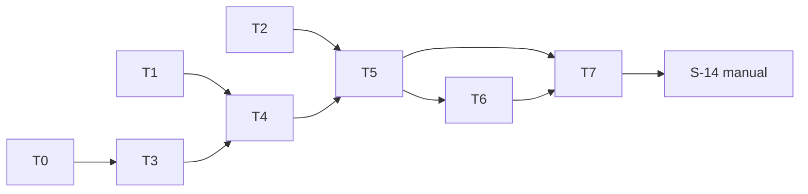

# tasks — review-enrichment-round

任務依 test-file 收斂。例外：`internal/ai/turn_test.go` 承 `S-03,S-05` 與 `S-04,S-12,S-13` 兩個任務——合併後要動 9 個檔（三 provider、retry、transcript、provider、turn、testfake、測試），超過單一 agent 約 5 檔範圍，且 remote／transcript 接線需在三家 turn 1／本地重送先綠後分開 commit。

## T0 `[x]` [INFRA] genai bump 至 v1.8.0

- 原因：依賴版本工件，無新行為可單測；正確性由既有 Gemini 測試守門
- 步驟：`go get google.golang.org/genai@v1.8.0 && go mod tidy`；`go doc google.golang.org/genai.Part | grep ThoughtSignature` 印出 `ThoughtSignature []byte`；`go build ./... && go test ./internal/ai/ -count=1`
- 檔案：`go.mod`、`go.sum`
- Verification command: `grep -q 'google.golang.org/genai v1.8.0' go.mod && go test ./internal/ai/ ./internal/rag/... -count=1`

## T1 `[x]` `S-01` [MODIFY] Enrichment 設定與值域

- 檔案：`internal/config/config.go`（`Config` :64-95、`load` :108、helper :251/:258）、`internal/config/envexample_test.go`（canonical :14-54）、`.env.example`（`# ── Review behavior` :43 段）、`internal/config/enrichment_test.go`（NEW）
- RED：`TestEnrichmentConfig`（預設五值；`yes` 不報錯為 false；五個值域外案例各含變數名與 `invalid value`；canonical 含五名）
- GREEN：`EnrichmentConfig` 型別、解析與檢查；canonical／`.env.example` 五行
- Verification command: `go test ./internal/config/ -run 'TestEnrichmentConfig|TestEnvExample' -count=1 -v`

## T2 `[x]` `S-06,S-07,S-08` [NEW] `internal/enrich` 工具、路徑安全、執行器與總預算

- 檔案：`internal/enrich/{tool,registry,search,readrange,paths,executor}.go`（NEW）、`internal/enrich/tools_test.go`（NEW）、`internal/rag/intake/denylist.go`（`isDenylisted` :36-43 匯出＋lower、清單 :13-32 加兩項）、`internal/rag/intake/walk.go`（:134 改名）、`internal/rag/intake/denylist_test.go`
- 依賴：無（`Limits` 型別自持，不依賴 T1）
- RED：`TestRepoSearch_ScopeExcludeTruncate`（S-06 fixture 三次呼叫）、`TestReadFileRanges_ClampAndReject`（六次）、`TestTools_TimeoutInvalidBudget`（六次＋`MaxTotalCalls=2` 注入三次）；三者在同一 RED pass 寫入
- GREEN：`Tool` 介面、`Registry.Default()`、`Executor.New/Execute/Executed`、`paths.resolve`（`EvalSymlinks`、整段比對、目錄排除、`intake.IsDenylisted`、`credential`／`secret`）、`isBinary`、工作量常數、截斷、ctx timeout 每檔檢查；`intake` 既有三測試仍綠並加大小寫案例
- Verification command: `go test ./internal/enrich/ ./internal/rag/intake/ -count=1 -v`

## T3 `[x]` `S-03,S-05` [MODIFY] 三家 `GenerateTurn`：工具定義、提示句、本地重送

- 檔案：`internal/ai/turn.go`（NEW：型別、常數）、`internal/ai/openai.go`（`doRequest` :105、`openaiResponse` :93-103、新 `GenerateTurn`）、`internal/ai/anthropic.go`（新 `GenerateTurn`）、`internal/ai/gemini.go`（新 `GenerateTurn`）、`internal/ai/turn_test.go`（NEW）
- 依賴：T0
- RED：`TestGenerateTurn_ToolDefinitionsAndCalls`（三家 subtest：工具定義路徑、提示句結尾、`store=false`＋`include`、`ToolCalls` 正規化、`Continuation`／`Usage` 非 nil）、`TestGenerateTurn_LocalReplayContinuation`（三家 turn 2 body：OpenAI 原 input＋`reasoning` 原樣＋`function_call`×2＋`function_call_output`×2 失敗者 `{"error":"timeout"}`；Anthropic 三則 messages、`is_error`；Gemini 三則 contents、`thoughtSignature:"sig"` 原樣、`functionResponse.response.error`；三家 tool results 區段以 `UntrustedFrame` 開頭）
- GREEN：三家 `GenerateTurn` 與 history 型別；`Generate` 路徑零變更（既有 `TestS07_TokenUsageRecorded`、`TestGeminiUsage_*`、`TestOpenAI_RequestSetsStoreFalse` 仍綠）
- Verification command: `go test ./internal/ai/ -run 'TestGenerateTurn_ToolDefinitionsAndCalls|TestGenerateTurn_LocalReplayContinuation' -count=1 -v && go test ./internal/ai/ -count=1`

## T4 `[x]` `S-04,S-12,S-13` [MODIFY] OpenAI remote 模式、retry／transcript 接線、`NewProvider` 與 fake

- 檔案：`internal/ai/openai.go`（`WithOpenAIRemoteState`、remote 分支）、`internal/ai/retry.go`（:27-75 抽 `do`、`GenerateTurn`、transcript 欄位）、`internal/ai/transcript.go`（:12-20 加欄位）、`internal/ai/provider.go`（`NewProvider` :23-41）、`internal/testfake/provider.go`（`GenerateTurn`、`ResponsesByPromptContains`、`GenerateTurnCalls`）、`internal/ai/turn_test.go`（追加三測試）
- 依賴：T1（`cfg.Enrichment`）、T3
- RED：`TestGenerateTurn_OpenAIRemoteContinuation`、`TestGenerateTurn_TranscriptPerTurnNoContent`（`resetTranscriptForTest`＋`WithRetry(…, config.APIConfig{AILogDir: t.TempDir(), RetryAttempts:1})`；兩筆、`turn`／`continuation`／`tool_calls`／`tool_results`；無 `SENTINEL-CONTENT-7`／`/etc/hosts`／TempDir；`MetricsSnapshot().APICalls` 兩筆 endpoint 後綴）、`TestNewProvider_StoreFollowsRemoteState`（三組 config）
- GREEN：remote 分支；`retryProvider.GenerateTurn`；transcript 欄位；`NewProvider` 接線；fake 擴充（fake 只在測試用，其 `GenerateTurn` 於此任務落地供 T5／T6 使用）
- Verification command: `go test ./internal/ai/ -run 'TestGenerateTurn_OpenAIRemoteContinuation|TestGenerateTurn_TranscriptPerTurnNoContent|TestNewProvider_StoreFollowsRemoteState' -count=1 -v && go test ./internal/ai/ ./internal/testfake/ -count=1`

## T5 `[x]` `S-02,S-09,S-10` [MODIFY] `enrich.RunRound` 與 single 模式接線、footer

- 檔案：`internal/enrich/round.go`（NEW）、`internal/reviewer/reviewer.go`（struct :84-105、`SetEnrichment`、`generateReview` :389-410、:234 aggregation）、`internal/reviewer/footer.go`（:59-91）、`internal/reviewer/reviewer.go`（`footerAggregation` :65-70）、`internal/reviewer/enrichment_test.go`（NEW；用 `newReviewerFixture` :651 樣式＋`testfake.FakeProvider.TurnResponses`＋暫存 repo）
- 依賴：T2、T4
- RED：`TestEnrichment_DisabledPathUnchanged`、`TestEnrichment_RoundLoopAndCallLimit`（主案＋子案 A／B，footer 字串與 `Degraded entries`）、`TestEnrichment_Turn2EmptyFallsToRetry`（`AIRetryAttempts=2`、`Executed()==1`、log 含 `enrichment: empty final text`）
- GREEN：`RunRound`＋`RoundResult`；reviewer 接線；footer 欄位；既有 `reviewer_test.go` 全綠
- Verification command: `go test ./internal/reviewer/ -run 'TestEnrichment_' -count=1 -v && go test ./internal/reviewer/ -count=1`

## T6 `[x]` `S-11` [MODIFY] multi 模式每 lane 接線與檢索不變量

- 檔案：`internal/lane/fanout.go`（`FanoutInput` :19-36、:90-99）、`internal/lane/parse.go`（:203-253）、`internal/reviewer/multilane.go`（:38-55）、`internal/lane/enrichment_test.go`（NEW；沿 `fanout_test.go:27-78` 的 prompt 路由 fake 或 `testfake.FakeProvider.ResponsesByPromptContains`；`testfake.FakeRetriever.RetrieveCalls()` 計數）
- 依賴：T5
- RED：`TestEnrichment_PerLaneContinuationAndRetrievalInvariant`（開／關各跑；4 次 turn 呼叫；`call_a`／`call_b` 不交叉；`Retrieve` 次數相等；兩 lane 皆有結果）
- GREEN：`FanoutInput.Enrichment`、`executeLaneWithOptions` 改走 `RunRound`、`LaneResult.Degraded` 併入；既有 `fanout_test.go`／`parse_test.go` 全綠
- Verification command: `go test ./internal/lane/ -run TestEnrichment_PerLaneContinuationAndRetrievalInvariant -count=1 -v && go test ./internal/lane/ ./internal/reviewer/ -count=1`

## T7 `[x]` [INFRA] main 接線與 docs

- 原因：接線與文件工件；行為由 T1–T6 的測試覆蓋，此處只有組裝與措辭；措辭紅線由 eagle 讀回
- 檔案：`cmd/mrinspect/main.go`（:166、:193-211：`enrich.New`、`SetEnrichment`、remote 啟動 log 句逐字）、`docs/us/configuration.md`、`docs/tw/configuration.md`（:48-55 表格加五列，remote 列含 retention 句）
- 依賴：T5、T6
- Verification command: `go build ./cmd/mrinspect && go vet ./... && grep -c 'MRI_REVIEW_ENRICHMENT' docs/us/configuration.md docs/tw/configuration.md && ! grep -ciE 'better|worse|improve' docs/us/configuration.md`

## Manual verification checklist

- [ ] S-14：本機 `MRI_REVIEW_ENRICHMENT=true`＋`MRI_AI_LOG_DIR`，`AI_PROVIDER` 各 openai／anthropic／gemini 與 key，輸入固定 `eval/fixtures` 一個 diff；各跑一次，OpenAI 另以 `MRI_AI_REMOTE_STATE=enabled` 再跑；四次無錯、transcript 一或兩筆、remote 那次 turn 2 `continuation=="remote"`、`jq '.tool_calls,.tool_results'` 不含 `/` 開頭路徑／`http`／`sk-`／`AIza`；結果記入 `docs/decisions_log.md` 新條目（Gemini thoughtSignature／OpenAI reasoning 重送實證）

## Task 依賴

## Requirements Checklist（引 spec 尾節，approval 時逐項對）

- [ ] 五個 `MRI_*` 變數：預設、上下界、canonical、`.env.example`、retention 句（T1、T7）
- [ ] 開關關閉路徑不變；`Generate` 簽名凍結（T5、T3 GREEN 條件）
- [ ] `TurnProvider` 六接觸點；三家工具定義、提示句、正規化；Args 上限（T3、T4、T2）
- [ ] OpenAI remote／本地（含 reasoning）、Anthropic／Gemini 本地（含 thoughtSignature）、失敗編碼、框架句；genai ≥ v1.8.0（T0、T3、T4）
- [ ] 工具純 Go、EvalSymlinks、整段比對、唯一 denylist、二進位、工作量與總預算常數、截斷、timeout、錯誤碼（T2）
- [ ] 回合迴圈、call-limit、每 call 一結果、空 turn 2 走重試、每 attempt 獨立鏈、檢索不變、degraded 併入 footer（T5、T6）
- [ ] transcript 新欄位無內容／原始 args；每 turn `LogAIAPICall`（T4）
- [ ] `store` 由 config 接線（T4）
- [ ] 真實 provider 手動驗證四次（S-14）
- [ ] D5 deferred 明列；Rejected options 逐字（spec 已含）
