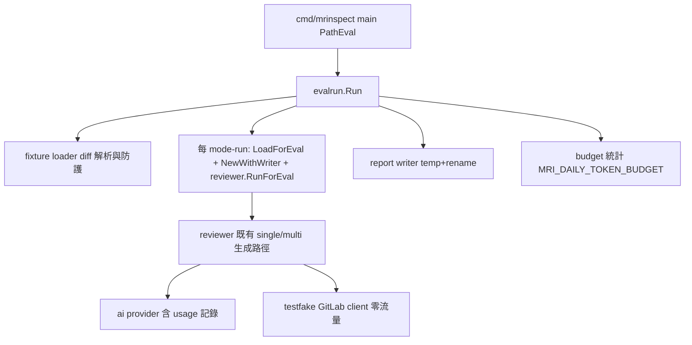
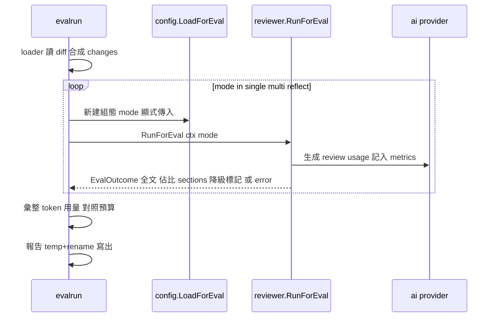

# design-be — review-quality-eval

Implements `REQ-01`–`REQ-05`（spec.md，fingerprint `6b70049105522961…`）。
無資料庫、無 HTTP API——Table schema 與 api.yml 均 **N/A**。

## 模組配置

| 位置 | 內容 | 對應 REQ |
|---|---|---|
| `internal/evalrun/`（新，NEW） | eval 全流程：fixture loader、mode-run 執行、報告寫出、預算統計。實作集中 `evalrun.go`，測試 `evalrun_test.go`（panel 簡化裁決：單一包、最少檔） | REQ-01/02/03/05 |
| `internal/ragcmd/index.go`（MODIFY） | `Dispatch` 增加 `PathEval`（`args[0]=="eval"`） | REQ-01 |
| `cmd/mrinspect/main.go`（MODIFY） | `PathEval` 分支：解旗標（`--fixtures`、`--report`）→ CI 防護 → `evalrun.Run` | REQ-01 |
| `internal/config/config.go`（MODIFY） | `LoadForEval()`：只要求 AI 憑證；不要求 GITLAB_TOKEN／CI_* | REQ-01 |
| `internal/reviewer/reviewer.go`（MODIFY） | eval 結果 seam：新增 exported `RunForEval(ctx, EvalMode, EvalInput) (EvalOutcome, error)`——`EvalInput{Diff string, Changes []gitlab.Change, Title/Description string}` 由呼叫端供給，因此 **完整繞過** `validateSystem`（:386-397，含 health check）、`fetchMRDetails`（:399-411，GetMergeRequest）、`fetchDiff`（:413-424，含 :422 GetMRChanges 與 :424 第二次 `MRI_REVIEW_MODE` env 讀取）與貼文（:198-199）——S-03「fake client 全方法 0 呼叫」由簽名保證，不靠繞行約定。`EvalMode ∈ {single, multi, reflect}` 為顯式參數，取代 :209/:424 兩處 env 讀取 | REQ-01 |
| `internal/logger/logger.go`（MODIFY） | (a) `NewWithWriter(io.Writer)` 建構變體（production `New()` 不變）；(b) `APICallMetric` 增選用 `Usage *TokenUsage`（`InputTokens`/`OutputTokens`）；(c) `LogAICallUsage` 或等價路徑只由 AI provider 設置 | REQ-03/04 |
| `internal/ai/*.go`（MODIFY） | 三 provider 解析回應 usage → 記入 metrics；三家建構函式皆增 base-URL/HTTP client 注入選項（anthropic/gemini 走 SDK 原生選項；openai 目前僅能同包白箱繞過——spec 的「已可注入」高估了，T3 一併補正式選項，使 spec 意圖成立） | REQ-04 |
| `eval/fixtures/`（新，資料） | `NN-<slug>.diff`（檔頭 `# mrinspect-fixture: source=<sha> kind=<kind>`）＋`README.md` 人讀表 | REQ-02 |
| `docs/{us,tw}/configuration.md`（MODIFY，S-09 後） | `MRI_DAILY_TOKEN_BUDGET` 條目＋建議值推導 | REQ-05 |

## 服務關係

## 執行序（每 fixture）

## 關鍵設計決定

1. **結果 seam 形狀**：`RunForEval` 與既有 `Run` 並存；`Run` 行為零變更
   （production 不受影響）。`EvalOutcome{ReviewText, BreakdownSections,
   Degraded bool, Mode}`。內部與 `Run` 共用 generate 路徑，僅入口與
   出口不同——不複製生成邏輯（DRY）。
2. **selfReflect 模式**：reflect mode-run 由 `LoadForEval` 回傳的組態
   copy 設 `SelfReflection=true` 實現，不動 process env（S-04）。
3. **changes 合成**：從 unified diff 的 `+++ b/<path>` 行解析 new path、
   `--- a/<path>` 解析 old path，組 `gitlab.Change{NewPath, OldPath,
   Diff}`——只填 lane 路由所需欄位。
4. **usage 归属**：每 mode-run 一個 `NewWithWriter` Logger 實例，
   metrics 天然按 mode-run 分片（S-07 之外的重複計數問題就地消解）。
5. **預算解析**：`strings.TrimSpace` → `strconv.ParseUint`；失敗或 0 →
   關閉（失敗另 Warn）。統計含 usage-unknown 時輸出前綴「≥」。
6. **CI 防護位置**：`main.go` PathEval 分支最前（在 LoadForEval 之前），
   `os.Getenv("CI")=="true" && MRI_EVAL_ALLOW_CI!="true"` → exit 非零。

## Requirements Checklist（S-51，plan 版）

- [ ] REQ-01：PathEval＋LoadForEval＋RunForEval＋CI 防護（T1/T3/T4）
- [ ] REQ-02：loader 防護＋changes 合成＋fixtures 落檔（T2/T6）
- [ ] REQ-03：writer seam＋報告生成 atomic（T3/T5）
- [ ] REQ-04：usage 子結構＋三 provider 注入（T3）
- [ ] REQ-05：預算解析與告警＋docs（T5/T7）
