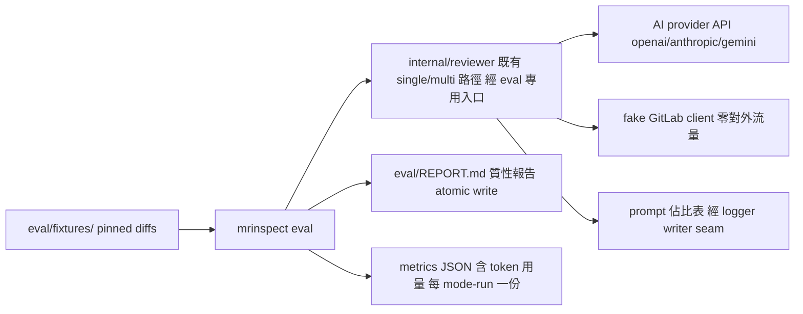

# review-quality-eval — 本地重放歷史 diff 的質性 dogfood 評估

## 背景與目標

repo 目前只有單元測試能證明「程式照規格運作」，沒有任何工件能回答
「AI review 的品質好不好」。本 change 建立一個可重現的質性評估：
把本 repo 自己的代表性歷史 diff 固定成 fixtures，本地重放過現有
single 與 multi review 路徑（真 AI provider、零 GitLab 流量、不貼文），
產出公開的質性報告（review 內容＋prompt 佔比表＋模式對比），並補上
token 用量記錄與每日 token 預算變數。

明確不做（見 Rejected options 與 D5 deferred）：precision/recall 評分、
GitLab mirror 上的活 dogfood。

## System context（C2）

## Requirements

### REQ-01 `mrinspect eval` 子命令：離線重放

新增 `eval` 子命令（`mrinspect eval --fixtures <dir> --report <path>`，
兩旗標皆有預設值 `eval/fixtures` 與 `eval/REPORT.md`）：

- **eval 專用組態與入口**：`LoadForEval`（只要求 AI 憑證，不要求
  GITLAB_TOKEN／CI_PROJECT_ID／CI_MERGE_REQUEST_IID）；review 執行走
  eval 專用入口——回傳 review 結果給呼叫端（結果 seam），跳過
  production 的 validateSystem／GitLab health check，且不貼文。
  GitLab client 一律注入 fake：**零 GitLab 流量**（任何方法呼叫皆為 0）。
- **模式為顯式參數**：每個 fixture 依序跑 single、multi、
  single＋selfReflect 三個 mode-run；每個 mode-run 各自新建組態與
  reviewer（selfReflect 是建構時定案的旗標），**不得以 os.Setenv 切換
  process-global env**。
- **multi 的 changes 需求**：fixture loader 從 unified diff 解析檔案
  路徑，合成 `[]gitlab.Change` 供 lane 路由；multi 因 lane 設定問題
  降級為 single 時，報告 MUST 標註降級（不得偽裝成 multi 結果）。
- **CI 誤觸防護**：偵測到 CI 環境（`CI` env 為 true）且未設
  `MRI_EVAL_ALLOW_CI=true` 時拒絕執行並說明——CI 內有真 key，誤觸
  會燒三倍模式成本。
- 不重用 LocalDiffFetcher 的原因：它對 git branch 取 diff，fixtures
  是 pinned 檔案；檔案型 fetcher 是新的第四實作，職責不同。

### REQ-02 fixtures：本 repo 代表性歷史 diff

`eval/fixtures/` 內 3–5 個 `NN-<slug>.diff`（unified diff）。metadata
以檔頭註解行內嵌（`# mrinspect-fixture: source=<sha> kind=<kind>`），
人讀說明集中在 `eval/fixtures/README.md` 表格——不設 per-fixture yaml。
載入規則：只接受 regular file（symlink 拒絕）、UTF-8、非空、大小上限
1 MiB；不合規者跳過並 Warn；**有效 fixture 數為 0 時整趟以錯誤結束且
不寫報告**（防止空報告覆蓋有效舊報告）。挑選為人工裁決，curation
準則（至少涵蓋 Go 邏輯變更／跨檔重構／設定檔變更三類，且只含本
repo 已公開內容）由 S-09 人工確認，不設機器 gate。

### REQ-03 質性報告 `eval/REPORT.md`

eval 結束時 atomic write（temp＋rename）產出報告：標頭（產生時間、
provider/model、fixtures 清單）＋每 fixture 一節：(a) 三個 mode-run 的
review 全文或失敗摘要（部分失敗記為該格的錯誤說明，不整趟中斷），
(b) 各 mode-run 的 prompt 佔比表，(c) token 用量小計，(d) multi
降級標註（如有）。報告公開、commit 進 repo
——裁決依據：fixtures 限定取自本已公開 repo 的歷史內容，無新增洩漏面
（見 Adjudications）。佔比表的取得依賴 **logger writer seam**：
`logger.New` 增加可注入 `io.Writer` 的建構變體，eval 據此擷取佔比表
（production 預設 os.Stdout 不變）。反省結果的可區分性（2026-09-01 修訂）：報告以三態註記呈現 reflect
mode-run——未套用（degraded）／已套用但原文未改（validated）／已套用
且已改寫；原「報告無法區分」的 limitation 已由 528b649 修復並移除。

### REQ-04 token 用量記錄

AI provider 的回應 usage 記入 metrics：`APICallMetric` 增加**選用**
usage 子結構（pointer，僅 AI 呼叫設置——GitLab 呼叫不帶此欄位）。
provider 呼叫失敗或回應無 usage → 該呼叫計入 usage-unknown 計數，
不計入 token 總量。eval 的每個 mode-run 使用**各自新建的 Logger 與
metrics 輸出**（既有 SaveMetrics 是累積式，共用會重複計數）。
為使三個 provider 皆可用 fake HTTP 層測試，anthropic 與 gemini 的
建構函式增加 base URL／HTTP client 注入選項（兩家 SDK 均原生支援；
openai 已可注入）。此欄位是通用強化，production 路徑同樣受益。

### REQ-05 每日 token 預算變數

新增 env 變數 `MRI_DAILY_TOKEN_BUDGET`（tokens/日；未設或 0＝關閉）。
解析：trim 後 ParseUint；malformed 或負值 → 視為未設並 Warn。
行為（誠實範圍——本工具無跨執行狀態，故為單次對照，不是記帳系統，
此限制寫入 docs）：eval 收尾印出「本次總用量／每日預算（百分比）」；
本次總用量含 usage-unknown 呼叫時以「≥」前綴標示為下限；單次用量
即超過每日預算時 Warn（不中斷、不影響 exit code）。建議預設值由
定價研究＋S-09 實測用量 ×20 MR/日推導；`docs/{us,tw}/configuration.md`
的建議值與推導在 S-09 完成後才定稿（任務順序：docs 條目落地於
S-09 之後）。研究已得的上界參考：20 審/日 ×（100k in＋8k out）≈
2.16M tokens/日 → 建議值 2,500,000 起，S-09 後校正。

## Scenarios

### S-01 eval 子命令分派

- GIVEN 二進位以 `mrinspect eval` 啟動
- WHEN `ragcmd.Dispatch` 解析 args
- THEN 回傳 PathEval；`index`／無參數行為不變
- Test mapping: `internal/ragcmd/index_test.go::TestS01_EvalDispatch`
- Verification command: `go test ./internal/ragcmd/ -run TestS01_EvalDispatch -count=1 -v`（輸出必須含該測試名，不得 no tests to run）

### S-02 fixture 載入與 changes 合成

- GIVEN 目錄含：合法 fixture、一個 symlink .diff、一個超過 1 MiB 的
  .diff、一個空檔
- WHEN loader 掃描
- THEN 只載入合法者（依 NN 排序）、其餘各以 Warn 跳過；每個載入的
  fixture 附有從 diff 解析出的 `[]gitlab.Change`（路徑正確）；diff
  位元組原樣保留
- Test mapping: `internal/evalrun/evalrun_test.go::TestS02_FixtureLoading`
- Verification command: `go test ./internal/evalrun/ -run TestS02_FixtureLoading -count=1 -v`

### S-03 零 GitLab 流量且結果可取回

- GIVEN eval 以 fake GitLab client 與 fake provider 組裝
- WHEN 一個 fixture 的 single mode-run 完整執行
- THEN fake client 的**所有**方法呼叫次數為 0；review 內容經結果 seam
  回到 eval 端且非空
- Test mapping: `internal/evalrun/evalrun_test.go::TestS03_OfflineIsolation`
- Verification command: `go test ./internal/evalrun/ -run TestS03_OfflineIsolation -count=1 -v`

### S-04 三 mode-run 依序且互不污染

- GIVEN 一個 fixture 與可辨識輸出的 fake provider
- WHEN eval 執行該 fixture
- THEN 依序產生 single、multi、single＋selfReflect 三份結果，各自
  來自新建的組態與 reviewer；過程中 process env 未被修改（測試前後
  比對相關 env）；multi 的 lane 設定壞掉時該格標「降級」，其他兩格
  結果不受影響
- Test mapping: `internal/evalrun/evalrun_test.go::TestS04_ThreeModes`
- Verification command: `go test ./internal/evalrun/ -run TestS04_ThreeModes -count=1 -v`

### S-05 零有效 fixture 的保護

- GIVEN fixtures 目錄為空（或全部不合規），且 report 路徑已存在一份
  舊報告
- WHEN eval 執行
- THEN 以非零 exit 結束、舊報告位元組不變
- Test mapping: `internal/evalrun/evalrun_test.go::TestS05_EmptyFixturesGuard`
- Verification command: `go test ./internal/evalrun/ -run TestS05_EmptyFixturesGuard -count=1 -v`

### S-06 報告生成

- GIVEN 兩個 fixture 以 fake provider 跑完（其中一個 mode-run 被 fake
  設定為失敗）
- WHEN 報告寫出
- THEN 報告含標頭、每 fixture 一節、三 mode-run 全文或失敗摘要、
  佔比表（經 writer seam 擷取）、token 小計；寫入為
  temp＋rename
- Test mapping: `internal/evalrun/evalrun_test.go::TestS06_ReportGeneration`
- Verification command: `go test ./internal/evalrun/ -run TestS06_ReportGeneration -count=1 -v`

### S-07 token 用量入 metrics

- GIVEN 三個 provider 各以注入的 fake HTTP 層（回應含 usage 欄位）
  完成一次呼叫，另一次呼叫回應無 usage
- WHEN 各 provider 完成呼叫
- THEN 有 usage 的呼叫記錄 input/output tokens；無 usage 的計入
  usage-unknown、不計 token 總量；GitLab 呼叫的 metric 不帶 usage 欄位
- Test mapping: `internal/ai/usage_test.go::TestS07_TokenUsageRecorded`
- Verification command: `go test ./internal/ai/ -run TestS07_TokenUsageRecorded -count=1 -v`

### S-08 預算解析與告警

- GIVEN 分別設定：未設、`0`、`abc`、`-5`、` 1000 `（帶空白）
- WHEN eval 收尾統計（fake 總用量 1500，其中含 usage-unknown 呼叫）
- THEN 未設/0/malformed/負值 → 預算關閉（malformed/負值另 Warn 解析
  失敗）；`1000` → 印「≥1500／1000（150%）」且 Warn 超額；exit code
  不受影響
- Test mapping: `internal/evalrun/evalrun_test.go::TestS08_BudgetWarning`
- Verification command: `go test ./internal/evalrun/ -run TestS08_BudgetWarning -count=1 -v`

### S-09 [MANUAL] 真 provider 全量跑一輪＋docs 定稿

- GIVEN 本機設定 `AI_PROVIDER_KEY`
- WHEN `./bin/mrinspect eval`（預設旗標）
- THEN 產出完整 `eval/REPORT.md`，各節佔比表與 token 數非零；使用者
  人工確認：報告可讀、review 內容合理、fixtures curation 準則達標
  （三類涵蓋、無非公開內容）；隨後以實測用量校正
  `docs/{us,tw}/configuration.md` 的預算建議值
- 原因：需要真 API key 與真模型輸出；品質與 curation 判讀屬人工。
- Test mapping: manual
- Verification command: manual（上列命令由使用者本機執行）

### S-10 CI 誤觸防護

- GIVEN env 含 `CI=true` 且未設 `MRI_EVAL_ALLOW_CI`
- WHEN `mrinspect eval` 啟動
- THEN 立即以非零 exit 拒絕並印出原因與 opt-in 方式；設
  `MRI_EVAL_ALLOW_CI=true` 後可執行
- Test mapping: `internal/evalrun/evalrun_test.go::TestS10_CIGuard`
- Verification command: `go test ./internal/evalrun/ -run TestS10_CIGuard -count=1 -v`

## Rejected options

- **合成 fixture（人造 MR）**：使用者裁決改用 dogfood——本 repo 歷史
  diff 更真實、零授權疑慮。
- **GitLab mirror 上的活 dogfood**：難重現、難對比，deferred（見 D5）。
- **precision/recall 評分**：dogfood 無標準答案卷；使用者裁決本次
  純質性。未來若引入評分，命中判定規則已定：**同檔案＋同問題類型
  即命中（行號不計）**。
- **每日預算做成硬限制（超額中斷）**：評估工具不該因預算殺掉跑到一半
  的結果；選 Warn-only。
- **per-fixture yaml metadata**：panel 簡化裁決——改為 diff 檔頭註解行
  ＋README 表格，少一個 loader 與孤兒配對邏輯。
- **以 os.Setenv 切換三模式**：selfReflect 於組態建構時定案、env 為
  process-global，切換易污染；改為顯式 mode 參數＋每 mode-run 新建組態。

## D5 deferred

- precision/recall 評分（含上述命中規則）——範圍外項目，不佔本 change
  的 scenario 分母（deferred scenario 數：0/10，0%）。
- GitLab mirror 活 dogfood——同上，範圍外項目。

## Requirements Checklist

- [ ] eval 子命令可離線重放 fixtures，零 GitLab 流量（REQ-01）
- [ ] fixtures 落檔、載入防護齊備（REQ-02）
- [ ] REPORT.md 結構齊備、atomic write、公開（REQ-03）
- [ ] 三 provider usage 入 metrics、可注入測試（REQ-04）
- [ ] 預算變數解析防呆＋誠實語意＋docs 推導（REQ-05）

## Adjudications

- REQ-01: REFUTED → 修訂——elf/orc 指出 Run() 無結果 seam 且必貼文、
  validateSystem 會打真 GitLab health check、config.Load 硬要求
  GITLAB_TOKEN、模式切換依賴 process env；修訂為 eval 專用組態
  （LoadForEval）＋結果 seam＋顯式 mode 參數＋每 mode-run 新建組態；
  另補 CI 誤觸防護（orc 證實 .gitlab-ci.yml 有真 key，「CI 無 key」
  假設錯誤）。
- REQ-02: REFUTED → 修訂——elf 指出 multi 需要 `[]gitlab.Change`（改由
  diff 解析合成）、涵蓋三類無機器可驗形（改為 S-09 人工 curation）；
  orc 指出 symlink/大小/空檔攻擊面（補載入防護與零 fixture 保護）；
  hobbit 裁決砍 per-fixture yaml（改檔頭註解＋README）。
- REQ-03: REFUTED → 修訂——elf 指出佔比表只進 slog、無擷取 seam（補
  logger writer seam）；orc 指出公開全文與 dump 硬化姿態的張力：裁決
  維持公開（使用者明示），依據是 fixtures 限定取自本已公開 repo 的
  歷史內容、curation 由 S-09 人工把關，無新增洩漏面；補 atomic write
  與空報告覆蓋保護；部分失敗與 selfReflect 靜默降級明文化。
- REQ-04: REFUTED → 修訂——elf 指出共享 LogAPICall 會把 usage 欄位
  stamped 到 GitLab metrics（改選用 pointer 子結構）、SaveMetrics 累積
  式會重複計數（每 mode-run 各自 Logger）、anthropic/gemini 無法注入
  fake HTTP（補建構選項）；失敗呼叫語意明文化（usage-unknown）。
- REQ-05: REFUTED → 修訂——elf/orc 指出「每日」名不符實（無跨執行
  狀態）與解析防呆缺失；hobbit 主張整條砍掉，**被使用者明示指示
  否決（保留變數）**；修訂為誠實的單次對照語意＋「≥」下限標示＋
  ParseUint 防呆，限制寫入 docs。
- REQ-03: 修訂（2026-08-31）——使用者於 S-09 判讀時指示移除報告的「人工評語」欄；spec 與 S-06 同步修訂並重算 fingerprint。
- REQ-03: 修訂（2026-09-01）——528b649 讓報告收集全部 prompt breakdown 表並以三態註記區分 reflect 結果，原「selfReflect 失敗無法區分」的已知限制不再成立；spec 隨碼修訂並重算 fingerprint。
