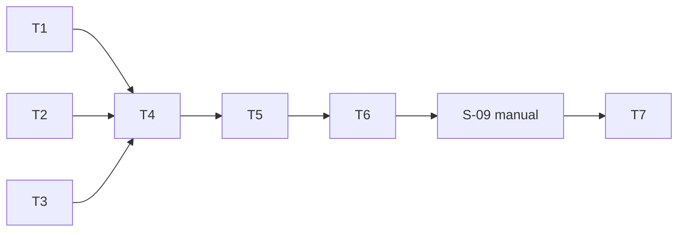

# tasks — review-quality-eval

任務依 test-file 收斂原則分組；`S-02`–`S-06`/`S-08`/`S-10` 共用
`internal/evalrun/evalrun_test.go` 但拆為 T2/T4/T5 三個 task——例外理由：
三組各自獨立可驗收（loader／核心執行／報告與收尾），且 RED/GREEN 需
分開 commit 以控制單次 codex dispatch 規模。

## T1 `[ ]` `S-01` [MODIFY] eval 子命令分派

- 檔案：`internal/ragcmd/index.go`（`Dispatch`，:28-33 一帶）＋
  `internal/ragcmd/index_test.go`
- RED：寫 `TestS01_EvalDispatch`（`eval` → PathEval；`index`／裸參數
  行為不變），跑紅 → 標 `[wip]` → 引 RED 輸出
- GREEN：加 `PathEval` 常數與分支；`go test ./internal/ragcmd/ -run TestS01_EvalDispatch -count=1 -v` 綠；全包回歸
- REFACTOR：SOLID/DRY 檢查（預期無事）
- Verification command: `go test ./internal/ragcmd/ -run TestS01_EvalDispatch -count=1 -v`

## T2 `[ ]` `S-02,S-05` [NEW] fixture loader 與防護

- 檔案：`internal/evalrun/evalrun.go`（loader 部分）＋
  `internal/evalrun/evalrun_test.go`
- RED：`TestS02_FixtureLoading`（合法載入排序、symlink／>1 MiB／空檔
  跳過＋Warn、changes 合成路徑正確、diff 位元組原樣）＋
  `TestS05_EmptyFixturesGuard`（零有效 fixture → 非零 exit 路徑、舊報告
  位元組不變）→ 標 `[wip]`
- GREEN：實作 loader（regular file only、UTF-8、1 MiB 上限、
  `# mrinspect-fixture:` 檔頭解析、`+++ b/`／`--- a/` 合成
  `[]gitlab.Change`）
- Verification command: `go test ./internal/evalrun/ -run 'TestS02_FixtureLoading|TestS05_EmptyFixturesGuard' -count=1 -v`

## T3 `[ ]` `S-07` [MODIFY] usage 記錄與 provider 注入

- 檔案：`internal/logger/logger.go`（`Usage *TokenUsage` 選用子結構、
  `NewWithWriter`）、`internal/ai/{openai,anthropic,gemini}.go`（usage
  解析＋三家皆補 base-URL/HTTP client 注入選項；openai 現況只能同包
  白箱繞過，本 task 補正式選項）＋
  `internal/ai/usage_test.go`
- RED：`TestS07_TokenUsageRecorded`（三 provider fake HTTP 回應含
  usage → 記錄；無 usage → usage-unknown；GitLab metric 無 usage 欄位）
  → 標 `[wip]`
- GREEN：實作；既有 ai/logger/gitlab 測試回歸
- 註：`NewWithWriter` 在本 task 一併落地（S-06 依賴），其斷言在 T5
- Verification command: `go test ./internal/ai/ -run TestS07_TokenUsageRecorded -count=1 -v`

## T4 `[ ]` `S-03,S-04` [MODIFY] eval 核心執行（結果 seam＋三 mode-run）

- 檔案：`internal/config/config.go`（`LoadForEval`）、
  `internal/reviewer/reviewer.go`（`RunForEval`＋`EvalMode`）、
  `internal/evalrun/evalrun.go`（mode-run 迴圈）＋
  `internal/evalrun/evalrun_test.go`
- RED：`TestS03_OfflineIsolation`（fake client 全方法 0 呼叫、review
  非空回傳）＋`TestS04_ThreeModes`（三 mode-run 各自新建組態、env
  前後不變、multi 降級標記、單格失敗不擴散）→ 標 `[wip]`
- GREEN：實作 `LoadForEval`／`RunForEval(ctx, EvalMode, EvalInput)`——
  `EvalInput` 攜 Diff/Changes/標題，完整繞過 validateSystem、
  fetchMRDetails、fetchDiff 與貼文（S-03 的零呼叫由簽名保證）；
  與 `Run` 共用生成路徑；reviewer 既有全測試回歸
- Verification command: `go test ./internal/evalrun/ -run 'TestS03_OfflineIsolation|TestS04_ThreeModes' -count=1 -v`

## T5 `[ ]` `S-06,S-08,S-10` [NEW] 報告、預算、CI 防護

- 檔案：`internal/evalrun/evalrun.go`（report writer、budget、guard）、
  `cmd/mrinspect/main.go`（PathEval 分支＋旗標＋CI 防護）＋
  `internal/evalrun/evalrun_test.go`
- RED：`TestS06_ReportGeneration`（標頭／每 fixture 節／失敗摘要格／
  佔比表經 writer seam／token 小計／人工評語空欄／temp+rename）＋
  `TestS08_BudgetWarning`（解析防呆矩陣、≥ 下限標示、超額 Warn、exit
  不變）＋`TestS10_CIGuard`（CI=true 無 opt-in → 拒絕）→ 標 `[wip]`
- GREEN：實作；`go build ./...` 全綠
- Verification command: `go test ./internal/evalrun/ -run 'TestS06_ReportGeneration|TestS08_BudgetWarning|TestS10_CIGuard' -count=1 -v`

## T6 `[ ]` [INFRA] fixtures 落檔

- 原因：純資料工件（diff 檔＋README 表），無可紅綠的行為。
- Maia 從 git log 裁選 3–5 個歷史 commit（涵蓋 Go 邏輯變更／跨檔
  重構／設定檔變更），產 `git show` diff → `eval/fixtures/NN-<slug>.diff`
  （加 `# mrinspect-fixture:` 檔頭）＋ `eval/fixtures/README.md`。
- Verification command: `./bin/mrinspect eval --fixtures eval/fixtures --report /tmp/eval-smoke.md`（fake key 下預期在 provider 呼叫階段才失敗，loader 全過）

## T7 `[ ]` [INFRA] docs 條目（S-09 之後）

- 原因：文件工件；建議值依 S-09 實測校正，無獨立可測行為。
- `docs/{us,tw}/configuration.md` 加 `MRI_DAILY_TOKEN_BUDGET`＋
  `MRI_EVAL_ALLOW_CI` 條目與推導（單次對照語意、≥ 下限、
  20 審/日假設、定價來源日期）。
- Verification command: `grep -n 'MRI_DAILY_TOKEN_BUDGET' docs/us/configuration.md docs/tw/configuration.md`

## Manual verification checklist

- [ ] S-09：本機真 key 跑 `./bin/mrinspect eval`，確認 REPORT.md 完整、
  佔比表與 token 非零、review 品質可接受、fixtures curation 達標
  （三類涵蓋、無非公開內容）；隨後 T7 定稿建議值。

## Task 依賴

