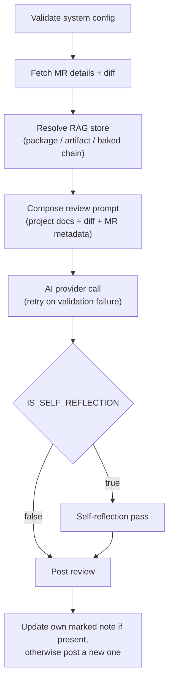
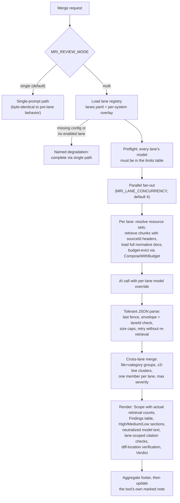

# 架構

一個 merge request 從 GitLab pipeline 走到留言完成的路徑，以及每一層各自負責什麼。

[English](../us/architecture.md)

## 運作方式

```
MR opened / updated
        │
        ▼
  GitLab pipeline
        │
   ┌────┴──────────────────────────────────────┐
   ▼                    ▼                       ▼
mrinspect (Go)    mrinspect (TypeScript)   superpowers layer
  │                    │                        │
  ├─ loads profile     ├─ loads profile         ├─ /code-review:code-review
  ├─ composes prompt   ├─ composes prompt       ├─ /security-review
  ├─ calls AI          ├─ calls AI              └─ /pr-review-toolkit:review-pr
  ├─ self-reflection   ├─ self-reflection            (5 parallel sub-agents)
  └─ posts 1 MR comment└─ posts 1 MR comment   posts up to 3 MR comments
```

**第 1a 層 — mrinspect Go 執行檔**
把服務名稱解析成對應的 system project（`projects/registry.yaml`），載入相符的 YAML 與 Markdown 審查標準，組出帶有情境的 prompt。接著呼叫設定好的 AI provider（預設為 OpenAI），並帶重試與指數退避。可選擇再跑一次 self-reflection，讓 AI 依專案標準檢查自己的審查結果。最後貼出一則結構化的 MR 留言。整體遵循 SOLID 原則——所有協作元件都透過 `internal/interfaces/` 的介面接起來，`cmd/mrinspect/main.go` 是 composition root。

**第 1b 層 — mrinspect TypeScript runner**
專案載入、prompt 組裝、AI provider 與 self-reflection 的邏輯都和 Go 執行檔相同，以 TypeScript 依 SOLID 原則實作。用 `npx tsx review.ts` 執行，不需要編譯步驟。CI 上使用 `node:22`（不需要預先建好的 Docker image）。如果你偏好免建置的環境，或想用 TypeScript 擴充 reviewer，這一層最適合。

**第 2 層 — superpowers**
安裝 Claude Code CLI 與 superpowers plugin，然後依序跑三個 skill：
- `/code-review:code-review` — 邏輯錯誤、慣例、findings 表格加上結論
- `/security-review` — OWASP Top 10、密鑰外洩、相依套件 CVE
- `/pr-review-toolkit:review-pr` — 派出五個平行 sub-agent（code reviewer、type design analyzer、silent failure hunter、comment analyzer、test coverage analyzer），並貼出彙整後的發現

所有層都是 `allow_failure: true`——它們只提供建議，永遠不會擋住 merge。

Go 審查留言帶有固定的 `<!-- mrinspect:review -->` 標記。重跑時，mrinspect 會找出作者 ID 或使用者名稱與當前 GitLab token 使用者相符、且帶有該標記的留言，直接更新它而不是再疊一則；如果找不到可辨識為自己的留言，就貼一則新的。

## 審查層一覽

| 層 | Image | 貼出 | 需要 |
|---|---|---|---|
| mrinspect (Go) | `mrinspect:latest` | 1 則結構化 MR 留言 | `AI_PROVIDER_KEY`, `GITLAB_TOKEN` |
| mrinspect (TypeScript) | `node:22` | 1 則結構化 MR 留言 | `AI_PROVIDER_KEY`, `GITLAB_TOKEN` |
| superpowers | `node:22` (Claude Code CLI) | 最多 3 則 MR 留言 | `ANTHROPIC_API_KEY`, `GITLAB_TOKEN` |

## Single 模式流程

預設路徑會先驗證設定，抓取 MR 與其 diff，接著沿著 `package / artifact / baked` 這條鏈解析出 RAG store，再用專案文件、diff 與 MR metadata 組出一份 prompt。AI 回傳的內容若沒通過驗證就會重試。`IS_SELF_REFLECTION` 決定貼出審查前要不要再跑一次 reflection；而所謂貼出，是指在已有自己標記的留言時直接更新它。



## Multi-lane 模式流程

`MRI_REVIEW_MODE` 決定走哪條路。`single` 與導入 lane 之前的行為維持位元組層級完全一致；`multi` 會從 `lanes.yaml` 加上各系統的 overlay 載入 lane registry，而設定缺漏或沒有任何啟用中的 lane 時，會以具名的理由退回 single 路徑。過了 preflight 之後，各 lane 在 `MRI_LANE_CONCURRENCY` 的限制下平行展開，各自組出經過預算裁切的 prompt，並用自己的 model override 呼叫 AI。解析後的結果跨 lane 合併，彙整成一份審查，貼到工具自己那則帶標記的留言。


