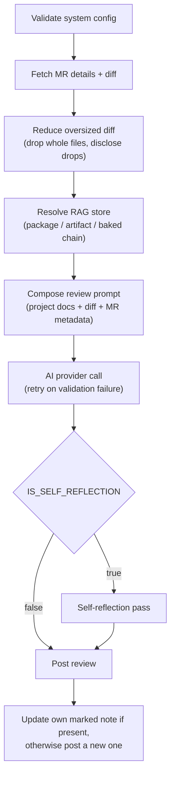
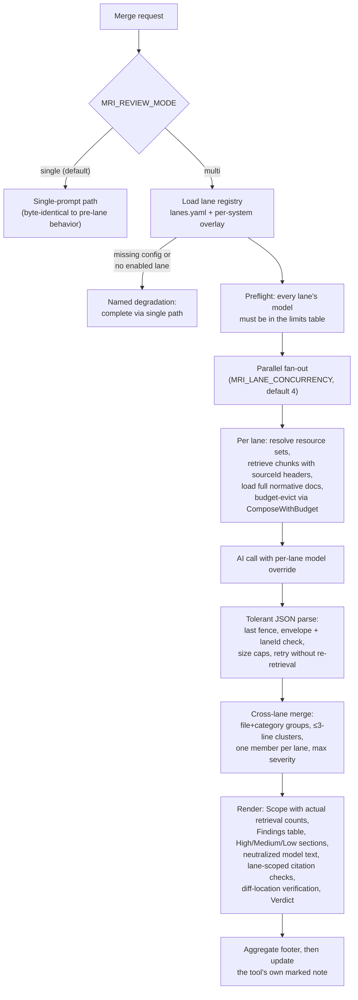

# Architecture

How a merge request travels from a GitLab pipeline to a posted review, and which layer does what.

[繁體中文版](../tw/architecture.md)

## How it works

```
MR opened / updated
        │
        ▼
  GitLab pipeline
        │
   ┌────┴───────────────────────────┐
   ▼                                ▼
mrinspect (Go)              superpowers layer
  │                                │
  ├─ loads profile                 ├─ /code-review:code-review
  ├─ composes prompt               ├─ /security-review
  ├─ calls AI                      └─ /pr-review-toolkit:review-pr
  ├─ self-reflection                    (5 parallel sub-agents)
  └─ posts 1 MR comment            posts up to 3 MR comments
```

**Layer 1 — mrinspect Go binary**
Resolves the service name to a system project (`projects/registry.yaml`), loads the matching YAML + Markdown review standards, and composes a context-aware prompt. Calls the configured AI provider (OpenAI by default) with retry and exponential backoff. Optionally runs a self-reflection second pass where the AI validates its own review against the project standards. Posts one structured MR comment. Follows SOLID principles — all collaborators are wired via interfaces in `internal/interfaces/`; `cmd/mrinspect/main.go` is the composition root.

**Layer 2 — superpowers**
Installs Claude Code CLI and the superpowers plugin, then runs three skills in sequence:
- `/code-review:code-review` — logic bugs, conventions, findings table + verdict
- `/security-review` — OWASP Top 10, secrets exposure, dependency CVEs
- `/pr-review-toolkit:review-pr` — dispatches five parallel sub-agents (code reviewer, type design analyzer, silent failure hunter, comment analyzer, test coverage analyzer) and posts their aggregated findings

All layers are `allow_failure: true` — they are advisory and never block a merge.

Go review notes carry the stable `<!-- mrinspect:review -->` marker. On a rerun, mrinspect looks for a marked note whose author ID or username matches the current GitLab token user and updates that note instead of stacking another one; if it cannot identify a matching owned note, it posts a new note.

## Review layers at a glance

| Layer | Image | Posts | Requires |
|---|---|---|---|
| mrinspect (Go) | `ghcr.io/twjohnwu/mrinspect:v0.2.0` | 1 structured MR comment | `AI_PROVIDER_KEY`, `GITLAB_TOKEN` |
| superpowers | `node:22` (Claude Code CLI) | Up to 3 MR comments | `ANTHROPIC_API_KEY`, `GITLAB_TOKEN` |

## Single mode flow

The default path validates configuration, pulls the MR and its diff, then resolves a RAG store through the `package / artifact / baked` chain before composing one prompt out of the project docs, the diff, and the MR metadata. The AI call retries when the output fails validation. `IS_SELF_REFLECTION` decides whether a second reflection pass runs before the review is posted, and posting means updating the tool's own marked note when one exists.



## Multi-lane mode flow

`MRI_REVIEW_MODE` picks the path. `single` stays byte-identical to pre-lane behavior; `multi` loads the lane registry from `lanes.yaml` plus any per-system overlay, and a missing config or an empty set of enabled lanes degrades back to the single path under a named reason. Past preflight, the lanes fan out in parallel under `MRI_LANE_CONCURRENCY`, each composing its own budget-evicted prompt and calling the AI with its own model override. The parsed results are merged across lanes, rendered into one review, and posted to the tool's own marked note.


